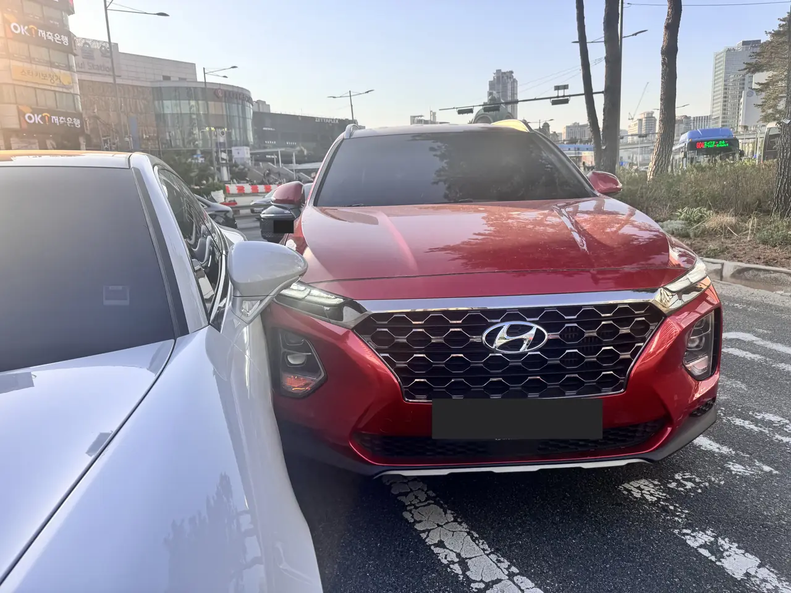
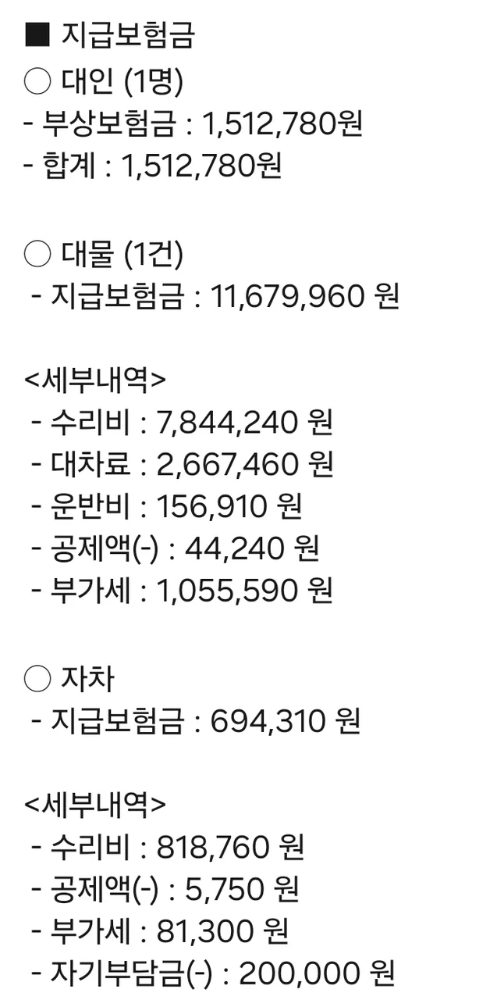
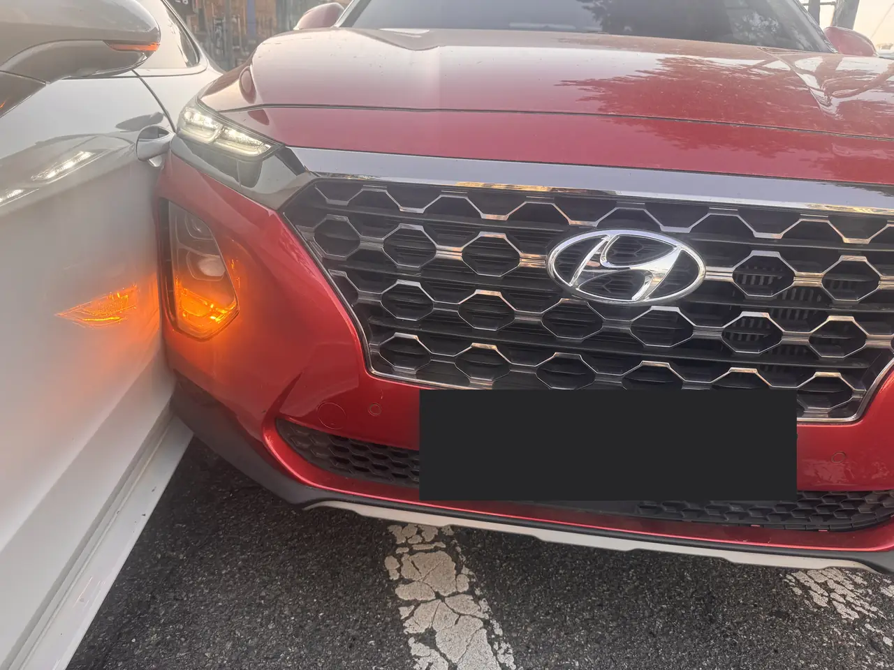

The bumper of your rental is touching another car, both sets of hazard lights
are going, and the car you've made contact with is a Porsche. Your Korean is
not good enough for this. Traffic is going around you.

Here is the part nobody tells you before they hand over the keys: **you are
not expected to sort this out yourself, and the single most useful phone call
is not to the police.** It's to whoever is carrying the insurance on the car
you're driving.

Further down is the settlement statement from exactly this collision —
photographed above, both cars still driveable — which came to **₩13,887,050 — just under US$10,000**.
That number is the reason the rest of this article matters.

*Minor contact, mid-junction, early evening · ⓒ @BalliBalliSeoul*

## First, the only question that changes everything

**Is anyone hurt?**

If yes — or if you aren't sure — call **119** for an ambulance. If no, treat
it as an insurance matter rather than an emergency.

But note the wording. *Nobody is hurt right now* is not the same as *there
will be no injury claim*. In the settlement below, an injury claim was paid
for one person after a collision that looked, at the roadside, like nothing
at all. Keep that in mind every time you're tempted to handle this privately.

**112** is the police. You do not need them for every scrape, and in Korea
most minor damage-only collisions are settled between insurers without
officers attending. Call 112 if someone is injured, if the other driver won't
give you their details, if you suspect they've been drinking, or if the other
party is behaving in a way that worries you. Both numbers have interpretation
support — we've written up
[how the 112 and 119 lines actually work in English](/blog/korea-emergency-numbers-112-119/).

What you must not do is drive away. Under Korean traffic law a driver
involved in a collision has to stop, help anyone injured, and give their
details to the other party. Leaving the scene of an accident where someone is
hurt is treated as a serious criminal offence in Korea, not a paperwork slip.
Never leave a scene because you're embarrassed or can't communicate.

## Then: the one call that does the work

This is the whole article, so it gets its own two lines.

> **Driving a rental car?** Call the **rental company's accident line** — the
> number is on your rental agreement, on a sticker in the glovebox or on the
> windscreen, and usually in the app you booked with.
>
> **Driving your own car, and you live here?** Call **your own insurance
> company's accident line** — the number on your insurance card.

Then do what they tell you.

This is genuinely how it works in Korea, and it surprises people who've had
accidents elsewhere. The rental company already holds the insurance on that
vehicle. Once you report it, **they take over**: they'll tell you whether to
wait, they can dispatch someone, they deal with the other party's insurer,
and they arrange the repair and any replacement vehicle. Korean insurers also
send a field agent to the scene as a normal part of the service, so on many
roadside collisions somebody whose job this is turns up while you're still
standing there.

Your job at that point shrinks to three things: don't leave, don't agree to
anything, and give the other driver your details.

## What a light touch actually cost

The photographs above are the entire accident. A front corner against
bodywork, both cars driveable, everyone standing in a junction wondering who
to ring.

This one was the second case — a resident driving on their own Korean policy,
rather than a rental. Here is their insurer's own settlement statement, and
below it the same figures in English.

*The insurer's settlement statement — broken down in English below · ⓒ @BalliBalliSeoul*

It lists three separate claims.

*Figures are taken from that statement. Dollar amounts are
converted at **₩1,440 = US$1** and rounded to the nearest dollar, so a column
may differ by a dollar from its rows.*

| Claim | Covers | Paid | ≈ USD |
|---|---|---|---|
| **Injury** — 대인, 1 person | Medical treatment and injury compensation | ₩1,512,780 | $1,051 |
| **Property damage** — 대물 | The other car | ₩11,679,960 | $8,111 |
| **Own vehicle** — 자차 | The driver's own car | ₩694,310 | $482 |
| | **Total paid by the insurer** | **₩13,887,050** | **$9,644** |

Just under **US$10,000**, for a contact that left both cars driveable and
everyone standing up.

### The other car's bill, itemised

| Line | Amount | ≈ USD |
|---|---|---|
| Repair — 수리비 | ₩7,844,240 | $5,447 |
| **Replacement car hire — 대차료** | **₩2,667,460** | **$1,852** |
| Transport — 운반비 | ₩156,910 | $109 |
| Deduction — 공제액 | −₩44,240 | −$31 |
| VAT — 부가세 | ₩1,055,590 | $733 |
| **Total** | **₩11,679,960** | **$8,111** |

Two lines deserve attention.

**The hire car cost a third of the repair.** ₩2,667,460 — about $1,852 — on
top of the repair itself. While the damaged car sits in the workshop, its
owner is entitled to a comparable replacement, and that is billed per day. A
long repair on an expensive car therefore generates a second bill that has
nothing to do with the damage. This is the line nobody budgets for, and on a
prestige car it is the line that scales.

**An injury claim was paid for one person: ₩1,512,780, about $1,051.** At the
roadside, this looked like a no-injury incident.

### The driver's own side

| Line | Amount | ≈ USD |
|---|---|---|
| Repair — 수리비 | ₩818,760 | $569 |
| Deduction — 공제액 | −₩5,750 | −$4 |
| VAT — 부가세 | ₩81,300 | $56 |
| **Excess, paid by the driver — 자기부담금** | **−₩200,000** | **−$139** |
| **Insurer paid** | **₩694,310** | **$482** |

So on the day, the driver's own cash outlay was the **₩200,000 excess — about
$139.** Insurance absorbed the other ₩13.7 million. What comes next is the
renewal premium, which is the part you find out about months later — and the
reason Korean drivers weigh up whether to claim at all on genuinely small
damage.

## Do not settle it at the roadside

The instinct — especially when the other car is expensive — is to make it go
away. Someone suggests a number, cash changes hands, everyone drives off.

Look at that total again, then don't.

**Had this driver handed over a few hundred thousand won at the scene to keep
it quiet, they would have been personally exposed to the ₩13.9 million that
followed** — including an injury claim that did not exist at the roadside and
a hire-car bill that ran for as long as the repair took. There is no version
of a cash settlement that protects you from what arrives later.

- **Don't admit fault.** In Korea the **과실비율 (gwasil biyul)** — the fault
  ratio — is worked out between the insurance companies afterwards, from
  evidence, and is very often split rather than all-or-nothing. What you say
  while adrenaline is running has no business deciding it.
- **Don't accept or offer cash.** A private settlement removes the insurer
  you've already paid for, and leaves you unprotected if the other party
  returns later with a bigger claim — or an injury claim.
- **Don't let anyone tell you it's cheaper to keep it off the books.** For a
  rental that isn't yours to decide: damage has to be reported to the rental
  company regardless.

Exchange details, report it, let the professionals argue about percentages.

> **Stuck at the roadside with a phone call you can't make?** Message us on
> [WhatsApp](https://wa.me/821075191282) — we'll ring the rental company or
> the other driver's insurer and translate it live. First answer is free.

## Photograph it before anything moves

Korean cars almost all have a **블랙박스 (beullaekbakseu)** — a dashcam — and
the footage usually settles the argument. But it points forward, so it may
not have seen what you need it to see. Take your own photos, and take more
than feels necessary:

*Get in close on the actual contact point · ⓒ @BalliBalliSeoul*

- **The two cars where they stopped**, from far enough back that the lane
  markings and the junction are visible
- **The contact point, close up**, on both cars
- **Both number plates**, and the other driver's licence and insurance details
- **The wider scene** — signals, road markings, the direction each car was
  travelling
- **Anything unusual** — a wet road, a blocked sign, roadworks

Given how much of the bill above was decided after everyone went home, the
five minutes you spend here is the best-paid five minutes of the whole day.

If there are witnesses, ask for a phone number before they leave. In practice
they leave quickly.

## Then move the car

Once it's documented, **get out of the traffic lane.** A stopped car in a
Seoul junction at rush hour is its own hazard, and Korean drivers will go
around you at a speed that makes standing beside your car unpleasant.

Hazards on, photos taken, then pull to the shoulder or the nearest safe spot.
If the car isn't drivable, stay well off the carriageway — not between the
two cars, and not standing in a live lane while you make your phone call.

## The rental version of the same bill

If the car is a rental, the claim doesn't reach you as the table above. It
reaches you as your rental agreement, and these four terms decide how much of
it lands on you:

| Term | What it means for you |
|---|---|
| **자차 / CDW** | The basic damage waiver. Caps what you owe on damage to the rental |
| **자기부담금** | Your excess — what you still pay even with the waiver, per incident |
| **완전자차** | The "full" version sold to reduce that excess, often to zero |
| **휴차보상료** | Loss-of-use. What the rental firm charges for the days their car earns nothing |

That last one is the same idea as the **₩2,667,460 대차료** line above, seen
from the other side of the counter — and a basic waiver may not cover it.
**Ask your rental company how they calculate it** rather than assuming. Terms
vary by company and waiver level, so the only numbers that matter are the ones
on your own agreement.

The short version: the waiver you clicked past at booking is the difference
between an inconvenience and a very bad week.

## The Korean part

Everything above is straightforward until it has to happen in Korean.

The rental company's accident line may or may not have an English speaker
free at that moment. The other driver almost certainly doesn't speak English,
and is as tense as you are. The insurance agent who arrives will work quickly
in Korean with the other party while you stand there guessing. And later
there's a repair estimate, a fault ratio and a settlement statement like
the one broken down above, all arriving as Korean documents.

None of that changes what you should do. It just makes doing it harder alone.

That's the part we handle. If you're at a roadside and the call has to happen
in Korean — the rental company, the other driver's insurer, a tow, or just
finding out what the agent standing in front of you is actually saying —
[send it to us](/etc) and we'll make the call and translate it live.

And if you're still deciding whether to drive here at all, the honest answer
for most visitors staying inside Seoul is that you don't need to: our
[guide to getting around Seoul](/blog/seoul-transportation-guide/) covers when
a car is worth it and when it's the slow, expensive option.
