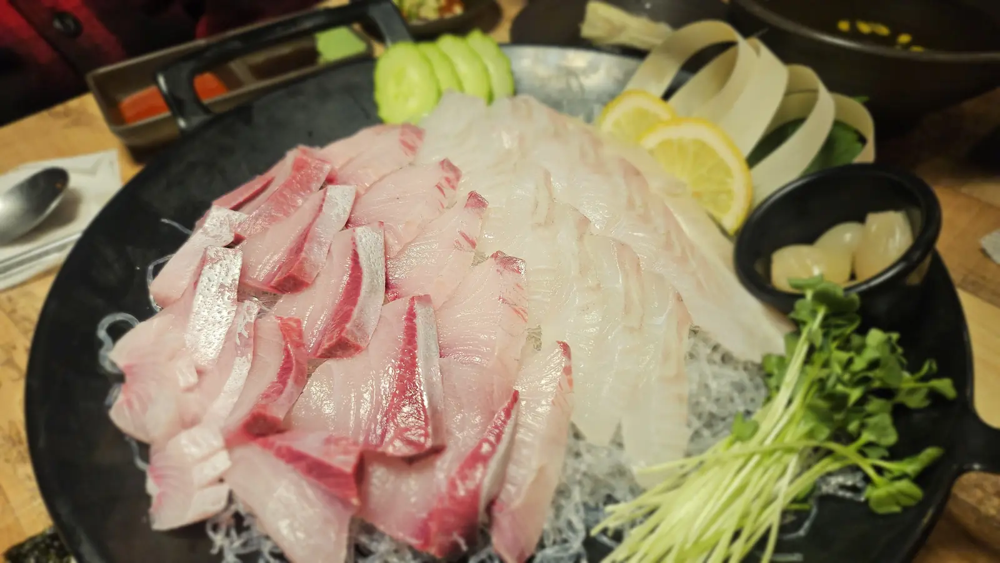
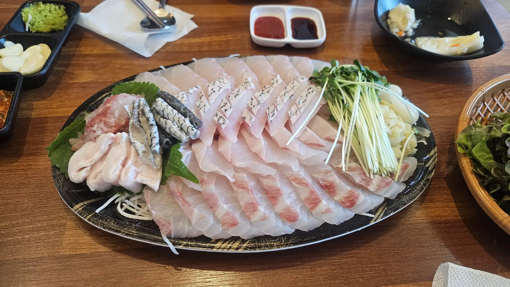
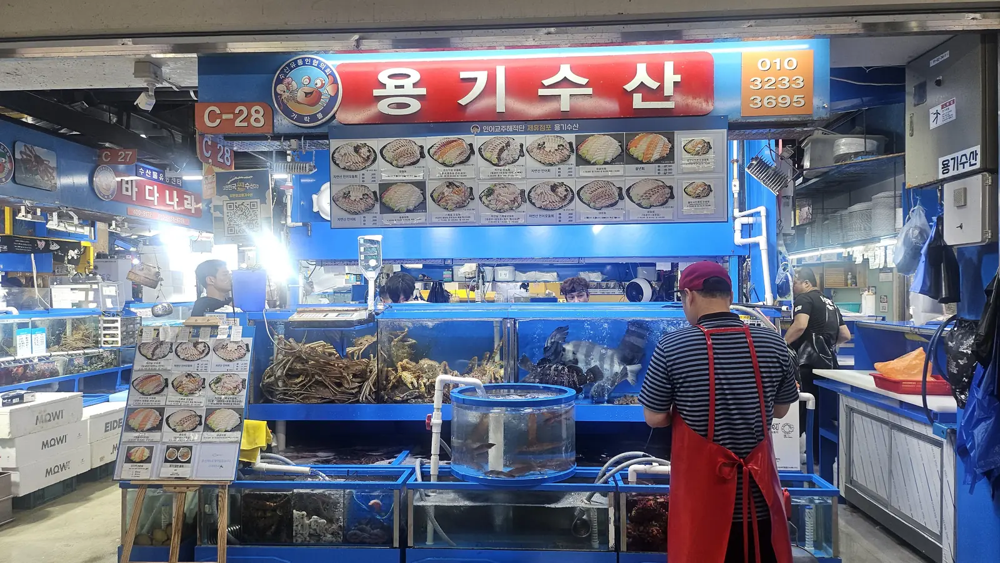
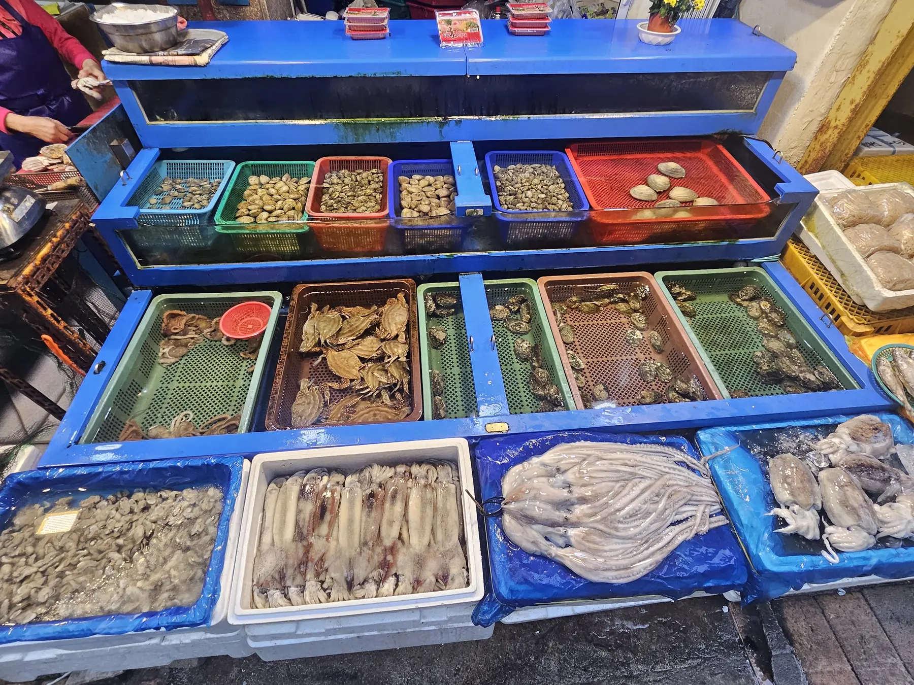
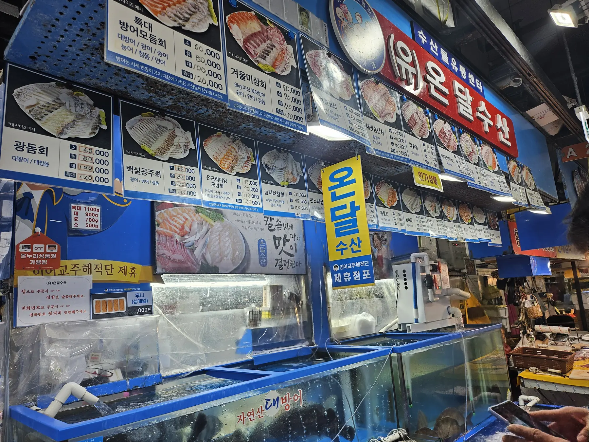
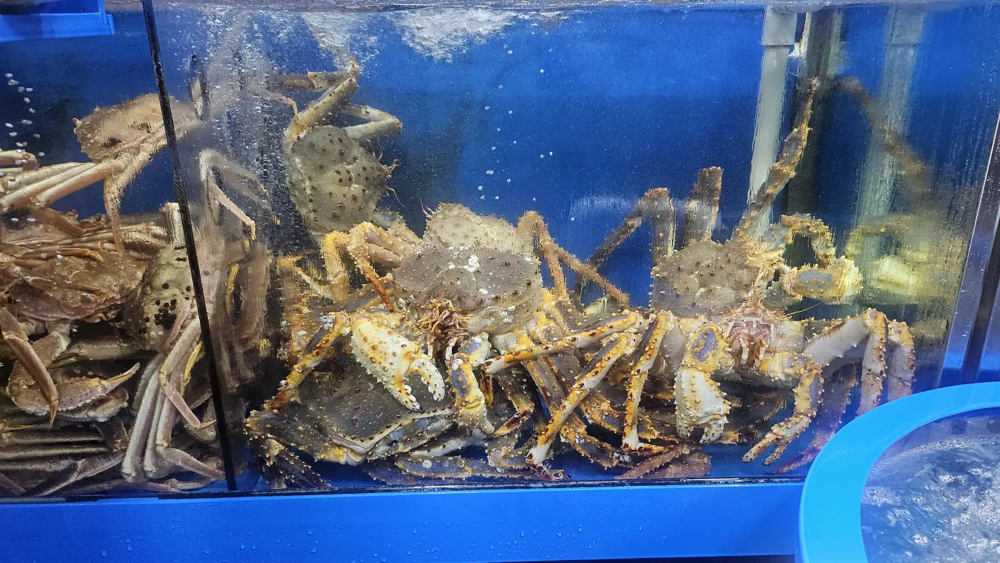
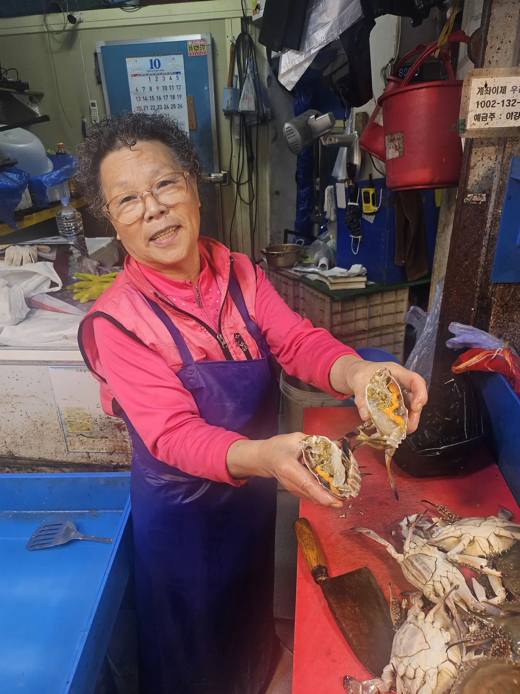
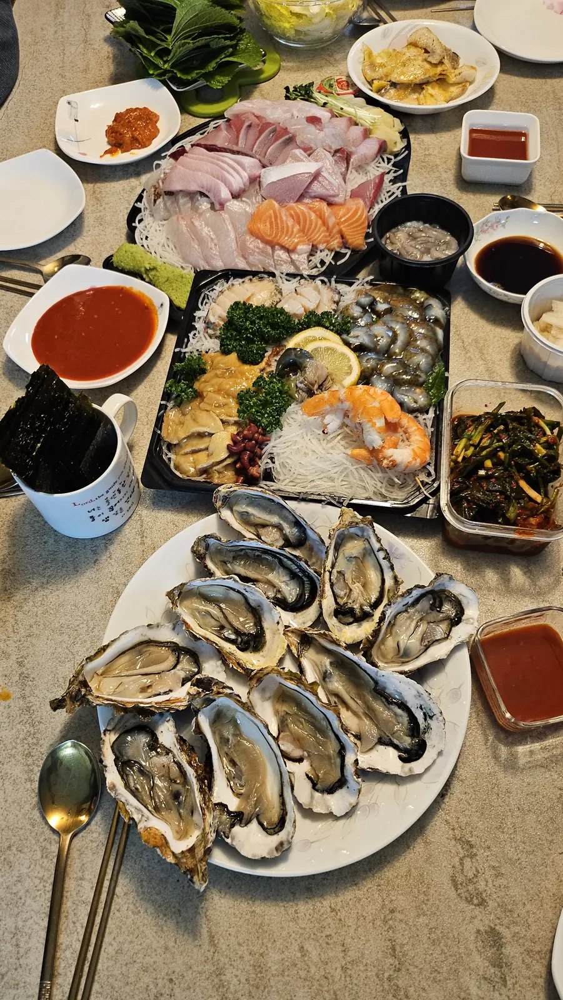
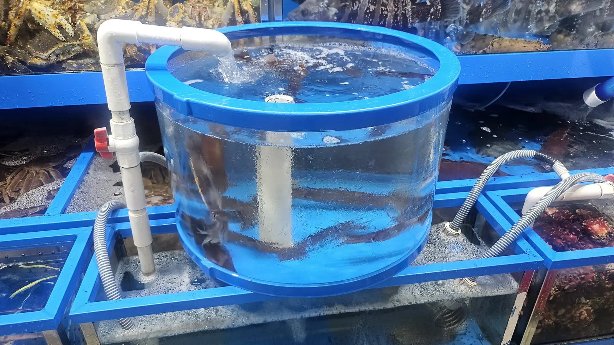
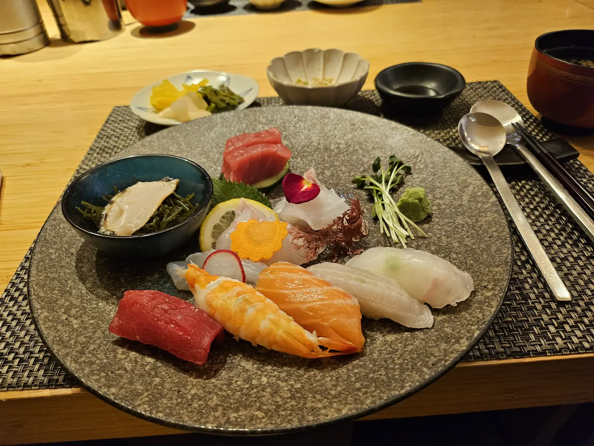

You searched for sushi in Seoul, and you will find it — Korea has
plenty of good Japanese restaurants. But it is not what Koreans eat
when they want raw fish, and it is not where the value is.

What they eat is **hoe (회)**: raw fish, sliced thick, no rice
underneath, eaten with a garlic-and-chilli dip and a lettuce leaf.
And the best way to have it is not a restaurant at all. It's a
**fish market**, where you choose the fish alive and eat it fifteen
minutes later.

## Sushi, sashimi, hoe — the difference in one paragraph

- **Sushi** is rice. Vinegared rice, with fish on top or rolled
  inside. Japanese.
- **Sashimi** is fish without rice, sliced thin, usually eaten with
  soy sauce and wasabi.
- **Hoe (회)** is the Korean version of the second one — and it is
  its own thing. Cut **thicker and chewier**, prized for texture as
  much as flavour, and eaten with **chogochujang (초고추장)**, a
  sweet-sour red chilli dip, as often as with soy sauce. It is
  usually wrapped in a perilla or lettuce leaf with garlic and
  green chilli.

If you order "sashimi" in Korea you will get hoe, and if you were
expecting the delicate Japanese version, the thickness is the first
surprise.

*Thick cuts, no rice, and the fish is the whole point · ⓒ @BalliBalliSeoul*

*One platter, shared, with the dips and the leaves · ⓒ @BalliBalliSeoul*

## Which market: it depends where you're sleeping

Seoul has two big wholesale fish markets that welcome the public,
and the right one is simply the one nearer your bed. Nobody should
cross the whole city for this.

| If you're staying in… | Go to | Get off at |
| --------------------- | ----- | ---------- |
| **Songpa-gu or anywhere in eastern Seoul** — Jamsil, Gangdong, Olympic Park | **Garak Market (가락시장)** | **Garak Market Station**, Line 3 or Line 8 |
| **Central Seoul, Gangnam, Yeongdeungpo, Mapo** | **Noryangjin Fish Market (노량진 수산시장)** | **Noryangjin Station**, Line 1 or Line 9 |

Both do the same thing. Noryangjin is the famous one, so it is
busier and more used to tourists; Garak is enormous, more of a
working market, and considerably closer if you are on the east
side of the river.

Both are on the subway, which is the only sane way to arrive —
[the lines, decoded](/blog/seoul-subway-lines-guide/) if you are
still working out the colours.

## How it actually works

This is the part that stops people at the door, because it does not
look like a restaurant and there is no host to seat you.

**1. Walk the aisles.** Stalls run in numbered rows, each with tanks
out front and a photo menu above. The fish are alive.

*Tanks at the front, photo menu above — you can order by pointing · ⓒ @BalliBalliSeoul*

*It is not only fish — shellfish and squid are sold the same way · ⓒ @BalliBalliSeoul*

**2. Point at what you want.** The photo menus exist precisely
because nobody expects you to name fish in Korean. Prices are
usually given by **platter size — 소 / 중 / 대 (small, medium,
large)** rather than per person, so tell them how many people are
eating and let them size it.

One word worth knowing: **자연산 (jayeonsan) means wild-caught**, as
opposed to farmed, and it costs more. If a board distinguishes the
two for the same fish, that's what the difference is.

## What it actually costs

Here is a real price board, photographed at a Seoul stall in
**August 2026**. Mixed-platter sets (모듬회, *modeum-hoe* — several
species on one plate) cluster tightly:

| Platter size | Typical mixed platter | Premium sets |
| ------------ | --------------------- | ------------ |
| **소 (small)** | **₩60,000** | ₩70,000–75,000 |
| **중 (medium)** | **₩80,000** | ₩90,000–95,000 |
| **대 (large)** | **₩100,000** | ₩110,000 |
| **특대 (extra large)** | **₩120,000–130,000** | ₩130,000–140,000 |

**Now the part that makes those words mean something.** The same
board defines the sizes by the weight of fish you get:

| Size | Weight of fish |
| ---- | -------------- |
| 소 | **500 g** |
| 중 | **700 g** |
| 대 | **900 g** |
| 특대 | **1,100 g** |

That is the single most useful thing on the wall, and almost nobody
translates it. It turns "small/medium/large" from a guess into
arithmetic: **500 g feeds two, 700 g feeds two hungry or three,
900 g feeds three to four, 1,100 g feeds four or five.** Order by
the gram count, not by the adjective.

*Prices by platter, sizes by gram — the blue circle is the key · ⓒ @BalliBalliSeoul*

Two caveats the board itself gives you:

- **Seasonal fish is market-priced.** Next to the yellowtail sets,
  the sign says plainly that the price moves with the market and to
  ask the owner. Anything in season works this way — take the
  posted number as indicative, not fixed
- **The platter is not the whole bill.** Add the upstairs charge
  below, and drinks

**Last verified: 2026-08-17.**

**3. Prices are negotiable-ish.** This is a market. You will not
haggle a stall down by half, but asking for a better price on a
larger order is normal and nobody is offended.

**4. They kill and slice it there**, and then — the part visitors
don't expect — **you take it upstairs.** The markets have eating
halls above or beside the stalls that plate your fish, give you the
table, the dips, the side dishes and the drinks, and charge a
separate **seating or preparation fee per person.** Budget for that
on top of the fish; it is not a scam, it is how the system works.

*Crab is the other reason people come — priced by weight, live · ⓒ @BalliBalliSeoul*

*Ask, and you get shown. This is a market, not a shop · ⓒ @BalliBalliSeoul*

## What arrives with it

Order a platter and a whole meal materialises around it without
being asked for. Expect:

- **Side dishes (반찬)** — free and refillable, as everywhere in
  Korea
- **Leaves, garlic, green chilli, and both dips** — the soy-wasabi
  and the red chogochujang
- **Maeuntang (매운탕)** at the end — a spicy stew made from the
  bones and head of the fish you just ate, usually for a small extra
  charge. **Say yes.** It is the point of the whole exercise for a
  lot of Koreans, and throwing that frame away is the actual waste.

If the "no server comes to your table" part is unfamiliar, the
rest of the Korean restaurant system is
[in our guide](/blog/korean-restaurant-how-it-works/).

*What one platter turns into once you sit down · ⓒ @BalliBalliSeoul*

*Everything is alive until you order it · ⓒ @BalliBalliSeoul*

## Practical

- **Go for lunch or early evening.** These are wholesale markets —
  the trading floor runs at hours that have nothing to do with
  dinner, and stalls thin out late.
- **Wear shoes you don't mind getting wet.** Floors are hosed down
  constantly.
- **Cash is not required** but is smoother at small stalls.
- **Two people can share one medium platter** and still be full
  after the stew.
- **Squeamish?** Look away at step 4. The fish is alive when you
  choose it, and it is not hidden.

## And if you actually did want sushi

Nothing above is an argument against sushi. Korea has a deep
Japanese-restaurant scene, from conveyor-belt places to omakase
counters where a chef hands you one piece at a time, and it is very
good.

*The other option, and a perfectly good one · ⓒ @BalliBalliSeoul*

Just know you are buying a different product. A sushi counter sells
**craft** — rice temperature, cure, cut, one piece at a time — and
prices accordingly. A fish market sells **freshness and volume**,
and hands you a kilogram of fish on a plate. Sitting down at a
market stall is the cheaper hour of the two, by a wide margin.

Both are worth doing. If you only have one dinner in Seoul, the
market is the one you cannot get at home.

## The Korean part

Pointing works, and stallholders at both markets deal with foreign
customers constantly. Where it gets harder is the middle: agreeing
what you're paying before the knife comes out, understanding what
the upstairs fee covers, and being sure the "recommendation" you
just accepted is the fish you wanted rather than the one they need
to move.

> **Want to eat this without guessing at the numbers?** Message us
> on [WhatsApp](https://wa.me/821075191282) — our
> [anything-else concierge service](/etc) will tell you which market
> is nearest you, what a fair price looks like for what you're
> being offered, and translate the negotiation while you're standing
> there. First answer is free.

## Get it sorted

The one-line version: **skip the sushi counter, take the subway to
whichever fish market is on your side of the city, point at a photo,
give them a group size, expect a separate upstairs charge — and
order the stew at the end.**

