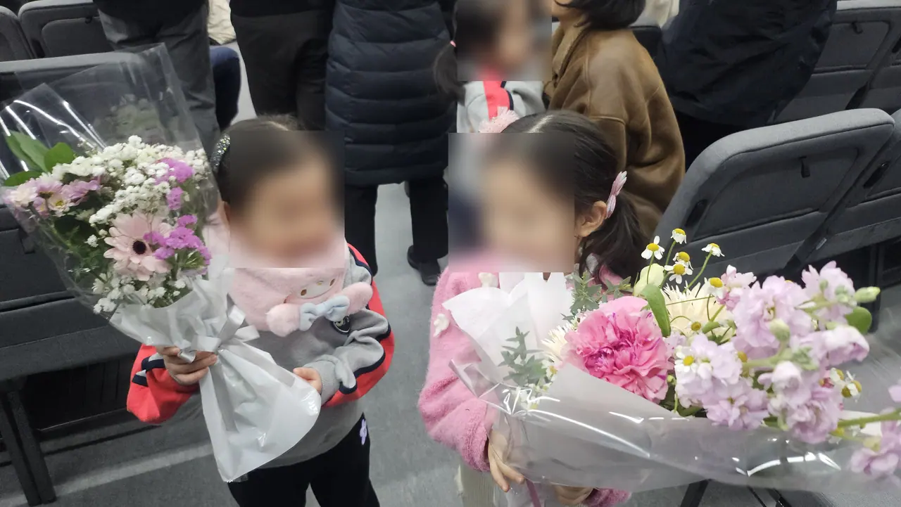
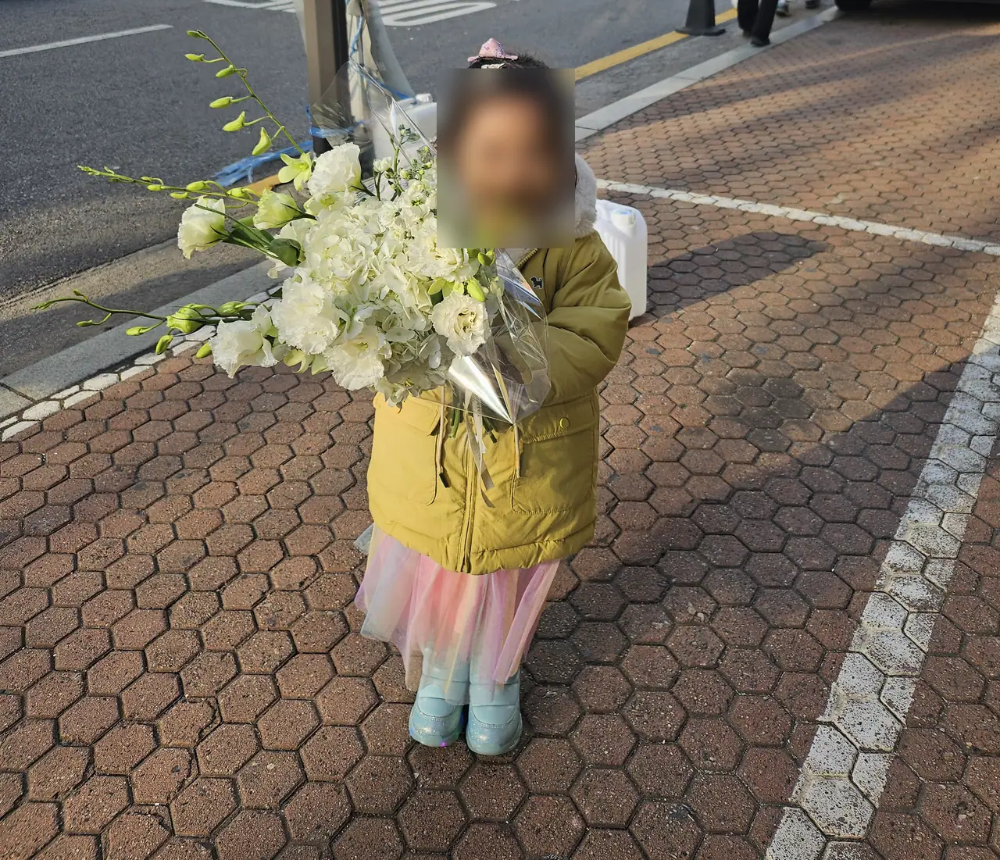
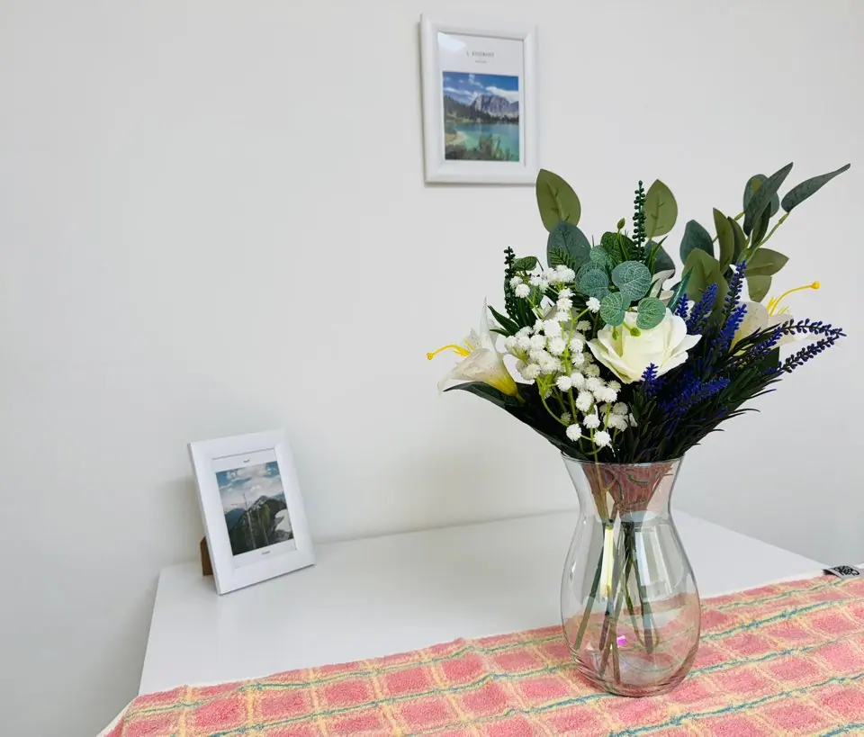

You want to send flowers to someone in Korea. You find a florist's site,
you get as far as the payment screen, and it stops — a box asking for a
Korean phone number, or a card that is declined without explanation.

That is the part everyone writes about. It is also the smaller problem.
The bigger one is that a Korean flower order asks you for things a
Western one does not, and getting those wrong is more visible than
paying late.

## The ribbon carries the message

Look at the cover photo. Two ribbons, written vertically, and between
them they do the entire job of a greeting card.

**The right ribbon is the message.** In this case 득남을 축하드립니다 —
*congratulations on the birth of your son.* **The left ribbon is the
sender**, a company name here, which is why it is blurred.

This is the single biggest difference from sending flowers in most
Western countries. There is no little envelope. The florist writes your
line onto the ribbon, in Korean, in a fixed set of forms, and the
recipient reads it from across the room before they look at the flowers.

A few standard openings, so you can recognise what you are being offered:

| Occasion | The line usually starts |
| --- | --- |
| Opening a business | 축 발전 · 축 개업 (*wishing you growth / congratulations on opening*) |
| Promotion, new post | 축 승진 · 축 영전 |
| A birth | 득남을 / 득녀를 축하드립니다 (*a son / a daughter*) |
| Funeral | 근조 (謹弔) — **never 축, and never bright colours** |

Two practical consequences. **Your name goes on the ribbon**, so decide
how it should be written in Korean before you order, not while a florist
waits on the phone. And **do not compose your own poetry.** These are set
phrases; an unusual one reads as a mistake rather than as warmth.

## When Koreans actually give flowers

The occasions are not the same ones you are used to, and the calendar is
tighter.

*Graduation and entrance ceremonies are the volume months · ⓒ @BalliBalliSeoul*

**Ceremonies, above all.** Graduations and entrance ceremonies —
kindergarten through university — are when the largest number of
bouquets change hands, clustered in February and early March. Family
turn up with a wrapped bouquet, photograph the child holding it, and
that photograph is the point.

**어버이날, 8 May.** Korea has one Parents' Day rather than separate
Mother's and Father's Days, and the flower is specifically the
**carnation**. This is the single busiest flower day in the Korean year.

**스승의 날, 15 May** — Teachers' Day, traditionally also carnations.
**Check before you send one.** Since the anti-graft act (청탁금지법) many
schools ask that teachers not accept gifts from individual students, and
a bouquet arriving from a parent can put the teacher in an awkward
position rather than a pleased one. A flower from the class as a whole,
handled openly by the school, is the usual workaround.

**Openings, promotions, births, funerals.** These are where the tall
three-tier wreaths (화환) and basket arrangements go — sent to a business
address or a funeral hall rather than a home, and read as a formal
gesture from a company or a family.

What is comparatively rare is the Western habit of sending flowers to
someone's house for no particular reason. Korean bouquets are mostly
handed over in person, at an event, to be held.

## What a Korean order asks for

Have these ready before you start, because the form will stop at the
first one you are missing.

**The recipient's mobile number.** Not optional, and this surprises
people most. The driver calls or texts on arrival — Korean delivery
assumes contact, not a doorstep drop. Without a number the order often
cannot be placed at all.

**A road-name address** (도로명주소), plus building and unit. For a
funeral, the hall and room number instead. For an opening, the shop name
is often more reliable than the address.

**A time window, and who will be there.** A bouquet delivered to an empty
office at 6pm is a bouquet in a corridor overnight.

**The ribbon wording and your name in Korean**, as above.

**A photograph on delivery, if you want proof.** Many florists will send
one to the person who ordered. Ask when you book — it is normal, but it
is not automatic, and asking afterwards is too late.

*Bouquets get carried home, so size matters more than you'd think · ⓒ @BalliBalliSeoul*

## What it costs

Guide ranges as of 2026 — florists price by flower type and by the day,
and both move.

| Item | Typical |
| --- | --- |
| Hand-tied bouquet, everyday | From around ₩20,000–25,000 |
| Bouquet, gift-wrapped for a ceremony | Roughly ₩50,000 and up, delivery included |
| Three-tier congratulatory wreath (축하화환) | About ₩65,000–105,000 |
| Premium standing wreath | ₩170,000–205,000 |
| Three-tier funeral wreath (근조화환) | About ₩90,000–105,000 |
| Five-tier funeral wreath | Around ₩257,000 |

**Two dates break these numbers**: 8 May, and graduation season. Prices
rise and same-day slots disappear. If the date is fixed and known, order
several days out.

## Why checkout fails from abroad

Here is where most attempts die, and the reason is usually not the card.

**The wall is identity verification, not payment.** Korean platforms
gate sign-up behind SMS verification on a **Korean** mobile number
(the PASS system). If you gave up your Korean number when you left, you
are stopped before you reach a payment screen at all.

**Coupang does take overseas cards — but you have to find the option.**
It is not the default card path: in the app you pick 기타결제 (other
payment) and then 해외 신용카드 (overseas credit card). Choosing the
domestic-card route with a foreign card gets an immediate rejection that
looks like your bank's fault and isn't. There is also a separate Coupang
Global section aimed at international cards and overseas addresses.
We cover the wider ordering flow in
[the Coupang guide](/blog/coupang-korea-shopping-guide/).

**KakaoTalk Gift has opened partway.** Kakao has extended 선물하기 to
some overseas numbers and added foreign-card payment in beta, but it
still expects a KakaoTalk account, and that account normally wants a
Korean number behind it.

**Naver is the most stubborn.** There is no guest checkout, Naver Pay
wants a verified Korean identity on the account, and foreign cards that
do get through often fail at the 3-D Secure step.

**All of this changes.** Every platform has been loosening these rules a
little each year, so treat the paragraph above as the position in 2026
and try the overseas-card path before assuming it is hopeless.

The workaround most people land on is the one that has always worked:
**phone a florist directly.** Neighbourhood shops take bank transfer or a
card over the phone, they will do same-day, and they do not care whether
you have a Korean app account. The obstacle there is that the call
happens in Korean.

*What arrives usually outlives the occasion by about a week · ⓒ @BalliBalliSeoul*

## If you're the one receiving them

Korean bouquets come wrapped in cellophane with a water pouch at the
base. Cut the wrapping off the same day, trim the stems at an angle, and
change the water every two days — cellophane is for the journey, not for
the vase.

## The Korean part

Everything above is doable in Korean and difficult without it. The call
is short but specific: the occasion, the ribbon wording, the recipient's
number, a delivery window, and whether the venue will accept a wreath at
all — funeral halls and some office buildings have rules about this.

## Get it sorted

If the flowers are the easy part and the Korean is not, that is what we
do. We are not a florist and we do not hold stock. We call local shops,
put your ribbon line into the form it needs to take, confirm the address
and the timing, and tell you what it will cost before anything is
ordered — the same way we handle everything else on
[the anything-else list](/etc).

We take no commission from any florist. Whichever shop ends up making it,
we earn the same, which is the only reason we can tell you honestly when
a ₩25,000 bouquet is the right answer.

If you would rather do it yourself and just need someone on the line,
Korea's free living-information hotline interprets three-way calls —
see [the 1330 guide](/blog/korea-travel-hotline-1330/). Finding a
florist near the recipient is easiest on a Korean map app, covered in
[the Kakao Map guide](/blog/kakao-map-korea/).
