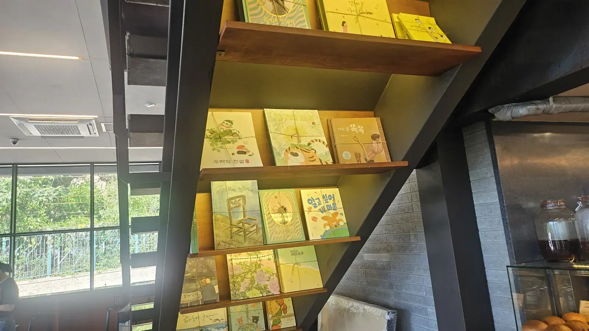
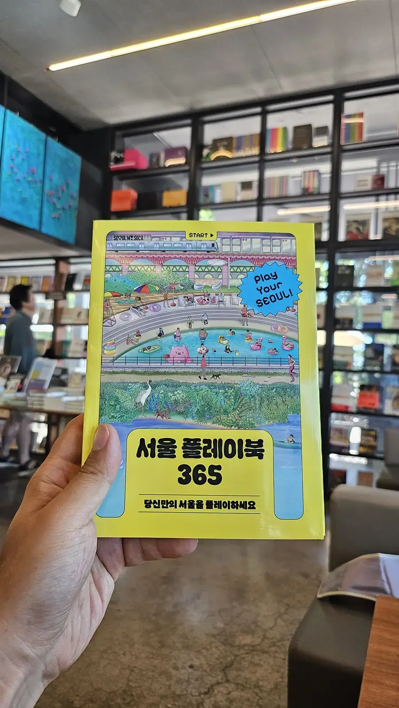
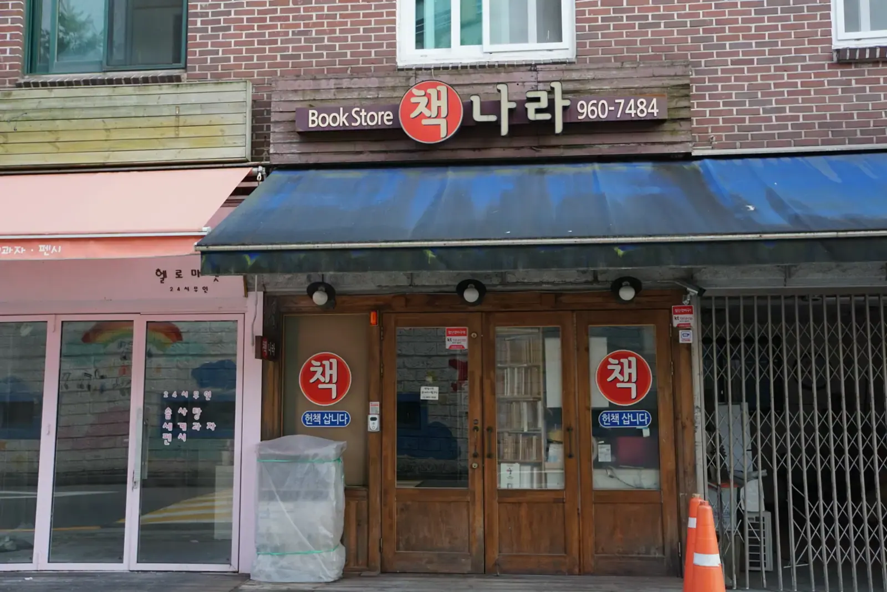

Let's deal with the obvious objection first: **you can't read the books.**
Ninety-something percent of what's on those shelves is in Korean, and no
amount of enthusiasm changes that.

Go anyway. A Seoul book cafe is one of the best free-ish rooms in the
city — quiet, cold in August, full of natural light, and run on the
understanding that **nobody is going to ask you to leave.** What you do
there just isn't quite reading.

## The format: a bookstore you're allowed to sit in

The thing to understand is that this isn't a cafe with a decorative
shelf. It's usually **a working bookshop with a coffee counter inside
it**, and the seating is the point rather than an afterthought — sofas,
long tables, window seats looking onto trees.

You buy a drink, you sit, and you can pull things off the shelf while
you do. The unspoken deal is the same one that governs
[every cafe in this country](/blog/korea-cafe-culture-guide/): one
americano buys you the table for as long as you want it, and staff will
not hover.

*Even the underside of the stairs is shelving · ⓒ @BalliBalliSeoul*

## What's actually there for you

More than you'd guess, once you stop looking for novels.

- **Art, photography and design books.** Entirely language-independent,
  and Korean publishers are very good at them. This is the single best
  reason to go.
- **The English section.** The big chains carry one — usually
  bestsellers, language-learning and a rotating literary shelf. Smaller
  independent shops may have a single case, or none.
- **Stationery, which is half the shop.** Korean bookstores sell pens,
  notebooks and desk objects at a level that turns sceptics into
  collectors. No Korean required to appreciate a good pen.
- **Magazines**, including imported ones, which are the easiest thing to
  browse over a coffee.
- **Children's books**, which are ideal if you're learning the language —
  large print, simple sentences, pictures doing half the work.

And occasionally something like this, which is genuinely aimed at you:

*Seoul activity books turn up on the display table · ⓒ @BalliBalliSeoul*

Guides and activity books about Seoul itself — the kind with maps,
neighbourhood walks and things-to-do checklists — sit on the front
tables, and a lot of them lean on illustration rather than text. Some
carry English alongside the Korean. They're worth a flip even if you
only take the map.

## The other kind: secondhand bookshops

At the opposite end of the spectrum from the glass-and-timber places is
the **헌책방 (heon-chaekbang)** — the secondhand bookshop, usually a
narrow room with a shutter, stacked to the ceiling, run by someone who
knows exactly where everything is despite all evidence to the contrary.

*책 on the door means books — and 헌책 means used ones · ⓒ @BalliBalliSeoul*

You will not be browsing these for English literature. Go for the
atmosphere, the prices, and occasionally a genuinely good find in art or
photography. **Bring cash**, expect no card reader, and don't expect
anyone to speak English — this is a pointing-and-smiling transaction and
it works fine.

Clusters of them survive around older parts of the city; the flea market
end of **Dongmyo** on
[Line 6](/blog/seoul-subway-lines-guide/) is the easiest one to combine
with an afternoon of looking at other people's old things.

## Two words that get you there

Worth memorising, because they aren't interchangeable and a map search
will send you to different places:

- **책방 / 서점** — bookshop
- **북카페** — book cafe, the sit-down kind

Search either in Naver Map or KakaoMap and you'll get what's near you
with opening hours attached. The big chain bookstores — the ones in
basement floors of department stores and malls — are the reliable
default if you want a guaranteed English shelf.

## Why this is a genuinely useful room to know

Beyond the books, a book cafe solves problems that have nothing to do
with reading:

- **August.** It's air-conditioned, it's free to enter, and one drink
  holds the seat. It belongs on the same list as
  [malls and libraries](/blog/ifc-mall-yeouido-heat-escape/) when your
  flat is unbearable.
- **Working.** Fast Wi-Fi, outlets, and a noise level between a library
  and a normal cafe. If you want the paid, silent version of this,
  that's a study cafe — one of the many
  [Korean businesses that rent you a room by the hour](/blog/why-everything-in-korea-is-a-cafe/).
- **Killing two hours somewhere pleasant** without spending real money,
  which is harder in Seoul than it sounds.

## One honest note

Your phone already handles the books. Point a camera at a cover and it
tells you the title; ask any AI what the book is about and it will tell
you that too. We're not going to pretend otherwise, and this is a good
thing — **the language barrier in a bookshop has genuinely been solved.**

What still isn't solved is everything that needs a person: a phone call
in Korean, a shop that only ships to a Korean address, a form that wants
identity verification you can't complete. That's the part
[we do](/etc) — not reading words off a page.

The one-line version: **go for the art books, the stationery, the air
conditioning and the chair — and treat the Korean shelves as very good
wallpaper.** One drink, a whole afternoon, and nobody watching the
clock.
