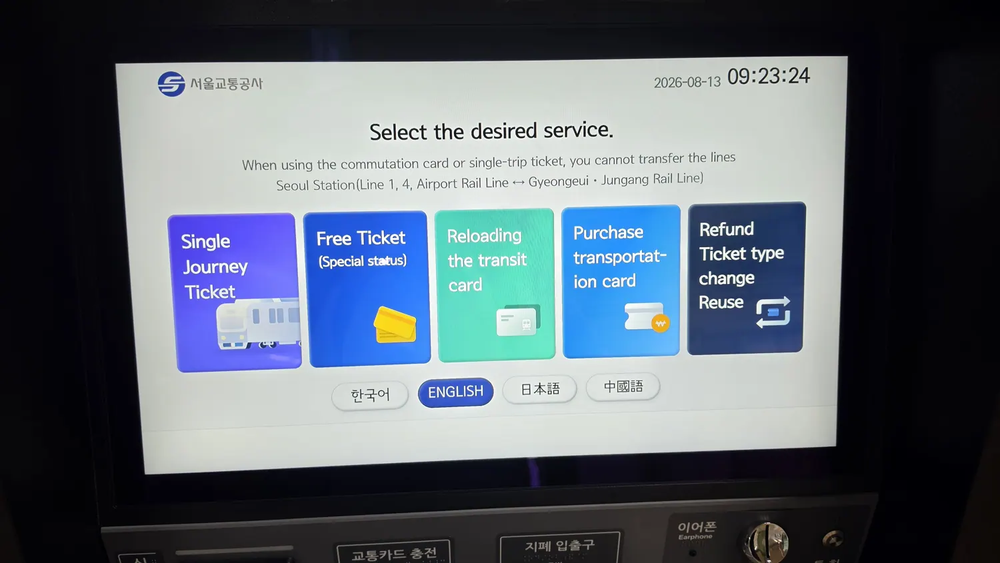

If you have been buying Seoul's **Climate Card (기후동행카드)** —
the unlimited 30-day transit pass — it is going away, and the
window to act is measured in weeks rather than months.

The replacement launches on **1 September 2026** and the naming is
genuinely confusing, so here is the whole thing in order.

## Three names for what is basically one change

This is the part that trips people up, and Seoul's own Q&A leads
with it, which tells you something.

| Name | What it is |
| ---- | ---------- |
| **Climate Card** (기후동행카드) | Seoul's own unlimited monthly pass, launched 2024. **Being wound down** |
| **K-Pass** (모두의카드) | The national scheme. Refunds a share of what you spend, valid **nationwide** |
| **Climate Companion Pass** (기후동행패스) | K-Pass **plus Seoul's own extras**, from 1 September |

So: the city is not replacing its pass with a worse city pass. It
is folding its pass into the national one and bolting its perks on
top. If you already use K-Pass and live in Seoul, **the new
benefits apply to you automatically from 1 September.** You do not
have to do anything.

If you are on a Climate Card, you do.

*The machines run in English — but the Climate Card is no longer among the things they sell you. A notice beside the screen sends you to the i-Center instead · ⓒ @BalliBalliSeoul*

## The dates that actually matter

| Your card | Last top-up | Last day it works |
| --------- | ----------- | ----------------- |
| **Prepaid 30-day** (선불 30일권) | **31 August** | **29 September** at the latest |
| **Postpaid** (후불 기후동행카드) | — | **30 September** |
| **Short-term passes** (1/2/3/5/7-day) | — | **Continuing** |

Two things follow from that table.

**A prepaid card topped up on 31 August still runs its thirty
days** — it just cannot be topped up again. Nobody is cutting your
current month short.

**A postpaid Climate Card does not stop working on 1 October.** It
turns into an ordinary transit card. The travel keeps happening;
the discount stops. That is the failure mode to watch for, because
nothing will tell you it has happened except a fare that no longer
gets refunded.

**The short-term tourist passes are not going anywhere.** If you
are visiting rather than living here, none of this applies to you.

## What you get instead

K-Pass does not sell you unlimited travel. It refunds a share of
what you actually spend, and it picks whichever of three
calculations leaves you paying least.

| | Standard | Youth · senior · 2 children | 3 children | Low income |
| --- | --- | --- | --- | --- |
| **Refund rate** | 20% | 30% | 50% | 53.3% |
| **Flat cap** | ₩62,000 | ₩55,000 | ₩45,000 | ₩45,000 |
| **Flat cap, Plus** | ₩100,000 | ₩90,000 | ₩80,000 | ₩80,000 |

Read the flat cap as a ceiling: spend more than it in a month and
the excess comes back to you. Spend less and the percentage
applies. **The system runs all three and gives you the cheapest**,
so you do not have to work out which you are on.

The **Plus** row is for people whose commute includes the
expensive stuff — the wider metropolitan services that the Climate
Card never covered at all.

### The age change worth knowing

From 1 September, Seoul's definition of **youth stretches from
19–34 to 19–39.** If you are 35 to 39 and live in Seoul, you move
into the youth tier: 30% back under ₩55,000 a month, the youth
flat cap above it.

## There is a discount running out at the same time

Between **1 April and 30 September 2026** there is a temporary
fuel-price measure attached to K-Pass, and it is substantial.

**Refund rates roughly double** during off-peak boarding times —
standard 20% becomes 50%, youth 30% becomes 60%. The off-peak
windows are:

- **Morning:** 05:30–06:30 and 09:00–10:00
- **Afternoon:** 16:00–17:00 and 19:00–20:00

Times are measured when you board.

**The flat caps are halved** for the metropolitan area at the same
time — the standard ₩62,000 becomes ₩30,000, the youth ₩55,000
becomes ₩25,000.

The practical consequence: **switching in August or September is
worth more than switching in October.** Seoul's own answer to
"should I wait until 1 September?" is no — the sooner you move,
the more of this you catch.

## How to actually get one

Three routes, and the registration step is the one people skip.

**Credit or debit card version.** Apply through a card company as
you would for any card, then **register it on the K-Pass site.**
Refunds start the following month.

**Prepaid version.** Buy one at a convenience store, then register
it **twice**: once with the issuer — T-money, Ezl and so on — with
your card number and the account you want refunds paid into, and
again on the K-Pass site.

**Mobile version.** Issued in an app, registered the same way as
the prepaid card.

> **The registration is not optional and it is not automatic.**
> Without your card registered on the K-Pass site, with your
> personal details, there is no refund. You can do it at any point
> in the month — the calculation runs on that month's spending
> either way.

## If you live outside Seoul, read this twice

**The Climate Companion Pass refunds are for Seoul residents.**

If you live in Gimpo, Goyang, Gwacheon, Guri, Seongnam, Hanam or
Namyangju — all places where the old Climate Card worked — the
Seoul benefits are not yours. **Gyeonggi Province runs its own
version, The Gyeonggi Pass (더경기패스)**, and that is the one to
sign up for.

The same shrinkage applies to the surviving short-term passes:
they now cover Seoul and getting off at Incheon Airport, and no
longer stretch to those cities.

This is the single biggest trap in the whole change, because the
card in your pocket will keep tapping in and nothing will announce
that the money has stopped coming back.

## The ₩30,000 payback closes on 31 August

Separately from all of the above: if you charged and used a 30-day
Climate Card between April and June, there is a **₩30,000 payback**
you can claim through the T-money Card & Pay site. **Applications
close on 31 August.**

### The paper route, which is the part written for us

Seoul's own guidance lists the people who cannot realistically
apply online, and **foreigners are named on that list**, alongside
over-65s and people without a Korean simple-authentication method.

For those groups there is a **manual application by post, fax or
email.** Print the form from the T-money Card & Pay site, attach
proof of name, card number, refund account and residence —
**for foreign residents that means a 외국인사실증명서, a
certificate of foreign resident registration** — and send it in.

- **Email:** climate@tmoneycsp.co.kr
- **Fax:** 02-6989-0120
- **Post:** (04535) 서울시 중구 소공로 70 서울중앙우체국 사서함
  2023호 ㈜티머니 기후동행카드 수기환불접수 담당자 앞

It is worth knowing this exists. The online path assumes a
verification method that plenty of foreign residents simply do not
have, and the alternative is not advertised anywhere in English.

## Your old card is worth a coffee, or a new card

Between **1 September and 23 September**, twelve major stations
run swap booths.

**Hand in an expired Climate Card and you get a physical Climate
Companion Pass card in exchange, one for one, free** — a ₩3,000
card for a ₩4,000 one. Already switched? Hand the old card in
anyway and they will give you a coffee or convenience store
voucher for it.

The twelve stations:

- **North of the river:** Seoul Station, Seongsu, Konkuk
  University, City Hall, Yeonsinnae, Nowon, Hongik University
- **South of the river:** Jamsil, Sadang, Seolleung, Yeouido,
  Gasan Digital Complex

Staff at the booths also help older users install the app and
register on K-Pass, which is the fiddly part.

## Still to come

Three things Seoul has said are coming but has not dated
precisely: a **youth discount extended to discharged servicemen up
to 42**, a **Ttareungyi bike-share link**, and **cultural venue
discounts** — the last of which needs a change to city ordinance
first. All are described as arriving within the year.

## The Korean part

Almost none of this exists in English. The Q&A is Korean, the
K-Pass registration is Korean, the issuer's site is Korean, and
the manual refund form is Korean — the form written specifically
for people who cannot manage the Korean online system.

**If you read Korean, go straight to the source.** Everything above
came from the city's own question-and-answer page, and it has more
detail than we have put here — every rate, every date, the card
designs, the lot:
**[서울시 기후동행패스 Q&A](https://mediahub.seoul.go.kr/archives/2019060)**.
It is the authoritative version, and it will be updated before we
are.

> **Stuck on the switch?** Send us a photo of your card or the
> screen you are stuck on. Our
> [anything-else concierge service](/etc) will tell you what it
> says and what to press next, in English. First answer is free —
> message us on [WhatsApp](https://wa.me/821075191282) or
> [KakaoTalk](https://pf.kakao.com/_RJxhSX/chat).

## Get it sorted

The one-line version: **top up a prepaid Climate Card by 31 August
and it runs to 29 September; a postpaid one quietly becomes an
ordinary card on 1 October. Register for K-Pass now rather than in
October, because the doubled refunds end on 30 September — and if
you live outside Seoul, the pass you want is The Gyeonggi Pass, not
this one.**

For what a single journey costs while you sort this out, we keep
[the fare guide](/blog/seoul-subway-fare-guide/) and
[the T-money guide](/blog/t-money-card-korea-guide/) current, and
[the transport guide](/blog/seoul-transportation-guide/) covers
which card to use for what.

*Details from the Seoul Metropolitan Government's
[official Q&A on the Climate Companion Pass](https://mediahub.seoul.go.kr/archives/2019060), as of August
2026. Dates and rates change — check with the city or T-money
before planning around them.*
