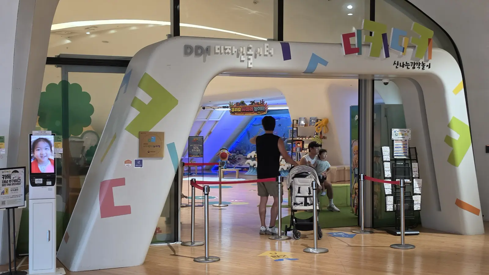
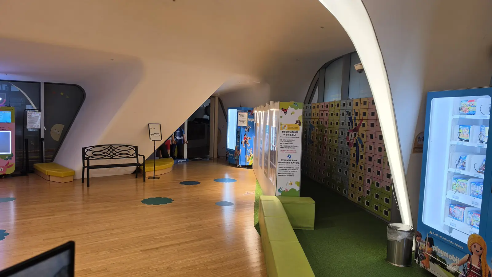
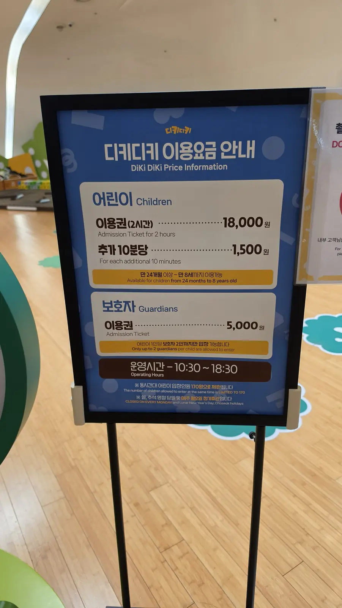
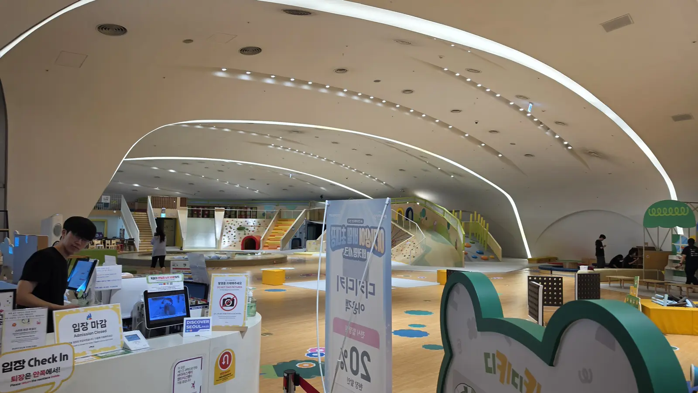

It is 35°C outside, or it has been raining since breakfast, and you
have a four-year-old in a hotel room in Seoul. What Korean parents
do at this point is go to a **kids cafe (키즈카페, *kideu kape*)** —
an indoor playground you pay to enter by the hour. There is almost
certainly one within two subway stops of you.

The concept is common enough here that nobody explains it, which is
how foreign parents end up turned away at the door for reasons that
had nothing to do with them.

## What a kids cafe actually is

It is not a cafe with a play corner. It is a **large indoor
playground** — slides, climbing walls, ball pits, building blocks,
role-play areas — with a kitchen and coffee counter attached for
the adults.

Three things make it different from a playground back home:

- **You pay to get in**, per child, for a fixed block of time
- **The adult pays too**, at a lower rate
- **It is fully enclosed and air-conditioned**, which is the entire
  point in August and in December

The bigger ones sit inside malls, department stores and cultural
complexes, so you are never far from food, toilets and a place to
park a stroller.

*Most are tucked inside a larger building rather than standing alone · ⓒ @BalliBalliSeoul*

## The rules that catch foreign parents out

### There is an upper age limit

This is the one that ruins afternoons. Kids cafes are licensed and
insured for a specific age band, and staff enforce it. A typical
band runs from around **24 months to 8 years old**. If you have a
ten-year-old, they are not getting in, however small they are.

There is a lower limit too — many places will not admit children
who cannot yet walk.

### Guardians buy a ticket, and there is a cap on guardians

You are not dropping the child off. An adult must stay, and that
adult pays an entry fee of their own.

Less obvious: there is usually a **maximum number of guardians per
child** — commonly two. If you have arrived as a family group of
two parents plus grandparents, part of your group may have to wait
outside. Worth knowing before everyone takes their shoes off.

### Shoes off — and check the sock rule, because it varies

Shoes come off at the entrance and go into a **shoe cabinet
(신발장, *sinbaljang*)**. These cabinets frequently have no lock,
and the notice on the wall will say plainly that the venue is not
responsible for anything that goes missing. Do not leave your good
trainers in one.

Then the part that surprises people: **the sock rule is not the
same everywhere.** Many Korean play spaces require socks on at all
times. Others require the opposite — the venue we photographed asks
you to **take the child's socks off**, in English on the sign,
because bare feet grip better on wooden floors and climbing
surfaces than socks do.

*"Please remove children's socks for safe play" — the opposite of what most parents expect · ⓒ @BalliBalliSeoul*

Carry a clean pair of socks for the adults anyway. Some venues want
grown-ups in socks even where children go barefoot, and no one
wants to buy emergency socks at a convenience store.

## How much does a kids cafe cost in Seoul?

Prices are per session, not per day, and the clock starts when you
check in. Overtime is billed in small increments rather than being
waved through.

As a planning number, **two hours for one child and one adult lands
around ₩20,000–₩30,000** across most of Seoul, with mall-based and
premium venues higher. Food is extra, and so is anything past your
booked block.

Two things quietly change what you pay:

- **Discover Seoul Pass** is accepted at some venues — if you are
  already carrying one for the palaces, check before you pay cash
- **Messenger-channel discounts** are everywhere in Korea. Adding
  the venue's KakaoTalk channel for a percentage off is standard
  practice, not a scam

## The DDP playground: prices, ages and hours

Here is one worked example, because a real price board beats a
range. The **Dongdaemun Design Plaza (DDP)** — the Zaha Hadid
building in Dongdaemun — has an indoor playground inside it, signed
**DDP 디자인놀이터 (DDP Design Playground)** and run under the name
**디키디키 (DiKi DiKi)**.

| Ticket | Price |
| ------ | ----- |
| Child, 2 hours | **₩18,000** |
| Each additional 10 minutes | **₩1,500** |
| Guardian | **₩5,000** |

| Detail | |
| ------ | --- |
| Age band | **24 months to 8 years** |
| Guardians | **Up to two per child** |
| Opening hours | **10:30–18:30** |
| Closed | **Every Monday**, plus the days of Seollal and Chuseok |
| Capacity | **170 children at a time** |
| Payment | Cards; **Discover Seoul Pass accepted** |

**Last verified: 2026-08-14.** Prices and hours at any single venue
change without much notice, so treat this as the shape of the
market and confirm before you travel across the city for it.

*Price boards are often bilingual, even where nothing else is · ⓒ @BalliBalliSeoul*

Getting there is the easy part: DDP has its own subway station
served by **lines 2, 4 and 5**, and the
[colour-coded line system](/blog/seoul-subway-lines-guide/) makes
it one of the simpler places in Seoul to reach. The station exits
bring you up inside the complex.

**Come by subway if you can.** Driving means the underground car
park, and **parking is charged separately from your admission
ticket.**

There is a way to avoid it, with a catch. The playground will issue
a voucher for **up to two hours of free parking** — but only if you
spend **₩50,000 or more** on food and drink inside. That is a high
bar for one family and one child, so the maths only works if you
were already planning to eat a full meal there. Ask at the counter
and hold on to your receipt.

On a busy weekend the garage fills, and once it does, simply
getting in becomes the problem before you have reached the door.
With a pushchair and a small child in the car, that is not the
start to an afternoon you want.

## Do you need to book, or can you just turn up?

Two operational details decide whether your trip works.

**They cap how many children are inside at once.** Fire and safety
rules mean a hard ceiling at every venue. When it fills, a sign
goes up at the counter reading **입장 마감 (*ipjang magam*) /
Admission Closed**, and that is the end of the conversation until
someone leaves.

*"입장 마감 / Admission Closed" — the sign you do not want to arrive to · ⓒ @BalliBalliSeoul*

Weekends, school holidays and rainy afternoons are exactly when
every other parent has the same idea. Go at opening time, or go on
a weekday.

**Many close one day a week, and Monday is the usual one.** Museums
and cultural venues in Korea overwhelmingly close on Mondays, and
playgrounds inside them follow suit. Add the day-of closures for
**Seollal** and **Chuseok**, the two big lunar holidays, when a
large share of the country shuts entirely.

## Can you eat inside a kids cafe?

Yes, and it changes the plan. Most have a real kitchen, and you
order from the counter or a tablet at your table — so a two-hour
session can absorb lunch or dinner instead of ending in a hunt for
a restaurant with a tired toddler in tow.

What is typically on the menu:

- **볶음밥 (*bokkeumbap*)** — fried rice. The reliable order for a
  child who is suspicious of everything else
- **치킨 (*chikin*) and chips** — Korean fried chicken and fries,
  and the thing most foreign children will actually finish
- **떡볶이 (*tteokbokki*)** — chewy rice cakes in a red sauce, and
  **this one is usually spicy.** Korean children grow up on it;
  children who have never met gochujang often cannot eat it. Ask
  before you order it for a four-year-old
- **Ice cream and slush drinks** — which is what the two-hour mark
  reliably turns into

Now the honest part: **expect venue pricing.** You are ordering
inside a ticketed room with no competition on site, and the prices
reflect that — noticeably more than the same dish at a normal
restaurant down the street. It is the cinema-popcorn rule, applied
to fried rice.

Whether that bothers you is a budget question, not a value one. Eat
before you arrive and keep the in-house order to ice cream at the
end, or accept the markup for the considerable luxury of feeding
everyone without putting shoes back on.

One exception worth doing the sums on: if you drove to DDP, the
₩50,000 spend that unlocks two hours of free parking is easier to
justify when it also covers lunch.

## The Korean part

Almost everything above is posted on a sign somewhere in the
building. The problem is that the *price* board is bilingual and
the *rules* board frequently is not, so the information you most
need — age bands, guardian caps, whether today is a closing day,
whether they are already full — is the part that stays in Korean.

The food menu is the same story. Ordering often runs through a
Korean-only tablet or kiosk, and "is this spicy?" is exactly the
question you cannot afford to get wrong for a small child.

Phone lines are worse. Small venues answer in Korean only, and
"are you full right now?" is not a question a translation app
handles well in a noisy room.

> **Not sure whether a place will take your child's age, or whether
> it is open today?** Send us the name or a link on
> [WhatsApp](https://wa.me/821075191282) and our
> [anything-else concierge service](/etc) will call and ask, in
> Korean, and tell you in English. First answer is free.

For more ways to get a family out of the weather, our guide to
[escaping the heat at IFC Mall](/blog/ifc-mall-yeouido-heat-escape/)
covers the same problem from the mall side.

## Get it sorted

The one-line version: **budget around ₩20,000–₩30,000 for two hours
for one child and one adult, check the age band before you travel
across town, expect to pay for yourself too, take shoes off and
read the sock sign, do not turn up on a Monday, and know that you
can eat there if you are willing to pay venue prices.**

Get those right and the weather stops being your problem for an
afternoon.
