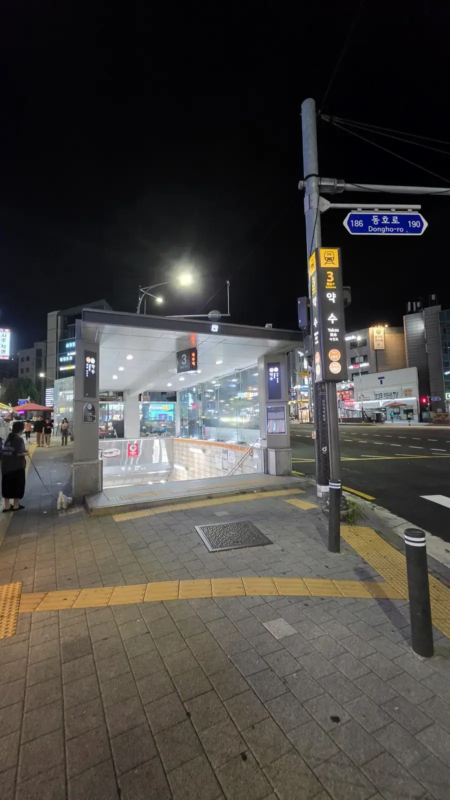
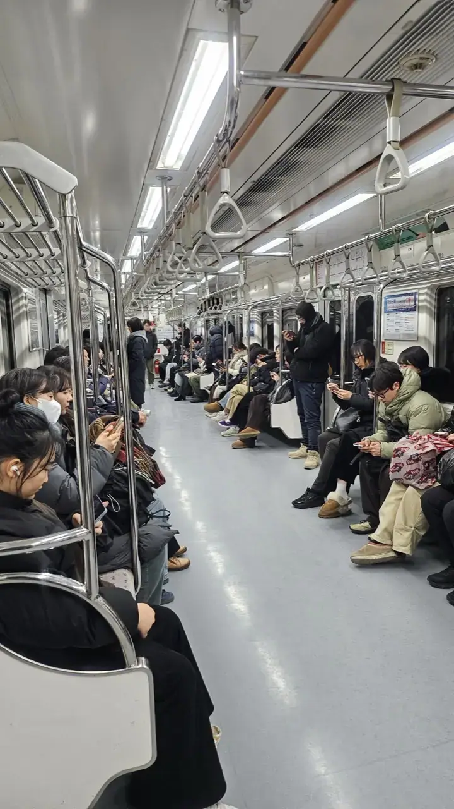

The Seoul subway map looks like a bowl of neon noodles the first time you
see it — twenty-plus lines, hundreds of stations, nine million daily
rides. But you don't need the whole map. You need to know what each colour
*does*, because in Seoul, **the line you live on shapes your life more
than the district you live in.** Here's the cheat sheet.

## The system is colour plus number

Before the lines themselves, the thing that makes Seoul navigable even
when you can't read a word of Korean. Look at any station entrance:

Three badges, three colours, three numbers — and the station name in
Korean, English, Chinese and Japanese. **Green 205 means Line 2, station
5. Blue 422 means Line 4, station 22.** The first digit is the line; the
rest is the station's position on it.

**Say the number, not the name.** "Two-two-two" gets you to Gangnam when
"Gangnam" does not, and it works with a taxi driver, a ticket machine or
a stranger. Once that clicks, the neon noodles stop mattering — you only
ever need one colour and one number at a time.

## The colours, at a glance

| Line | Colour | What it's for |
| ---- | ------ | ------------- |
| **2** | Green | The loop. Gangnam, Hongdae, Sinchon, Seongsu, Jamsil |
| **1** | Dark blue | The old spine, north–south. **Branches — check the destination** |
| **3** | Orange | Palaces, Bukchon, Insadong, then Apgujeong |
| **4** | Light blue | Myeongdong, Dongdaemun, Seoul Station |
| **5** | Purple | Gwanghwamun, Yeouido, out to Gimpo Airport |
| **6** | Brown | Itaewon, Hangangjin, Noksapyeong — the international circuit, plus Dongmyo |
| **7** | Olive | East-side connector, skirting downtown |
| **8** | Pink | Jamsil and the southeast |
| **9** | Gold | **Express trains.** Gimpo Airport to Gangnam |

The rest of this article is what those rows mean in practice.

## The lines that run your life

**Line 2 (green) — the loop.** The single most important piece of
infrastructure in your Seoul life. It circles the city core and hits
almost everything: Gangnam, Hongdae, Sinchon, Seongsu, Konkuk, Jamsil,
City Hall. Jobs, nightlife and universities cluster along it, which is
why "near Line 2" is the first filter in every apartment hunt — and why
it's packed at rush hour.

**Line 1 (dark blue) — the elder.** Korea's first line (1974), running
enormous distances north and south of the city, through Seoul Station and
old downtown. Useful, historic, and famously confusing for newcomers —
it branches, and boarding the wrong destination train is a rite of
passage. Check the train's final destination, not just the line.

**Line 3 (orange) — the culture line.** Gyeongbokgung and Anguk (the
palaces, Bukchon, Insadong), then across the river to Apgujeong and the
Express Bus Terminal. Tourist days mostly happen here.

**Line 4 (light blue)** — Myeongdong, Dongdaemun, Seoul Station: the
shopping-and-transit spine, and reliably full of luggage.

**Line 5 (purple)** — Gwanghwamun offices, Yeouido (finance and The
Hyundai mall), and all the way to Gimpo Airport.

**Line 6 (brown) — the expat line.** Itaewon, Hangangjin, Noksapyeong
(the Haebangchon side) — the foreigner-neighborhood circuit — plus World
Cup Stadium. If your social life is international, you'll memorize this
one fast.

It also carries **Dongmyo**, which has quietly become one of the most
foreigner-heavy stops on the network for a reason that has nothing to do
with expat bars: the **flea market** spilling out around the station.
Racks of secondhand and vintage clothing sold by the piece for a few
thousand won, plus old records, watches and assorted junk, over streets
that look like nothing else in Seoul. Go on a weekend, bring cash, and
expect to dig. (Dongmyo is also on **Line 1**, so it's an easy transfer
from the old downtown spine.)

**Line 7 (olive)** — the east-side connector, threading Konkuk and
Cheongdam toward the northeast without touching downtown.

**Line 8 (pink)** — the southeast shuttle: Jamsil (Lotte World and the
mall), Songpa's apartment seas, and onward past the city edge. Short,
uncrowded by Seoul standards, and exactly what it needs to be.

**Line 9 (gold) — the express.** Gimpo Airport to the Gangnam corridor,
with Seoul's best trick: **express trains (급행)** that skip stations and
cut journeys nearly in half. Red on the platform display means express —
check whether your station has express service, and brace: it's the most
crowded line in the city at rush hour.

## The suburban cast

- **Sinbundang (red)** — a fast, slightly pricier private line from
  Gangnam down to Pangyo (tech-job land) and Suwon.
- **AREX** — Incheon Airport into the city.
- **Gyeongui–Jungang** — the scenic river-hugging line across the north
  bank; lovely, but trains come less often, which matters more than
  you'd think.
- **GTX-A** — the new high-speed regional line, turning far suburbs like
  Dongtan into commutable territory.

## Reading the system like a local

- **Stations are numbered** (Gangnam is 222: Line 2, station 22) — when
  a name won't stick, the number works in any language.
- **Transfers are legs, not steps**: some interchange walks run several
  hundred meters. Naver or Kakao Map's route planner accounts for it;
  your intuition won't.
- **Last trains run around midnight**, earlier on Sundays — and the last
  *useful* train is earlier still if you need a transfer. Miss it and
  you're in [taxi territory](/blog/seoul-transportation-guide/).

*After midnight this is just a lit staircase to nowhere · ⓒ @BalliBalliSeoul*
- The official English map and route planner live on
  [Seoul Metro's Cyber Station](http://www.seoulmetro.co.kr/en/cyberStation.do)
  — good for orientation, though the map apps win for daily use.

*Seats full, aisle clear — this is a quiet carriage by Seoul standards · ⓒ @BalliBalliSeoul*

- Etiquette in one line: let people off first, stand right on escalators
  (mostly), and the marked seats stay empty for those who need them.
- **Rush hour is real**: 7:30–9 AM and 6–7:30 PM turn Lines 2 and 9 into
  a full-contact sport. Shifting a commute by thirty minutes changes
  your quality of life more than most apartment upgrades.

## The Korean part

Where the subway meets Korean-only reality: choosing which line to live
on — the question hiding inside every housing decision — deciphering
service-change notices taped up in Korean, and the apps' Korean-first
corners. For the "which line should I live on for a
commute to X" question specifically — that's a five-minute answer for
us, and we give it free through our
[anything-else concierge service](/etc). For fares, cards and the rest
of the system, our
[Seoul transportation guide](/blog/seoul-transportation-guide/) covers
the mechanics.

## Get it sorted

> **Planning where to live around a commute — or just lost at
> Sindorim?** Message us on [WhatsApp](https://wa.me/821075191282) with
> your two anchor points, and we'll tell you which lines and
> neighborhoods make your life easiest. First answer is free.

Learn Line 2 first, respect Line 1's branches, and find out if Line 9's
express stops near you. That's ninety percent of Seoul subway mastery —
the neon noodles sort themselves out from there.
