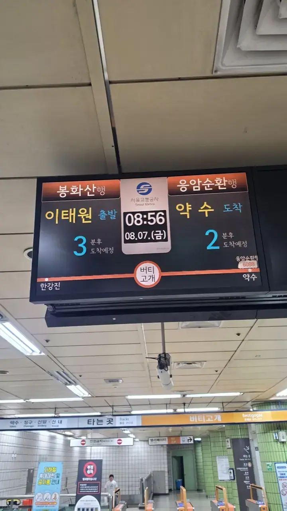
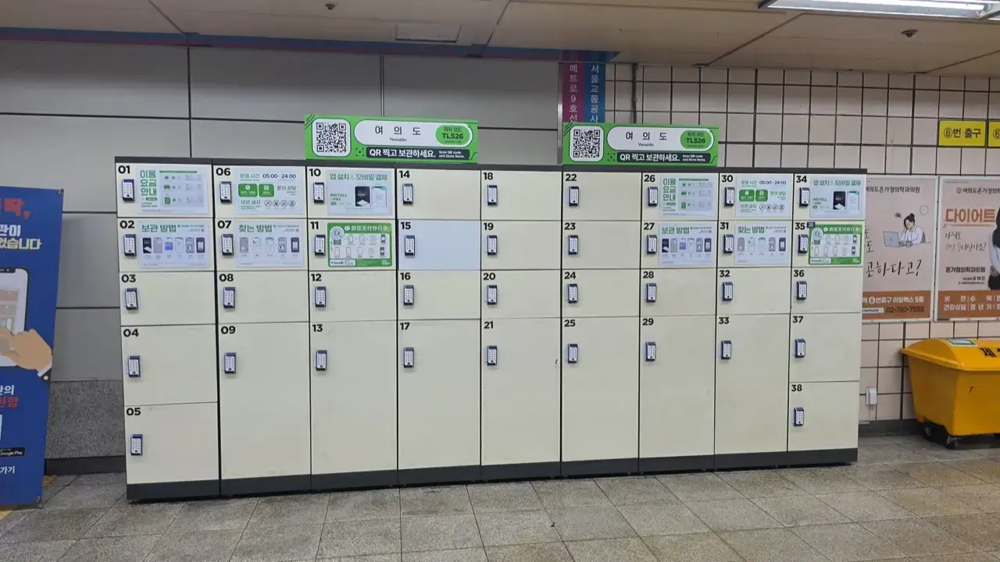
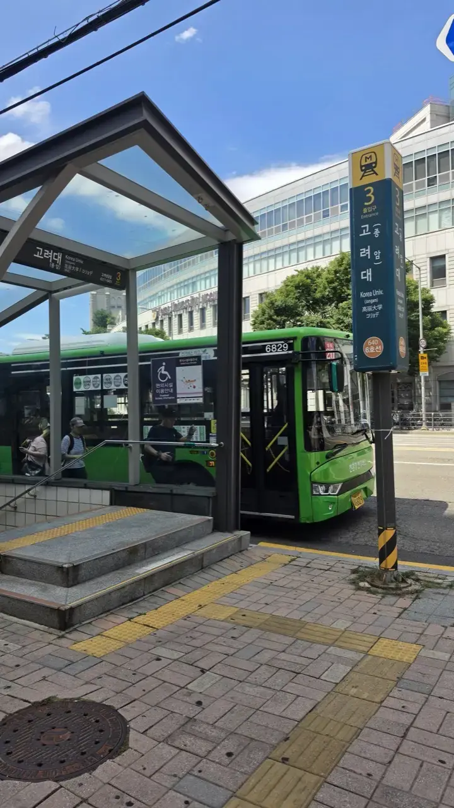

A visitor put the whole question on
[r/seoul](https://www.reddit.com/r/seoul/comments/1k7u5ua/best_transportation_method_in_south_korea_for/)
better than we could:

> *"I'm a 29-year-old Saudi man, and my wife and I are planning a
> 6-day trip… I was thinking about using Uber for most of our
> transportation, but it sounds like it might be expensive or not as
> common as in other countries… Would you recommend sticking to
> public transport? Are taxis affordable and easy to hail? Is there
> a better ride-hailing app than Uber that locals use?"*

Every one of those questions has a clean answer, and they don't all
point the same way. Here's the whole thing, in the order you'll
need it.

## Short answer: which one, when

| Situation | Use | Why |
| --------- | --- | --- |
| Anywhere in Seoul, daytime | **Subway** | Fastest, cheapest, fully signed in English |
| Short hop with luggage, heat or rain | **Taxi** | Cheap by global standards, door to door |
| **After midnight** | **Taxi or night bus** | The subway stops. This is the big one |
| Two of you, a couple of kilometres | **Taxi** | The maths flips — see below |
| Airport | **AREX train or limousine bus** | Bus wins with big suitcases |
| Day trip to another city | **KTX or the metro network** | Depends how far — see below |
| Crosstown at rush hour | **Subway**, always | Roads lose to rails, decisively |

The rest of this article is why.

## The card that runs all of it

Everything except long-distance rail runs off one tap card,
**T-money**, which you buy at any convenience store for a few
thousand won and top up — **in cash at a shop counter, or by card
at a station machine, which accepts foreign ones**. It covers subway, every bus,
taxis, and even snacks at the till — and it's what unlocks **free
transfers** between bus and subway, which is the single biggest
saving in the system.

We wrote that up separately, in detail:
**[the T-money card, and why transfers are the point](/blog/t-money-card-korea-guide/)**
— including the monthly passes, which are mid-restructure in 2026
and worth reading before you commit to one.

Everything below assumes you have the card.

## The subway: your default

Base fare is **₩1,550** for an adult with the card, rising in small
increments with distance — we've broken the whole thing down, including
the youth and child rates and a 20% discount before 6:30am, in our
[guide to Seoul subway fares](/blog/seoul-subway-fare-guide/). Signs,
announcements and ticket machines are all in English, and **every station
has a number** — so "Line 2, station 222" gets you there even when the
name defeats you.

*Arrival boards count down in minutes, on every platform · ⓒ @BalliBalliSeoul*

Two things worth internalising:

- **Trains run roughly 5:30 a.m. to around midnight. There is no
  overnight subway.** Plan your night around that or plan on a taxi.
- **Google Maps barely works here.** Korean law restricts the export
  of detailed map data, so driving directions are largely missing
  and even transit routing is patchy. Install **Naver Map** or
  **KakaoMap** — both have English modes, live arrivals, and will
  even tell you which carriage to board for the fastest exit.

Stations also have **coin lockers**, which quietly solve the
"checked out of the hotel, flight is at nine" problem:

*Left luggage, by the hour, in most larger stations · ⓒ @BalliBalliSeoul*

And if the bag went the other way — left on the train rather than in
a locker — Seoul Metro runs **four separate lost property offices,
split by line.** Which number you call depends on which train you
were on, and the car-and-door marker on the platform is what makes
the search findable:
[how to get it back](/blog/lost-item-seoul-subway/).

## Buses: read the colours

The colour of a Seoul bus tells you its job:

| Colour | What it does |
| ------ | ------------ |
| **Blue** | Trunk routes across the city on main roads |
| **Green** | Local routes and feeders to subway stations |
| **Red** | Express to suburbs and satellite cities |
| **Yellow** | Short downtown circulators |
| **N** | "Owl buses" — through the night on major corridors |

*Green means local — and this one is a subway feeder · ⓒ @BalliBalliSeoul*

**Tap on when you board and tap again when you get off.** The exit
tap is what preserves your transfer discount; skip it and you can be
charged the maximum fare. Buses are effectively **cash-free** now, so
without the card you aren't riding.

The **N buses** deserve their own line. When the subway is asleep and
it's raining and every taxi is taken, an owl bus on a main corridor
is the answer nobody tells visitors about.

## Taxis, Uber and Kakao T

Now the part the Reddit poster actually asked about.

**Uber in Korea is not the Uber you know.** It doesn't run a private
driver fleet here — it dispatches **licensed Korean taxis** through
the app you already have. Which is good news: Seoul's taxi fleet is
enormous, clean and cheap, and Uber just gives it an interface you
can read.

Three reasons it's the usual recommendation for visitors:

- **No Korean verification wall.** Your existing account and your
  foreign card work — the barrier that blocks foreigners from most
  Korean apps isn't there.
- **Romanised search works.** Type "hongdae" and it finds it. No
  Hangul, no dropping pins in a language you can't read.
- **The destination travels in the app**, so the language gap
  mostly stops mattering.

### The meter is sacred — and it never counts heads

Before anything else, the rule that decides how you should travel
here:

> ## **A Korean taxi charges by distance. Never per person.**
>
> One fare per ride. Four people pay exactly what one person pays.
> There is no "per head" price, no group rate, no negotiation, and
> nothing to haggle over — the meter runs on distance and time, and
> that is the entire fare.

If your taxi instincts came from Bangkok, Manila or Cairo — agree a
price first, watch for the per-person "special price", pad 30% for
the tourist tax — you can put all of it down. None of it applies.

That single fact is why the maths below works out the way it does:
**the more of you there are, the cheaper a taxi gets per head**,
while the subway charges every one of you separately. It's the
opposite of the instinct most visitors arrive with.

Two more things that follow from it:

- **No tipping.** Not in taxis, not anywhere —
  [the full explanation is here](/blog/no-tipping-in-korea/).
- **The payment method doesn't change the number.** Card, cash,
  T-money or in-app, you pay what the meter says.

The one scam vector left is the freelance **"taxi?" man in the
airport arrivals hall** — an unlicensed van, not a taxi, with no
meter and no rules. Walk past him to the official rank.

### What it should cost — and how to check

This is the anxious question, so here is the actual arithmetic. A
Seoul taxi meter, as of 2026:

| Component | Rate |
| --------- | ---- |
| **Base fare** | **₩4,800** for the first 1.6 km |
| Distance after that | ₩100 per 131 m |
| Time, when crawling under ~15 km/h | ₩100 per 30 seconds |
| Tolls | Added on top — normal, not a scam |
| **Passengers** | **Irrelevant. One to four people, same fare.** |

**The surcharges are where the surprises live**, and knowing them
kills most "was I ripped off?" anxiety:

| When | Surcharge |
| ---- | --------- |
| **22:00–04:00** | Late-night surcharge applies |
| Seoul / Gyeonggi plates | **+20%** |
| Incheon plates | **+30%** |
| Late night **and** crossing a city boundary | Surcharges can **stack** — reportedly to as much as +60% in the worst case |

That last row explains the ride people complain about online: a
1 a.m. airport run crosses from Incheon into Seoul at night, so it
can cost dramatically more than the same trip at 2 p.m. **The meter
isn't lying to you; the rules changed at 10 p.m.**

For a distance anchor: **Incheon Airport to southern Seoul —
roughly 62 km — runs about ₩50,000–60,000 in daytime**, before
tolls. Somewhere closer, like Hongdae, is less. At 1 a.m. it is
meaningfully more.

> ### Not sure what your ride should cost?
>
> **Tell us the route and the time — "Incheon Airport to Hongdae,
> landing 1 a.m." — and we'll tell you roughly what the meter should
> read, and what it should *not*.**
>
> [Message us on WhatsApp](https://wa.me/821075191282). If you've
> already taken the ride and the number felt wrong, send us the
> receipt and we'll read it. **Free — this one is just so nobody
> gets fleeced.**

### Uber vs Kakao T

| | Uber | Kakao T / K.Ride |
| --- | --- | --- |
| Signing up as a visitor | Existing account works | K.Ride: email + card |
| Foreign cards | Reliable | Now registerable; "pay in car" as fallback |
| Search in Latin letters | ✅ | Mostly wants Hangul or a pin |
| Fare shown | Estimated range | Exact fare upfront |
| Outside Seoul | Thinner | **Stronger nationwide** |

**The playbook most travellers land on: Uber as the main app in
Seoul, Kakao T or K.Ride installed as backup — and flip that outside
the capital**, where Kakao's network is deeper. Prices are close
enough that availability, not fare, should decide.

Street-hailing still works. Read the roof light: **빈차 red = empty,
wave it down · 예약 green = booked · 휴무 blue = off duty.** Drivers
will U-turn for a fare, so don't ignore the cabs going the other way.

### When rides get hard

- **Hongdae after 1 a.m.** is the classic twenty-minute wait —
  everyone leaves at once.
- **Rain and rush hour** collapse availability everywhere. Order
  earlier than you think.
- **Short hops get cancelled** sometimes. Not personal; rebook.

## The two-person maths

The Reddit poster is travelling as a couple, and that changes the
answer more than people expect — because of the rule above. **The
taxi charges once. The subway charges each of you.**

Transit costs roughly **₩1,550–2,000 per person per trip**. So:

- **Alone**, a short hop: subway, obviously. ₩1,550 versus ₩5,000+.
- **Two of you**, a short hop: you're already spending ~₩3,500 on
  transit, against a ₩5,000–7,000 taxi that goes door to door with
  air conditioning. In August heat, with shopping bags, that gap
  buys a lot.
- **Three or four**, a short hop: the taxi is frequently **the
  cheaper option outright.**
- **Any number, a long crosstown haul at rush hour:** subway wins on
  both money and time, decisively. Seoul traffic is real.

## Getting out of Seoul for the day

The bit most transport guides skip. There are three tiers:

**1. Still on your T-money card.** The metropolitan rail network
reaches far further than "Seoul" suggests — **Incheon, Suwon,
Uijeongbu, Chuncheon** on the Gyeongchun Line. Same card, same tap,
no booking. If your day trip is inside that network, you've already
paid for the infrastructure.

**2. KTX, for real distance.** Seoul to Busan in around two and a
half hours; Gyeongju, Jeonju, Gangneung all comfortable day trips.
This is a **separate ticket**, not the T-money card — book on the
**Korail** app (it has an English mode) or at any station counter,
and book ahead on weekends and holidays.

**3. Intercity and express buses**, which cover the towns rail
doesn't and are usually cheaper. Terminals are large, signposted in
English, and tickets are sold at machines with an English option.

For a six-day trip based in Seoul, the honest advice is: **do your
day trips by rail, and don't rent a car.** Parking is genuinely
difficult, and the map apps that work here are the ones that assume
you're not driving.

If you do drive, read
[what to do after an accident in a rental](/blog/rental-car-accident-korea/)
before you need it — it includes a real settlement statement where a light
touch with a Porsche came to ₩13.9 million.

## Airport connections

From Incheon, the **AREX** train runs two flavours: the all-stop
train, which takes your T-money and connects straight into the
subway, and the Express, which runs nonstop to Seoul Station with
reserved seats. **Airport limousine buses** cost more but stop near
major hotels and take your suitcases underneath — the right call
with heavy luggage.

Taxis and app taxis work too; expect highway tolls on top of the
meter, which is normal and not a scam.

If the "luggage" in question is closer to a household than a
suitcase — arriving to move in, or leaving with everything you own —
that's a van and a crew, not a taxi, and it's
[what our moving service arranges](/moving).

## The Korean part

The system is unusually foreigner-friendly. The friction is all at
the edges: which pass fits your commute, a top-up machine that
switches to Korean, a 5 a.m. airport run with three suitcases and a
van taxi that needs booking by phone, a KTX seat on a holiday
weekend.

That's the errand our
[anything-else concierge service](/etc) handles — we'll tell you
which card to get, book the awkward leg, and write your destination
in Korean so you can show a driver.

## Get it sorted

> **Not sure which one to use, or stuck at a machine?** Message us
> on [WhatsApp](https://wa.me/821075191282) — tell us where you're
> going and we'll give you the route in English, and book it if it
> needs Korean. First answer is free.

The one-line version: **subway by day, taxi after midnight, Uber in
Seoul and Kakao outside it, the card covers day trips as far as
Chuncheon, and KTX for anything beyond.** Nobody needs a car.
