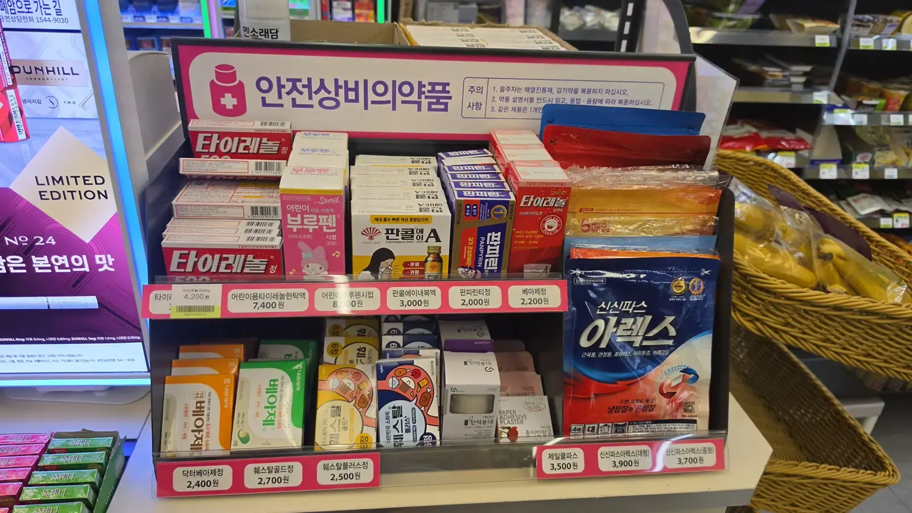
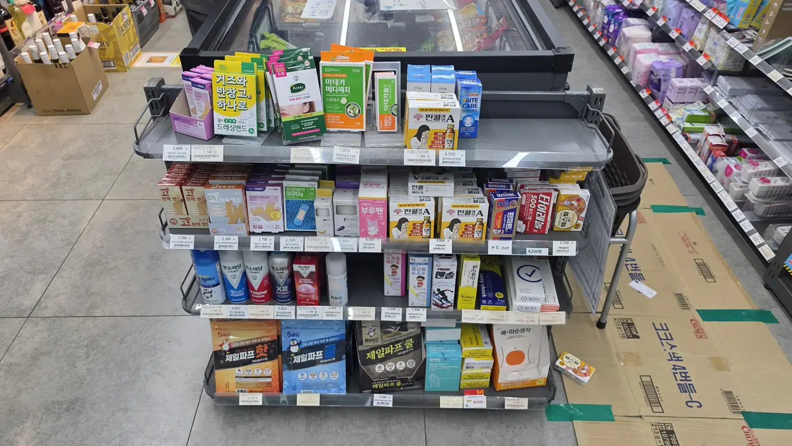

It's 2 a.m., the pharmacies shut hours ago, and someone has a
fever — maybe your child. You don't know the word for
"paracetamol" here, you don't know if anything is open, and the
internet is telling you to find a hospital. Usually you don't need
one. **Korea has a four-step ladder for exactly this, and the first
rung is the convenience store on your corner.**

## What we can and cannot help with

We are not a medical service, and we're deliberate about where our
help ends.

> **We do not recommend, endorse or refer you to any hospital,
> clinic, doctor or pharmacy.** Korean medical law is strict about
> this and we stay well clear of the line. **We accept no
> commission, referral fee or payment of any kind from any medical
> institution.**
>
> **This article is general information, not medical advice.** It
> describes what is sold where — not what you should take, or what
> is wrong with you. Dosage, suitability and interactions are
> questions for a pharmacist or a doctor, and the packaging is the
> authority, not us.
>
> **Choosing where and how to be treated is entirely your decision
> and your responsibility.** If symptoms are severe or worsening,
> stop reading and go to step 4.

## Step 1 — The convenience store, 24 hours

This is the part most visitors don't know exists. Since 2012 Korea
has allowed a short, **officially designated list of
over-the-counter medicines — 안전상비의약품 — to be sold in
registered 24-hour convenience stores**, precisely so that people
aren't stuck at 2 a.m.

Look for a stand near the counter with a **pink and blue
안전상비의약품 sign** on it. If the store has one, everything on it
is on the government's list. (Medicine is one of several things
these shops quietly do — the
[convenience store guide](/blog/korean-convenience-store-guide/)
covers the rest, including the counter services.)

*The designated stand — everything on it is government-listed · ⓒ @BalliBalliSeoul*

The list covers **four categories only**: fever and pain relief,
cold remedies, digestive tablets, and pain patches. From the price
tags on the stand above, as of August 2026:

| Item | What it is | Price |
| ---- | ---------- | ----- |
| 타이레놀 500mg | Paracetamol / acetaminophen, adult | ₩4,200 |
| **어린이용타이레놀현탁액** | **Children's paracetamol, liquid** | **₩7,400** |
| **어린이부루펜시럽** | **Children's ibuprofen, syrup** | **₩8,000** |
| 판콜에이내복액 | Cold remedy, liquid | ₩3,000 |
| 판피린티정 | Cold remedy, tablet | ₩2,000 |
| 베아제정 / 닥터베아제정 | Digestive enzyme tablets | ₩2,200 / ₩2,400 |
| 훼스탈골드 / 훼스탈플러스 | Digestive enzyme tablets | ₩2,700 / ₩2,500 |
| 제일쿨파프 · 신신파스 아렉스 | Cooling and medicated patches | ₩3,500–3,900 |

**For parents, the important line is in the middle.** Children's
fever medicine is on that shelf, in both paracetamol and ibuprofen
form — and it is **liquid**. The children's *tablet* versions were
discontinued back in 2022, so don't stand there hunting for a small
box: **you're looking for a bottle.**

Four limits worth knowing before you walk out at 2 a.m.:

- **Not every store carries it.** Only registered 24-hour branches
  do. If there's no pink sign, try the next one — in most Seoul
  neighbourhoods that's a two-minute walk.
- **The list is short by design.** No antibiotics, nothing for
  ongoing conditions, no prescription anything.
- **Quantities are capped**, so it's a bridge to morning, not a
  medicine cabinet.
- **It's sold as an adult purchase.** Staff can and do refuse to
  sell to children.

One clarification, because bad advice circulates: **Olive Young
does not sell fever medicine.** It's a health and beauty retailer,
not a pharmacy. For medicine it's the convenience store or the
pharmacy, full stop.

The same shops also carry a wider **non-medicine health aisle** —
plasters, patches, masks, saline, cooling sheets — which is useful
but is *not* the regulated list:

*The general health aisle — plasters and patches, not medicines · ⓒ @BalliBalliSeoul*

## Step 2 — The pharmacy (약국)

If the four categories above don't cover it, the next rung is a
pharmacy. Look for the sign **약국**, usually with a green cross.

- **Hours**: typically around 09:00–19:00 on weekdays, shorter on
  Saturdays, and **many close on Sundays and holidays.**
- **Pharmacists here advise directly.** Describe the symptom and
  they will hand you something appropriate from behind the counter
  — a far wider range than the convenience store list, and cheaper
  than you expect.
- **Late-night pharmacies exist.** They're called 심야약국, and
  larger neighbourhoods and hospital districts usually have one.

To find one that's actually open right now, Korea runs a **public
emergency medical portal, E-Gen (`e-gen.or.kr`)**, which lists
pharmacies and hospitals open at the current hour. **119 will also
tell you** — see step 4.

## Step 3 — A clinic (의원)

Fever that persists, an infection, anything that needs a
prescription: that's a clinic, and in Korea you walk into a small
local one rather than a hospital. They're cheap, fast and
everywhere, and they're **labelled by specialty, not by doctor** —
which is its own puzzle if you can't read the sign.

We wrote the decoder for that separately: **[which clinic to walk
into, by symptom](/blog/which-clinic-korea-department-guide/)** —
including what it costs without national insurance, and what to
bring.

## Step 4 — 119

For anything severe — trouble breathing, chest pain, a fever that
won't come down in a child, confusion, a bad injury — **call 119.**
It's free, it's 24 hours, and there are two things foreigners
routinely don't know about it:

- **119 is not only an ambulance.** It's also a medical
  information line. You can call and be told **which hospital near
  you is open and can take your case right now** — without an
  ambulance being dispatched.
- **Interpretation is available.** You can ask for English on the
  call and be connected to interpretation support.

If you're a tourist and want a general helping voice in English,
the tourist information line **1330** also runs 24 hours with
interpretation, and can help you communicate.

**If you are unsure whether something is an emergency, call.**
That's what the line is for, and nobody will be annoyed with you.

## What you can't get off a shelf, at any hour

- **Antibiotics** — prescription only, always.
- **Anything ongoing or prescribed** — you'll need a clinic visit.
- **Emergency contraception** — prescription only here, which
  surprises many visitors; we cover it in
  [where to buy the essentials](/blog/condoms-pads-tampons-korea/).
- **Bringing your own?** Check your medication against Korean
  customs rules before you fly, especially anything containing
  codeine or stimulants.

## The Korean part

Every rung of this ladder is written in Korean — the stand, the
box, the dosage line, the pharmacy sign, the clinic's specialty. At
2 a.m. with a sick child, that language wall is the actual problem,
not the medicine.

> **What we do**, through our
> [anything-else concierge service](/etc):
>
> - **Read the box for you.** Send a photo and we'll tell you what
>   it is and what the label says.
> - **Find what's open right now** — pharmacies or clinics near
>   you, at the hour you need one.
> - **Find where English is spoken**, by calling and asking.
> - **Translate on the call**, or stay in the chat while you're
>   there.
>
> We give no medical advice, no diagnosis, and no opinion on any
> provider — and we take no money from any of them.

## Get it sorted

> **Standing at the medicine stand unable to read a box?** Message
> us on [WhatsApp](https://wa.me/821075191282) — send a photo and
> we'll translate it, in English. First answer is free.

The one-line version: **convenience store for a fever at 2 a.m.
(including children's syrups), pharmacy when it needs advice,
clinic when it needs a prescription, 119 when it's serious — and
119 will tell you what's open even if you don't need an
ambulance.**
