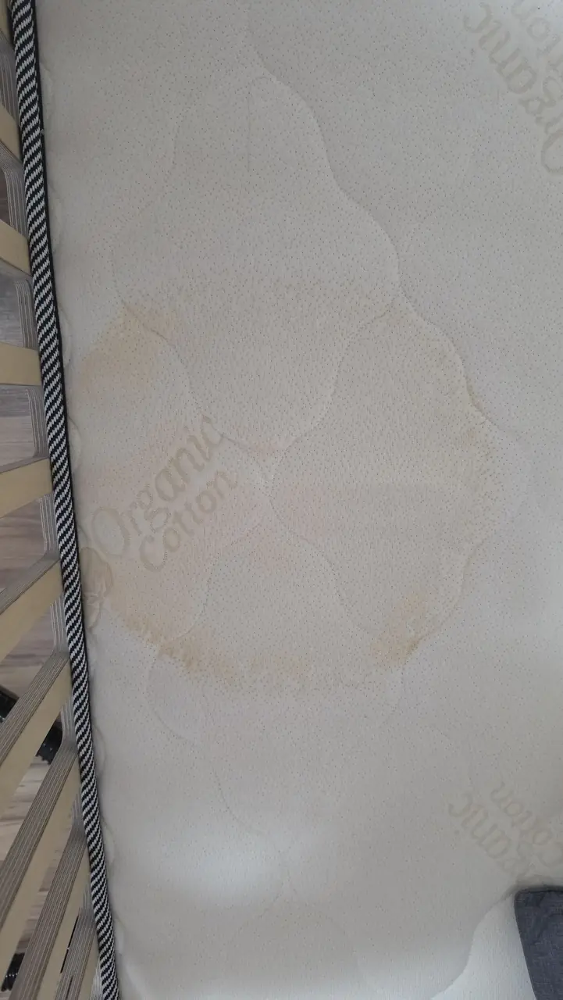
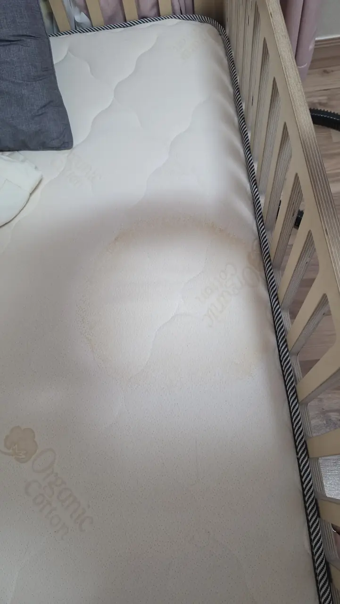
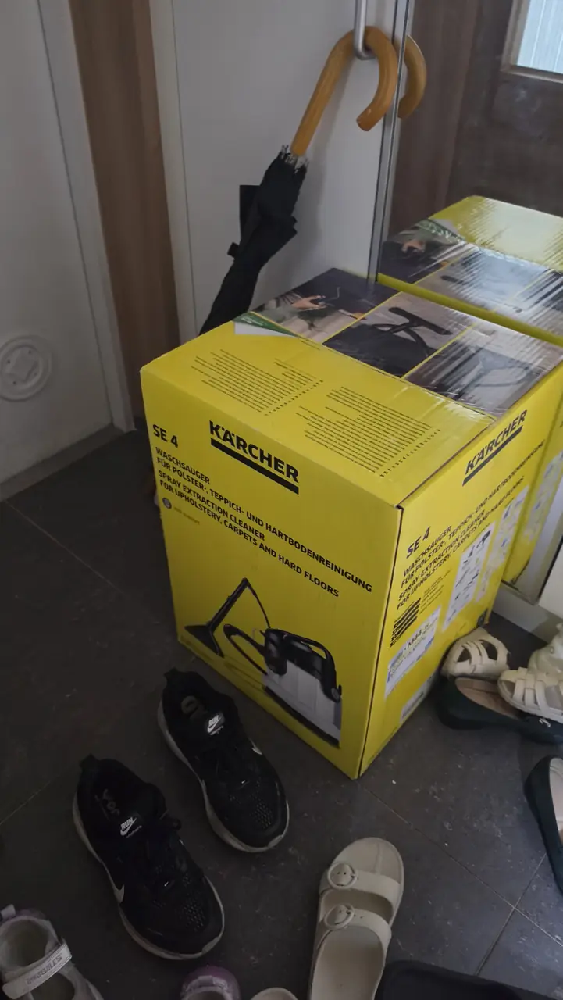
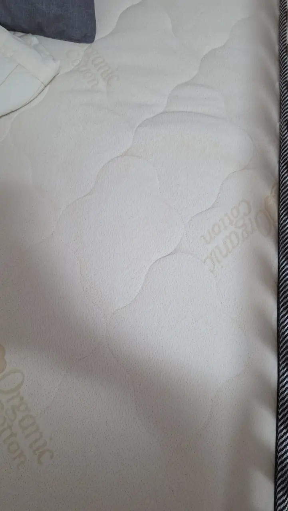
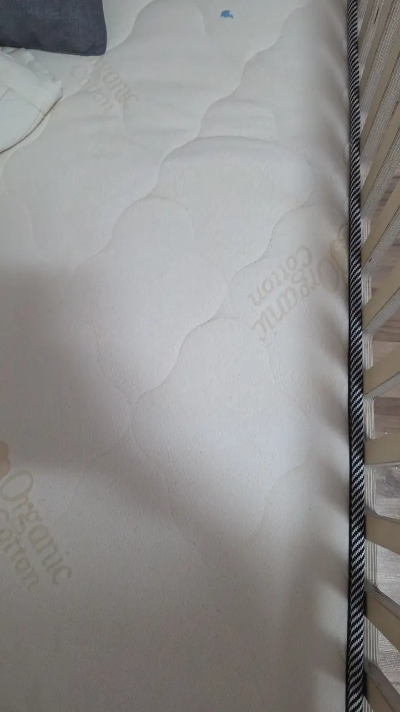

Here is a thought most people have on their second night in a furnished
Korean flat, and then try not to have again.

**The mattress came with the room.** So did the sofa, if there is one.
Neither arrived new, nobody told you when they were last cleaned, and
the lease describes them as "included" rather than as anything you have
a say over.

This is what you can do about it, what it costs, and — the part worth
reading — when the answer is not cleaning.

**Here because a child wet the bed?** Skip to
[how to get a urine stain out of a mattress](#how-to-get-a-urine-stain-out-of-a-mattress).

## It is a real service here, and it comes to you

**소파 청소** and **매트리스 청소** are ordinary bookable jobs in Korea,
done at your flat. Nothing gets taken away.

The equipment is the point. A crew arrives with a machine that injects
a cleaning solution into the fabric and extracts it under vacuum, plus
usually a high-frequency beater to lift dust and mite debris out of the
surface first, and a UV or steam step for sanitising. The unit is left
damp, not wet, and dries in a few hours with the windows open.

**This is why home methods disappoint.** Spraying a fabric cleaner and
blotting moves the top centimetre around. It does not reach what has
worked its way down into the foam over four summers, and it cannot pull
anything back out.

## Why this comes up more in Korea

Three things stack.

**Furnished is the default at the small end.** One-rooms, officetels and
share houses very often come with a bed, and the mattress is the fixture
nobody replaces between tenants unless it visibly fails.

**The summer is wet.** 장마 is weeks of high humidity, and a mattress
that has absorbed sweat all summer in a room that never fully dries is a
different object from the same mattress in a dry climate. Dust mites
thrive in exactly those conditions.

**Floor sleeping and low sofas.** Bedding used directly on an ondol
floor, and low fabric sofas, both live where dust settles.

None of that means your mattress is a health emergency. It does mean
"it looks fine" is not the same as "it is fine", which is the honest
reason people book this.

## What it costs

Guide ranges as of 2026. Both are priced per item, by size and by how
bad it is.

| Item | Typical |
| --- | --- |
| **Fabric sofa, 3-seater** | ₩70,000–120,000 |
| Sofa, across the market generally | Around ₩95,000 average; ₩30,000 at the small end, up past ₩200,000 for large or sectional |
| **Mattress** | Around ₩80,000 typical; roughly ₩50,000–150,000 by size and condition |
| Nationwide firms listing online | **From ₩20,000–26,000** — an entry price, not the price. See below |

### The number you see online is a floor, not a price

Search in Korean and you will find nationwide firms selling a sofa clean
from around **₩20,000** and a mattress clean from around **₩26,000**, often
beside a crossed-out "list price" several times higher. Those numbers are
real, and they are also the smallest possible version of the job: a minimum
call-out that every choice after it adds to.

What moves it up, on the listings we have read:

- **Size** — seats on a sofa, single through king on a mattress
- **Material** — fabric and leather are different jobs, and some materials
  (suede, nubuck) are refused outright
- **Method** — dry, wet or steam, with wet and steam costing more and needing
  a day or two to dry before you can use the thing again
- **Stains** — charged as extra work, and sold with a caveat that old or dyed
  stains may not come out completely
- **Where you are** — nationwide coverage does not mean one price everywhere

<!-- ⚠️ 발행 전 확인: 위 옵션 목록은 상세페이지 실물 확인 후 확정할 것. 인승·소재·습식/건식·얼룩·지역 -->

So the useful sentence, before anything is booked, is a complete one:
**"Three-seat fabric sofa, two stains, ground floor, wet clean — what is the
total?"** A price that cannot be given until someone is standing in your
living room is the same structure that
[turned a ₩300,000 toilet job into ₩900,000](/blog/toilet-unclogging-cost-seoul/),
and the fix is identical: agree the total while you still have the option of
saying no.

Two more things these listings say in the small print, and both are worth
knowing before you pay. **Book about a week out** — five to seven working
days is what the nationwide firms ask for. And **cancelling on the day is
usually non-refundable** once the slot is confirmed.

Three things move the number: **size** (a corner sofa is two or three
jobs), **contamination** (stains, smell and anything organic take longer
and sometimes cannot be finished), and **equipment** — a crew with
proper extraction charges more than one with a wet vac, and the
difference shows.

**Leather is a different job.** A fabric process is wrong for leather —
it wants cleaning and conditioning instead, and a firm that quotes the
same price for both without asking has not asked enough questions.

## How to get a urine stain out of a mattress

A child coming out of nappies has accidents at night. That is the whole
story, and it happens in every country. What is different here is what you do
about it at two in the morning in a flat with no tumble dryer and a mattress
that cannot go anywhere.

This is what urine looks like on a cot mattress a few days later, once it has
dried:

*The ring is the edge of where the liquid stopped · ⓒ @BalliBalliSeoul*

*The same mattress, wider. Most of what you can see is underneath the cover · ⓒ @BalliBalliSeoul*

**Urine is not a surface stain, and that is why wiping fails.** The liquid
goes down into the fill and spreads sideways, and the brown ring you end up
looking at is the outline of how far it travelled before it stopped. Wiping
the top removes the part that was never the problem. Worse, in a Korean
summer the smell comes back with the humidity, because what is left is salt
and organic residue sitting in the foam waiting for damp.

### Why the smell comes back in summer

Even after the stain looks handled, the smell can return in July. What is
left behind is salt and organic residue sitting in the foam, and Korean
summer humidity brings it back to life. That is why drying it properly
matters as much as cleaning it, and why a stain treated in a damp month
deserves a second look a week later.

So the fix has to put clean water in and pull the dirty water back out.

*A spray-extraction machine — the domestic version of what a crew arrives with · ⓒ @BalliBalliSeoul*

We used a **Kärcher SE 4**, a spray-extraction cleaner: it sprays water and
solution into the fabric and vacuums it straight back out in the same pass.
That is the same principle as the professional job described above, at a
smaller scale and a much smaller price.

**What worked, in order:**

1. **Blot, never scrub.** Scrubbing drives it deeper and frays the quilting.
2. **Work from the outside of the stain inwards**, so the edge does not
   spread further.
3. **Several light passes rather than one soaking.** The machine's job is
   removal, and it can only remove what it can pull back.
4. **Then dry it properly** — windows open, a fan on it, and give it hours
   rather than minutes.
5. **Look again the next day.** As a mattress dries, whatever is left deeper
   down travels back up to the surface, so a stain that looked gone in the
   evening can reappear faintly by morning. A second pass on the dry
   mattress is normal.

*After · ⓒ @BalliBalliSeoul*

*Close up: much lighter, not a showroom finish · ⓒ @BalliBalliSeoul*

### Buy a machine, rent one, or call somebody

A machine like this is worth owning if there is a small child, a pet, or a
sofa that gets used. It is also rentable for a weekend, which is the sensible
option for a single accident.

  

    <strong style="color:var(--fg)">Spray-extraction machines on Coupang</strong> — the Bissell SpotClean on the left is the common household choice; the Kärcher in the middle is the same family as the SE 4 in the photos above and takes hot water; <strong style="color:var(--fg)">the one on the right is a rental</strong>, which is usually the right answer for one stain rather than a habit. All three do the same job: put solution in, pull it back out.
  

  

    
    
    
  

  

    Affiliate links — we earn a small commission if you buy or rent through them, at no extra cost to you. 
    이 포스팅은 쿠팡 파트너스 활동의 일환으로, 이에 따른 일정액의 수수료를 제공받습니다.
  

**Or just call somebody.** A professional visit costs more than a weekend
rental — the guide prices are further up this page — but it arrives with a
stronger machine, an operator who has done it a hundred times, and nothing
for you to store afterwards. For one bad stain, rent. For a mattress that has
had a hard year, book the crew.

**Be honest about the result.** It is dramatically better and it does not
smell. It is not a new mattress. Dried urine that has been there for weeks
sits in fibres that have already taken the colour, and a domestic machine
lifts most of it rather than all of it — which is exactly the distinction the
next section is about.

## What it cannot fix

Say this to the company before they come, because the answer decides
whether it is worth booking.

- **Old set-in stains** often lighten rather than disappear. Ask
  directly; a straight answer here is a good sign.
- **Smell** depends on the cause. Sweat and general staleness usually
  respond. Smoke embedded through the foam, and urine that has soaked
  through to the core, frequently do not.
- **Structural failure** — a collapsed edge, a broken frame, springs you
  can feel — is not a cleaning problem.
- **Bed bugs are a separate trade.** If you have bites in a line or dark
  specks along the seams, that is [pest control](/blog/pest-control-korea-cockroaches-bed-bugs/), not upholstery cleaning,
  and it needs saying up front rather than discovering on the day.

If the whole flat is being deep-cleaned around the same time, ask whether
the same company does upholstery — many do, and one visit means one
[check at the end](/blog/deep-clean-service-seoul/) instead of two.

## When to replace instead

This is the calculation nobody offers you, so here it is plainly.

**A mattress clean is around ₩80,000. A new one starts not far above
that.** If the mattress is old, sagging, or the smell is in the core, the
clean is money spent on something you will replace within a year anyway.

Two things change that arithmetic in a rental:

**It is not yours.** Replacing the landlord's mattress at your own
expense is a gift to the next tenant. **If it is genuinely unfit, that
is a conversation with the landlord rather than a purchase** — and it
goes better with photographs taken on the day you moved in, which is one
more reason
[the move-in photographs](/blog/photograph-your-flat-move-in-day/) earn
their twenty minutes.

**Getting rid of the old one costs money and planning.** A mattress is a
large item: it needs a paid disposal sticker arranged with the district
office in advance, and it cannot simply go out with the rubbish. The
process is in
[how to throw away rubbish in Korea](/blog/how-to-throw-away-trash-in-korea/).
Budget that in before deciding replacement is the cheap option.

## If the answer is a new one, we can do the whole chain

Replacing a mattress in Korea is three jobs, not one, and each has a Korean
step in it.

**Buying it.** The cheap, good options are on Korean sites, and checkout
usually wants a Korean phone verification. Delivery is then scheduled by
phone, in a window, by someone who will call you rather than message.

**Getting the old one out.** Before anything else, read the next paragraph,
because it is the one that saves people money.

> 🛏️ **Ask the shop first — many of them will take the old one away.**
> Plenty of Korean bed and mattress retailers collect the item you are
> replacing when they deliver the new one, either as part of the delivery or
> for a small fee. It is a normal request here and it is worth making before
> you file anything with the district, because a yes makes the whole disposal
> problem disappear. The question to have asked for you: **"기존 매트리스
> 수거도 되나요?"**

If the answer is no, it is bulky waste: reported to the district in advance,
a fee by item and district, and a pickup date the district assigns rather
than one you pick — on average about a week out, as the
[trash guide](/blog/how-to-throw-away-trash-in-korea/) covers in full.

**The stairs.** A double or king does not go up every Korean lift, and old
buildings have turns on the stairwell that decide the whole thing. Measure
before ordering, not after.

**The order matters, too.** Do not file the disposal before the new one has a
confirmed delivery date, unless you are content to sleep on the floor for the
gap. New in, old out, same day if it can be arranged.

What we do with this, in any combination:

- **Disposal only** — we file the report, pay the district fee, carry it
  down, and put it out on the assigned date
- **Buy and deliver** — you tell us the size and the budget, we order it,
  schedule the delivery, and handle the phone call on the day
- **Both together** — the new one arrives and the old one leaves, ideally
  within the same hour

**You pay the shop and the district fee at what they cost — we do not mark
either up**, and our own fee is agreed with you in the chat first. No bed
shop, cleaning company or disposal crew pays us to be recommended. (The
Coupang links further down are retail affiliate links, and they are marked as
such.) If a seller will collect your old mattress for free, we will tell you
that instead of quoting you for the disposal.

## Between cleans

The habits that actually matter are dull and free.

**Air the room.** Windows open daily, even in the wet season, even
briefly. Humidity is what feeds the problem.

**Use a washable protector** on the mattress and wash it hot. This is
the single highest-return item in this article — a ₩20,000 cover that
goes in the machine every few weeks does more than an annual clean.

**Wash bedding at 60°C** where the fabric allows it. Mites do not
survive it; a cold wash does not trouble them.

**Do not make the bed immediately.** Pull the covers back for half an
hour so the surface dries before you seal the moisture in.

**Vacuum the sofa** with the upholstery head, seams included, when you
vacuum the floor.

## The Korean part

Booking runs by phone or KakaoTalk, and the questions come fast: what
kind of sofa, what size, fabric or leather, what is wrong with it, which
floor, is there a lift, and when.

The one worth preparing is the honest description of the problem. **A
company that knows it is dealing with a smell rather than dust brings
different equipment** — and if they arrive expecting a routine clean and
find something else, you get a revised price at your door instead of in
the chat.

> **Not sure whether yours is worth cleaning?** Send a photo and tell us
> what the problem is on [WhatsApp](https://wa.me/821075191282?text=Hi%20Balli%20Balli%21%20I%27d%20like%20a%20cleaning%20quote.%0A%0A-%20Name%3A%0A-%20Phone%3A%0A-%20Address%3A%0A-%20Home%20size%20%28pyeong%20or%20m2%29%3A%0A-%20What%20I%20need%20%28move-in%20deep%20clean%20%2F%20housekeeping%20%2F%20mold%20%2F%20Airbnb%29%3A%0A-%20Preferred%20day%20%28e.g.%20Sat%204%20Oct%2C%20or%20weekdays%29%3A%0A-%20Preferred%20time%20%28e.g.%2010am%2C%20or%20morning%29%3A%0A%0A%28Photos%20help%20a%20lot%21%20Please%20book%20at%20least%202%E2%80%933%20days%20ahead%20%E2%80%94%20ideally%20a%20week.%20Same-day%20or%20next-day%20requests%20may%20not%20be%20possible.%29) — we'll
> ask in Korean, get you a quote per item, and tell you honestly if the
> answer is "replace it". Asking costs nothing.

## Get it sorted

Buy the protector first — it is the cheapest thing here and it changes
the most. Book a clean if the problem is dust, general staleness or a
recent stain. **If it is smoke, a soaked core or a failing frame, stop
and have the replacement conversation instead**, and if the item belongs
to the landlord, have it with them.

We arrange this in English, per item, with the condition described
accurately before anyone is booked — and if the answer is a new mattress
rather than a clean, we can buy it, get it delivered and have the old one
taken away. The
[cleaning page](/cleaning) covers the rest of the house — and if this is
the week you are leaving, the deposit-side version of the same job is in
[move-out cleaning](/blog/move-out-cleaning-korea/).
