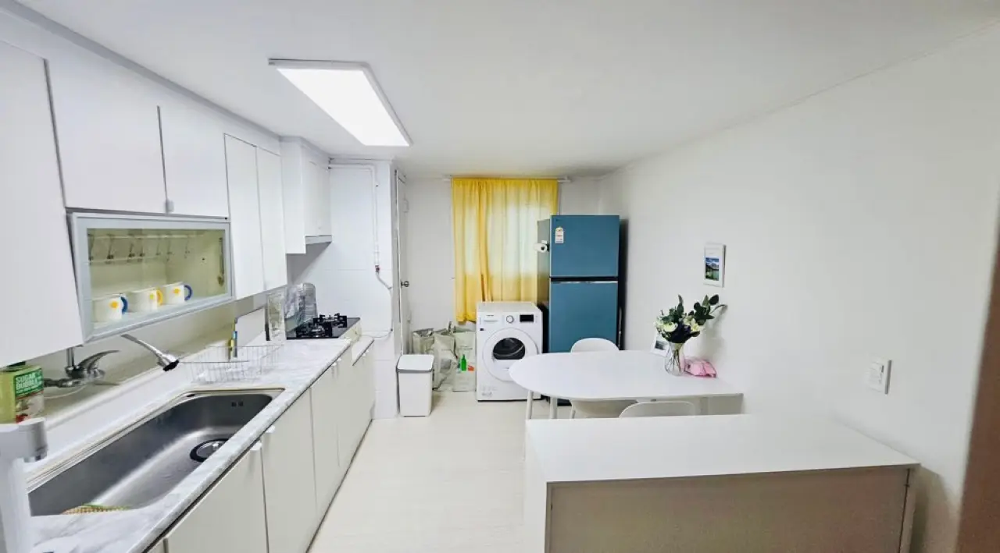
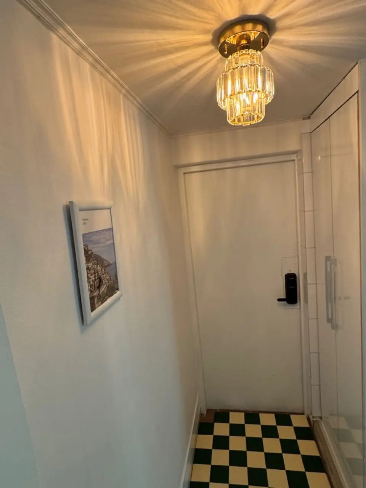

It's August, your Korean semester starts in September, and you're
trying to line up a studio from abroad. You've discovered the wall
every incoming student hits: Korean housing platforms want a Korean
phone number and an ARC — the two things you won't have until
*after* you arrive. Meanwhile the deposit numbers you're seeing
make no sense, and half the advice online says "just look when you
get here." Here's how this actually works, and the play that
students use every intake.

> ### 🏠 One spot open right now — as of August 8, 2026
>
> We run coliving houses ourselves, and we have **one place free in
> a twin room** in **Dongdaemun-gu**, taking **fall-semester
> students** now. It's walking distance to **Kyung Hee University**
> and **Hankuk University of Foreign Studies**.
>
> - **Deposit US$1,000 · Rent US$400/month** (utilities and
>   maintenance billed separately)
> - **Minimum stay: 6 months**
> - Furnished room, shared kitchen and laundry — and **no ARC or
>   Korean phone number needed** to book it, which is the whole
>   problem this article is about
>
> Ask us on [WhatsApp](https://wa.me/821075191282) or in our
> [KakaoTalk open chat](https://open.kakao.com/o/glCt6lMh).
> **When this spot fills we'll update this post** — so if you're
> reading this box, it's still open.

## Why every site rejects you

Korean rental platforms (Zigbang, Dabang and friends) sit behind
Korea's identity-verification system — the same wall that blocks
foreigners from half the Korean internet. Verification needs a
Korean phone in your name; a Korean phone contract effectively
needs an ARC; and your ARC only exists a few weeks after you land.
It's not personal, it's plumbing — but it means the mainstream
listing apps are read-only for you until you're already here.

## The three doors that are actually open

**1. Foreigner-friendly platforms (book from abroad).** A handful
of services — Enko/Enkostay is the one students name most — list
studios you can reserve with a passport and a credit card, no ARC,
no Korean phone, and little or no deposit. Understand the trade
you're making: **you're paying the deposit in the rent.** A studio
that a local rents at ₩500,000 with a ₩10,000,000 deposit shows up
here at ₩1,000,000+ all-in with almost nothing down. For a
one-year exchange with no Korean bank account, that trade is often
rational — just make it knowingly. Short-term platforms (the
33m²-style monthly rental services) are the same idea but usually
cap stays around three months.

**2. The two-step: land short, then sign local.** The veteran
move: book only your **first 2–4 weeks** (goshiwon, short-term
studio, or a hostel), then hunt in person through a neighborhood
realtor (부동산) once you can see rooms with your own eyes.
In-person contracts are possible with a passport before your ARC
arrives — plenty of landlords sign them — and local contracts get
you local pricing. The catch is the deposit (next section) and the
Korean-language everything.

**3. Share houses and university housing.** Dorms fill fast but
cost least; share houses split the difference — low deposits,
furnished rooms, other students and young workers around, and
operators who are used to foreign paperwork. If the private-studio
requirement is negotiable, this door has the least friction per
won.

What "furnished" means in practice: bed, desk, chair, storage,
air conditioning and curtains already in the room, so you arrive
with suitcases and nothing else. The trade for the lower deposit
is that kitchen, laundry and living space are shared:

*Shared kitchen and laundry — the trade for a lower deposit · ⓒ @BalliBalliSeoul*

Two details that matter more than they sound: **the front door
usually runs on a keypad code** rather than keys, which is how you
get in on arrival day without meeting anyone at a specific hour —
and how a landlord or operator can let you in remotely.

*Keypad entry — no key handover needed · ⓒ @BalliBalliSeoul*

Worth knowing before it happens to you at 1 a.m.: those keypads run
on batteries, and when the battery dies the door simply stops
opening. It's the single most common way people get locked out here,
and it's fixable in minutes if you know the trick — we wrote up
[what to do when a keypad lock dies](/blog/keypad-door-lock-dead-locked-out-seoul/),
and we [open doors in English](/locksmith) when it can't wait.

## The deposit reality check

This is the number that decides which door is yours. Standard
Korean one-room contracts run **₩5,000,000–10,000,000 deposits**
(fully refundable at move-out, and often tradeable — bigger
deposit, lower rent). If you can wire that and want the cheapest
monthly cost, the two-step local contract wins. If your ceiling is
₩2,000,000–3,000,000, be honest with yourself: **you're shopping
the foreigner platforms and share houses**, and chasing regular
listings will burn weeks you don't have. Neither answer is wrong —
they're different products for different wallets.

## Picking the neighborhood: commute math first

Seoul students overwhelmingly optimize on one number: **door-to-
door commute time**, and 30–40 minutes is the comfortable line.
Three local tricks make the map read differently than it looks:

- **Express trains skip stations.** Line 9's express doubles your
  speed — but only if both your station and campus station are
  express stops. Check the stopping pattern, not just the line.
- **Bus-subway transfers are free** (T-money handles it), so a
  "15 minutes from the station" listing with a good bus stop
  outside often beats a pricier one next to the tracks.
- **Next to elevated tracks = noise.** Rooms within a couple
  hundred meters of above-ground rail sound like it; a few blocks
  of buffer fixes it. Ask, or check the map for elevated lines.

University belts (the streets around every campus) stay the
cheapest hunting grounds — that's where the one-room supply was
built for exactly your situation.

## The Korean part

Everything decisive here happens in Korean: the realtor
conversation, the landlord's questions, the contract you're
signing, the building registry check that confirms the "landlord"
owns the building. This is our home turf twice over.

First, directly: **we run
[coliving houses in Seoul](/about/) ourselves**, full of students
and young internationals — furnished rooms, low deposits, English
spoken, no verification wall. If a room is open when you write,
the simplest answer to this whole article is "stay with us." If
we're full, we'll happily point you to operators we know and
trust — that introduction is free.

Second, as backup for any other room you find: through our
[anything-else concierge service](/etc) we translate the listing,
call the landlord or realtor with your questions, and read the
contract with you before you sign — a language-and-paperwork
service, priced as such. To be clear, **we're not a licensed real
estate brokerage and don't broker other people's rooms**: your
contract is always signed directly with the landlord or a licensed
agent (공인중개사). And if the move itself is the next headache,
our [moving help](/moving) covers that leg too.

## Get it sorted

> **Semester's coming and the housing hunt is stuck?** Send us
> your budget, university, and dates on
> [WhatsApp](https://wa.me/821075191282) — if one of our own
> rooms fits, we'll show it to you; either way we'll tell you
> which door fits your budget and help with the Korean side.
> First answer is free.

The one-line version: **no ARC means platforms-with-a-premium or
land-short-then-sign-local; your deposit ceiling picks the door;
and commute math beats neighborhood hype.** Sort those three and
September gets a lot less scary.
