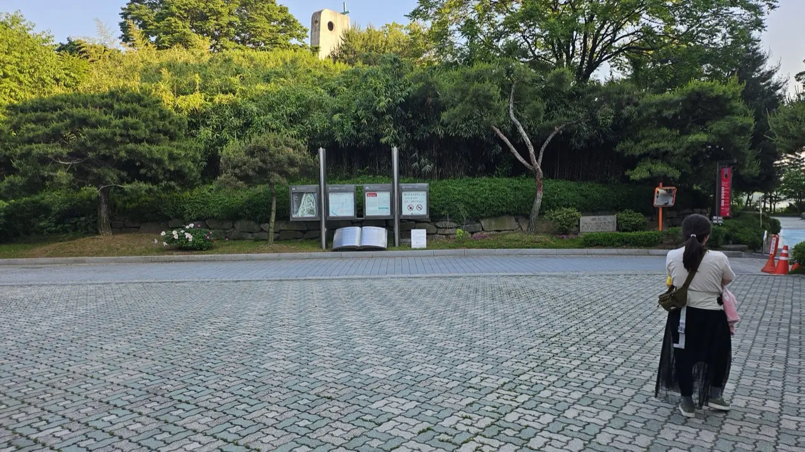
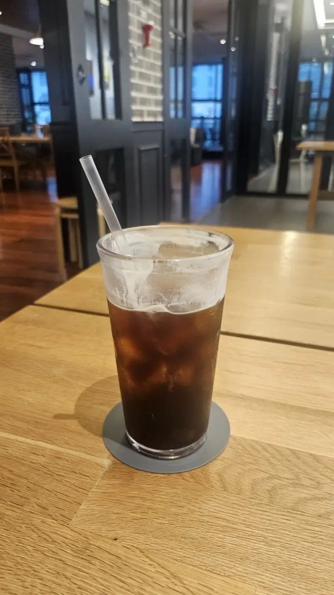
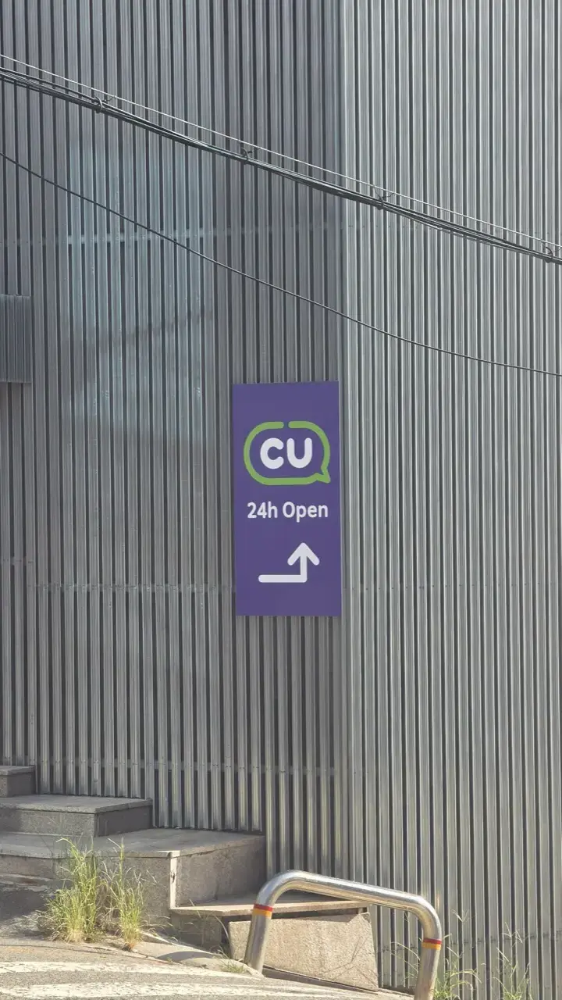

Everyone arrives in Korea with a mental list of what they expect — the
food, the pace, the neon. Then the first week happens, and it's three
much smaller things that actually make people stop mid-sentence. Here
they are, with the explanations nobody gives you.

## 1. The streets are spotless — and there are no trash cans

Seoul moves ten million people a day, and the sidewalks are somehow
clean. Streets stay spotless through crowds that would bury most cities
in cups and wrappers —
[this street view](https://www.youtube.com/shorts/8sJis1hd4z8) is a
pretty typical scene, not a showcase block.

Then comes the double take: you finish a coffee, look around for a bin,
and walk three blocks without finding one. In Seoul, **finding a trash
can is genuinely harder than finding trash.** Public bins were largely
removed decades ago — partly so households wouldn't dump their garbage
in them to dodge disposal fees — and the city never really brought them
back.

*A typical public space — no litter, and no bins either · ⓒ @BalliBalliSeoul*

So how does it stay clean? A few unglamorous reasons: an army of early
morning municipal cleaners, shop owners sweeping their own frontage,
and a deep social norm of simply **carrying your trash home**. Koreans
pocket the wrapper, keep the empty cup, and deal with it later. Do the
same and you'll blend right in.

The bins that do exist come with unwritten limits, and getting this
wrong is the fastest way to annoy someone:

- **A convenience store's bin is for what you bought there** — drink
  the coffee at the counter, bin the cup on your way out. It isn't a
  public disposal point.
- **Subway station bins take small litter only** — a wrapper, a
  tissue, an empty bottle you're carrying.
- **Household trash never goes in a street or store bin.** That's
  exactly the behaviour the city removed public bins to stop, it's
  what those posted fines are about, and locals notice.

So the real answer is the boring one: carry it, and dispose of it
where you live.

What happens to that carried-home trash is its own system of bags,
fines, and sorting rules — we wrote the full survival version in our
[guide to throwing away trash in Korea](/blog/how-to-throw-away-trash-in-korea/).

## 2. Restaurants and cafes are everywhere, open late — with waits to match

Korea has one of the highest densities of restaurants and cafes in the
world. Any residential street corner has a fried chicken place, two
cafes, and a 24-hour gukbap (soup and rice) joint, and "dinner at 10
p.m." is a completely normal sentence. Coming from a city where
kitchens close at nine, this alone rearranges your evenings.

The surprise inside the surprise: with all that supply, **the popular
places still have lines.** Koreans treat waiting as part of the outing
— trending cafes and famous restaurants routinely run 30–60 minute
waits, managed by a tablet at the door (or an app like Catch Table)
where you leave a phone number and get pinged when your table's ready.
Two things worth knowing before you join one: the tablet is almost
always Korean-only, but the flow is universal — tap, enter party size,
enter a phone number, take the screenshot. And a Korean phone number is
usually required for the ping, so if you're on a tourist eSIM without
one, ask the staff to call you in ("웨이팅 되나요?" gets the point
across, or just point at the tablet and smile).

The upside of the density: if the line is absurd, an equally good
un-famous place is usually within a hundred meters. The famous spot is
on every app; the one next door is often where the neighborhood
actually eats.

One more cafe norm that surprises people in both directions: nobody
rushes you out. A single americano legitimately buys a table for an
afternoon of laptop work — cafes here double as the city's living room
and study hall.

*One iced americano. The table is yours until you leave · ⓒ @BalliBalliSeoul*

Nobody will bring you a check, hover, or ask if you'd like anything
else. Big tables, outlets at most seats, and a room full of people
doing exactly what you're doing.

Sit-down restaurants run on the opposite script, and on their own
set of unwritten rules — the cutlery hidden in a drawer in the
table, the bell you press instead of waiting to be greeted, the side
dishes nobody charges you for. Those are
[all here](/blog/korean-restaurant-how-it-works/).

## 3. When everything's finally closed, the convenience store isn't

*"24h Open" — the two words that save your night · ⓒ @BalliBalliSeoul*

Past midnight, when even the late kitchens wind down, the glowing
storefront on the corner is still there. Korean convenience stores —
GS25, CU, 7-Eleven, emart24 — are 24/7, everywhere, and far closer to
a mini-restaurant than the gas-station snack rack the name suggests:
fresh dosirak (meal boxes), triangle kimbap, instant ramyeon with a
hot-water station and seating to eat it, decent coffee, and beer.
There is enough going on in there that we gave it
[its own guide](/blog/korean-convenience-store-guide/).

The part that genuinely surprises people: **they also sell medicine.**
Since 2012, convenience stores can legally stock a fixed list of
emergency household medicines (안전상비의약품) — Tylenol
(acetaminophen), ibuprofen-type painkillers, cold tablets, fever
patches, digestive aids. It's a short, regulated list rather than a
full pharmacy, but at 2 a.m. with a headache, it's exactly enough. If
your symptoms are past what a convenience-store shelf fixes, the next
step is a clinic — and Korean clinics are signposted by specialty, so
knowing which one to walk into is its own skill
([our department guide](/blog/which-clinic-korea-department-guide/)
decodes the signs). Our
[anything-else concierge service](/etc) can find one near you that's
open and can take you in English.

And the stores quietly do half the neighborhood's errands beyond food:
most have an ATM (look for one marked 해외카드 for foreign cards), they
top up your T-money transit card at the register, and they double as
package pickup and drop-off points for couriers. When Koreans say
"there's a convenience store for that," it's rarely an exaggeration.

## Get it sorted

> **Something in Korea confusing you at 1 a.m.?** A label you can't
> read, a queue app in Korean, a medicine you can't find? Message us on
> [WhatsApp](https://wa.me/821075191282) — we'll figure it out with you
> in English. Asking costs nothing — you pay only for the work you book.

Korea's small surprises share one theme: the system works, it's just
never explained out loud. The trash goes home in your pocket, the wait
is part of dinner, and the corner store is the city's safety net.
Learn those three and your first month gets a lot smoother.
