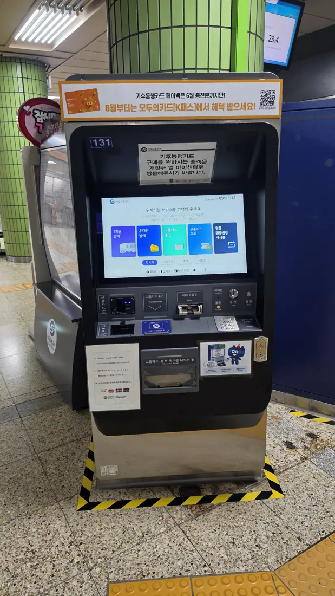
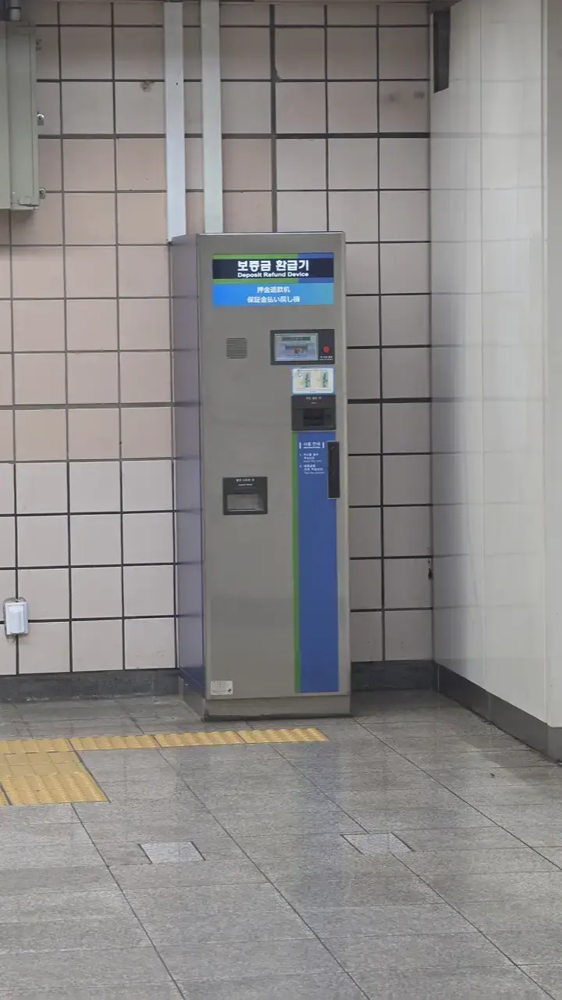
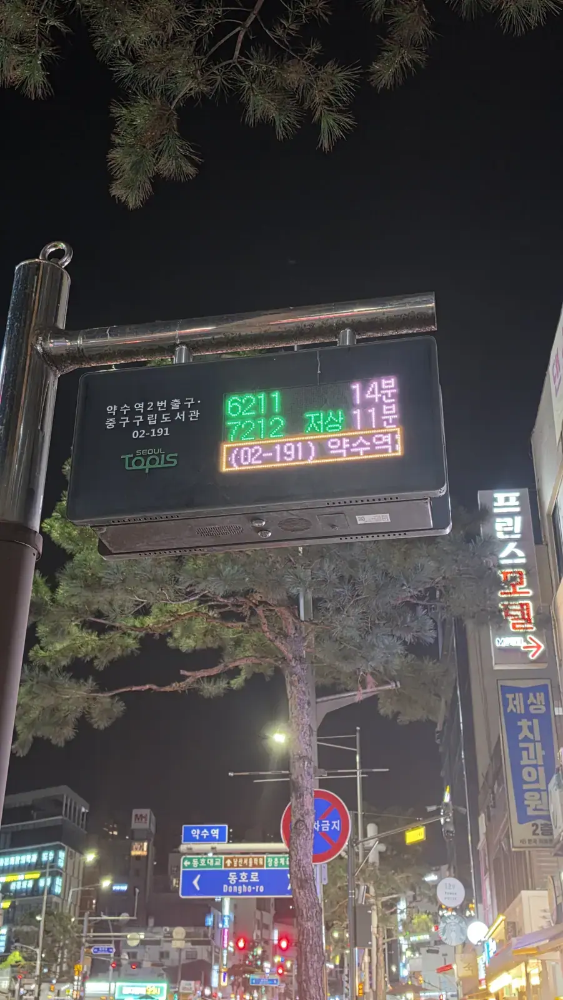

Every Korea trip planner eventually falls into the transit-card
rabbit hole: T-money versus Cashbee versus tourist passes versus
"can I just pay cash on the bus?" Here's the answer that saves you
the evening: **walk into any convenience store, say "T-money card
please," pay a few thousand won, load some cash on it, and you're
done.**

Don't optimise this. The card is cheap, it works on almost
everything, and the thing it unlocks — Seoul's free transfer
network — is the actual prize.

## Buying one takes ninety seconds

Any GS25, CU, 7-Eleven or emart24 sells T-money cards at the
counter. "T-money card juseyo" works; honestly, "T-money?" works
too. The card costs a few thousand won (**₩3,000–5,000** depending
on the design, as of 2026), and then you **top it up in cash at the
same counter** — ₩10,000 or ₩20,000 is a sensible start.

**Carry notes for this one.** At a convenience store counter, a
top-up is a cash transaction — this is the single errand in Korea
that still wants paper money.

Station machines are the exception, and a useful one:

*Note the placard on the left · ⓒ @BalliBalliSeoul*

The machines take coins and notes, but they also have a **credit
card slot**, and the placard taped to the side says it plainly:
**"Foreign-issued credit cards and mobile payments are accepted"** —
Visa, Mastercard, JCB, UnionPay and Alipay+. So if you land without
won, a station machine is the better bet than a shop counter.

They all run in English, too. Press **ENGLISH** and the menu
becomes five plain buttons:

*Buy a card, reload it, or get your deposit back — all in English · ⓒ @BalliBalliSeoul*

**"Purchase transportation card"** buys you the plastic;
**"Reloading the transit card"** tops it up. The screen also warns
about something easy to trip over: **a single-journey ticket does
not transfer between lines** at certain interchanges — another
reason to hold a proper card.

Mobile T-money in your phone's wallet exists, but effectively
requires a Korean-verified phone number — visitors should just
carry the plastic.

## The transfer system is the whole point

Here's what the card actually buys you. Seoul's fare isn't charged
per vehicle — it's charged per **journey**. Tap in, ride, **tap
out, and your next leg within 30 minutes counts as a transfer, not
a new fare**:

- Subway → bus? Transfer.
- Bus → subway? Transfer.
- Bus → bus → subway? Still one journey — up to four transfers.

You pay the base fare once (**₩1,550 by card for an adult on the
Seoul subway**, as of 2026) plus small distance increments, instead
of paying again for every vehicle you board. A three-leg crossing
of the city costs a cash payer three separate fares and a card
holder one. The full rate card — youth and child fares, the distance
bands, and what a single-journey ticket costs on top — is in our
[Seoul subway fare guide](/blog/seoul-subway-fare-guide/).

So: is the card worth it for a short trip? **It pays for itself in
about two transfers.**

## The one habit to build: always tap out

On buses, tap the reader again as you get off — even when the door
is open and everyone is pushing past you.

**No tap-out means no transfer credit**, and on distance-based
routes it can also mean being charged the maximum fare. It takes
half a second and it is the single most common mistake visitors
make.

On the subway you can't forget, because the gate won't open.

## Cash is quietly being retired

If you were planning to feed coins into a bus: increasingly, you
can't. **Many Seoul buses have removed the cash box entirely**, and
those that still take cash charge more per ride — with no transfer
rights at all. Cash on transit is now the expensive legacy option.

The subway still sells single-journey tickets from machines, but
each one carries a **₩500 deposit** you have to reclaim at your
destination, from a machine like this:

*The ₩500 you get back — one of these sits inside every station · ⓒ @BalliBalliSeoul*

It works fine. It's just a small chore repeated at both ends of
every single ride, which is exactly the thing the card abolishes.

## Buses: how to read the stop

Bus stops carry an LED display showing **which numbers are coming
and how many minutes away** they are — the same information the
apps give you, in a format you can read while standing there.

*Two numbers, two waiting times · ⓒ @BalliBalliSeoul*

Three things worth knowing before your first bus:

- **Board at the front, tap. Leave by the back, tap again.**
- **Press the bell before your stop.** Drivers don't stop by
  default at quieter stops.
- **Hold on.** Seoul bus drivers move off promptly; find a rail
  before the bus does.

The comfort of the stops themselves — heated seats in winter, air
conditioning in summer — is one of the
[things that quietly surprise people here](/blog/surprising-things-about-korea/).

## Where the card works

One card covers more than most visitors expect, as of 2026:

| Works on | Notes |
| -------- | ----- |
| Seoul subway + all buses | The core use — with transfers |
| Metro systems nationwide | Busan, Daegu, Daejeon, Gwangju and more |
| Taxis | Accepted — though a long fare drains the balance fast, so pay taxis by credit card. [No tipping, either way](/blog/no-tipping-in-korea/) |
| Convenience stores | Tap to pay for snacks and drinks |
| Some intercity and airport transit | Coverage keeps expanding |

Buy it at the airport convenience store the hour you land and it
stays useful until the hour you leave.

## Monthly passes: don't build a plan around them right now

If you're staying months rather than days, unlimited passes can
beat pay-per-ride at roughly 40+ rides a month. But **this is the
one part of Korean transit currently in flux**, so treat any
article you read — including this one — as a snapshot:

- Seoul's **Climate Card (기후동행카드)** is being wound down. A
  banner on the ticket machines in August 2026 put it bluntly:
  **payback applies only to top-ups made through June, and from
  August the benefits move to "모두의카드" — the K-Pass.**
- The machines have also stopped selling the Climate Card
  altogether. A notice taped to the screen sends buyers to the
  **i-Center beside the fare gates** instead.
- From **1 October 2026** the short-term Climate Card narrows to
  journeys **within Seoul city limits**.

There's also a practical catch that outlives any policy change:
**plain T-money recharges at every convenience store in the
country**, while the special passes generally only recharge at
subway station machines. That's a small thing until it's 11 p.m.,
your balance is short, and you're at a bus stop nowhere near a
station.

**For a visit measured in days or weeks, plain T-money wins on
flexibility alone.** For a long stay, check the current rules at
the time you commit — not from a blog post.

## Leaving Korea: get your balance back

Don't donate the leftover money to the card. **Any convenience
store can refund a remaining balance under ₩20,000**, minus a small
service fee — hand over the card, take the cash.

Keep the card itself as a ₩4,000 souvenir, or for next time:
balances don't expire.

## The Korean part

The card is the easy half. The hard half is a bus route that
branches, a station with fourteen exits, or a destination you can't
pronounce to a driver.

Send us where you're trying to get to and our
[anything-else concierge service](/etc) will write it out in
Korean, map the route, and sort the awkward legs — the 5 a.m.
arrival, the three suitcases, the last bus you just missed.

## Get it sorted

> **Not sure which card, or how to get somewhere?** Message us on
> [WhatsApp](https://wa.me/821075191282) — we'll map it in English and
> write your destination in Korean to show a driver. Asking costs nothing
> — you pay only for the work you book.

The one-line version: **convenience store, "T-money juseyo," top up
with cash, always tap out, refund the balance before you fly.**
That's the whole transit-card question — now go and spend the
evening you just saved.
