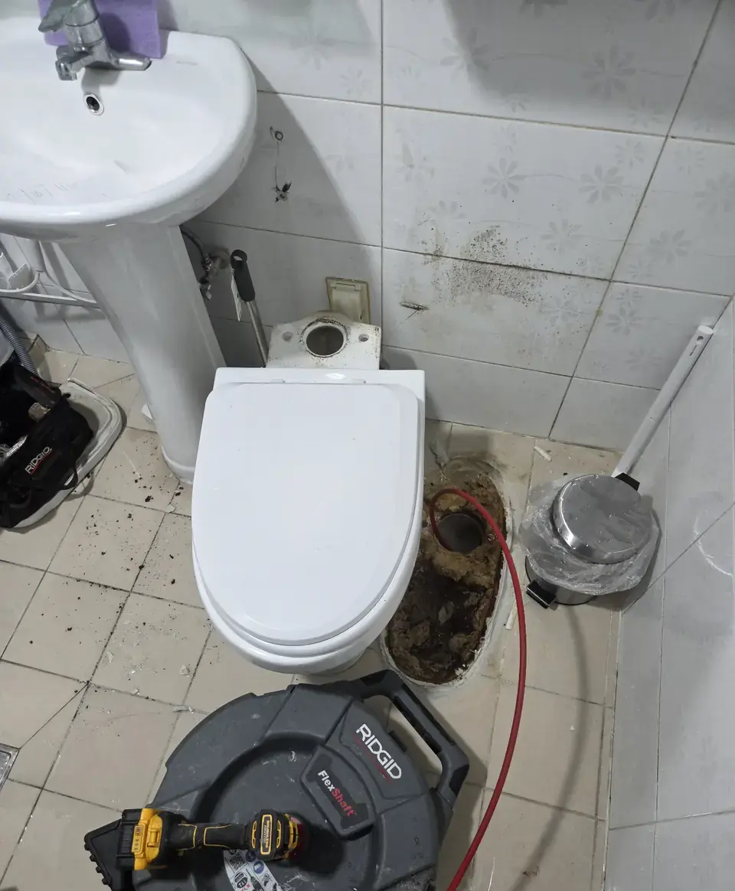
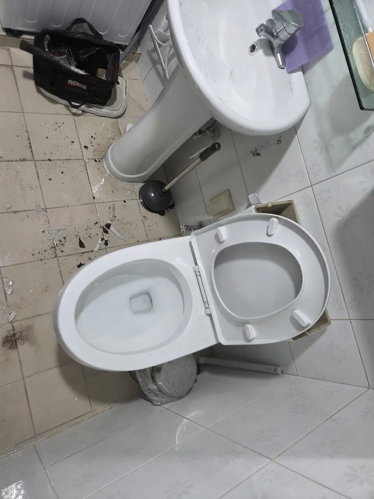
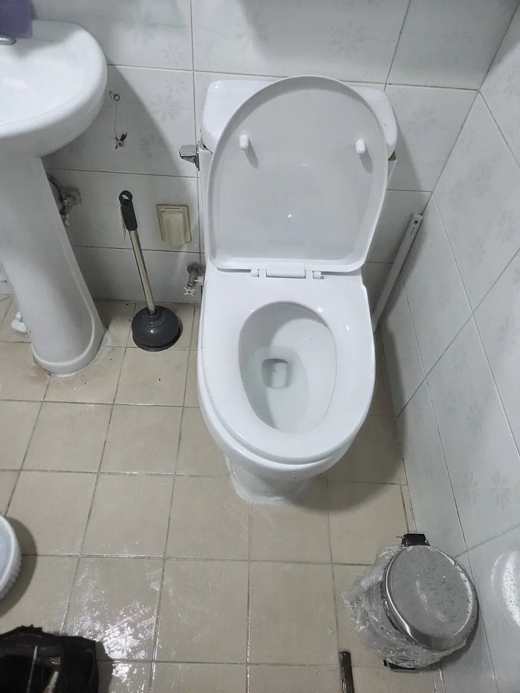

A blocked toilet is not like a broken air conditioner. You cannot decide to
deal with it at the weekend. If the flat has one bathroom, the clock starts
immediately, and everyone in the building knows it — including whoever you
call.

That urgency is what the price is built on. Here is what happened to us, and
the flat prices we now hold ourselves to so it cannot happen to you.

> ⚠️ **Fair warning.** This article is about what comes back up a blocked
> waste pipe. Nothing here is graphic, but there is no way to explain the
> pricing without describing the job.

## What happened in one of our own buildings

A tenant messaged to say the toilet was blocked. We sent someone, it was
cleared, everyone moved on.

A few weeks later, the same flat again: the water was going down, but slowly
enough that they were watching it every time. Nobody had put wet wipes,
sanitary products or kitchen roll down it — we asked, and we believed them,
which turned out to be the important detail.

Because we were busy, we passed the job to an acquaintance who does this for a
living rather than finding someone ourselves. Before he came, we set a
number in writing: **₩300,000, and not one won more.**

He opened the toilet. Debris kept coming out of the pipe, more than anyone
expected. Then the price arrived: **₩600,000–700,000**, because the toilet had
to be lifted off the floor — plus **₩100,000 for every metre of pipe** that
had to be cleared. How many metres? *We will know when we get there.*

The toilet was already off the floor and the flat had no working bathroom. We
said yes, because at that point there is no other answer.

*The toilet off the floor. Everything after this point was quoted, not agreed · ⓒ @BalliBalliSeoul*

When the work was finished, a video arrived: the toilet itself was now broken
and would need replacing. **₩200,000 more**, total **₩900,000**, and the
earliest fitting date was two days away.

We said no to that part and had it replaced through a supplier we already
knew, for a fraction of it. But the rest we paid.

## How ₩100,000 becomes ₩900,000

Read that story again and notice that **nothing in it is obviously dishonest.**
That is the point. The structure does the work:

1. **The price is discovered during the job, not before it.** Once the toilet
   is off the floor, you are not comparing quotes. You are getting your
   bathroom back.
2. **The unit is invisible.** ₩100,000 per metre sounds reasonable until you
   realise you cannot see, count, or check the metres — and in fairness,
   neither can the man doing the work. He is feeding a cable into a pipe
   nobody can see. At best he is judging it by how much cable has come off
   the drum and by what the machine feels like in his hands: an experienced
   guess, but a guess. Nothing in that bathroom measures anything. A price
   charged by a unit that neither side can verify is not a measurement — it
   is a number that arrives when the job is over, and the only person who
   can dispute it is standing in a flat with no working toilet.
3. **Fear does the closing.** We were told that if this were left, the pipe run
   could fill and the line itself might shift. It is the plumbing version of
   *your brakes could fail on the motorway*: technically a sentence about
   physics, practically a sentence about money.
4. **The last item arrives after the work.** A broken toilet and a two-day
   wait, quoted by the only person standing in your bathroom.
5. **The clock is on the other side of the table.** He said 4:30 and arrived
   at about five. By the time the toilet was off the floor it was evening —
   too late to call anyone else, and far too late to leave a household
   without a working bathroom until morning. We have no way of knowing
   whether that was deliberate, and we are not going to claim it was. But it
   is worth seeing plainly: **the later a job starts, the fewer choices the
   customer has when the price is named**, and everyone in the trade knows
   that.

*Someone had already written "Do not flush" on the basin. The blockage was never about what the tenants put down it · ⓒ @BalliBalliSeoul*

If this can happen to a Korean landlord who does this for a living, with a
plumber he was introduced to personally, then the exposure for someone
arranging it in a second language, by phone, at nine at night, is not a small
step up from that.

## The rule that costs nothing: do not hurry

You are allowed to say, out loud, *stop.*

Before a tool goes into the toilet, get these four answers — in a message, so
they exist afterwards:

| Ask | Why it matters |
|---|---|
| **What is the total price for this visit?** | Not the starting price. The total |
| **What could change it, and by how much?** | A number you cannot picture is not a quote |
| **Is anything charged by length, time or unit?** | This is where the invisible metres live |
| **What happens if it is not fixed?** | Decide this while you still have a choice |
| **What time will you arrive, and how long will it take?** | A job that starts in the evening ends when you have no alternatives left. Ask for the morning |

**And now the honest part: we did all of that, and it did not hold.** We named
₩300,000 before he came, in writing, and said plainly that it was a ceiling
rather than an opening bid. The number still moved once the toilet was off the
floor.

So asking is necessary, and it is not sufficient. What actually protects you is
**the stop point**, and there is only one:

> **Nothing comes apart until the price for taking it apart is agreed.**

Lifting a toilet is the moment your options end. Before it happens you have a
bathroom, a phone and other numbers to call; after it happens you have an open
pipe in the floor and one person who can close it. Any price named after that
line is not a quote — it is a bill you were told about. So make the decision
while the toilet is still bolted down: *what does the next step cost, and what
is the most this can end up being?* If the answer is "we'll see", that is the
answer, and it is the point to say no and call someone else.

And two things you can do in the meantime, both free: **stop flushing** (a
second flush is how a blocked toilet becomes a flooded bathroom, and the
ceiling below becomes your problem), and give it twenty minutes before anyone
touches it. A partial blockage often drops on its own. The full version of the
do-it-yourself route — including the ₩3,000 tool that clears most household
blockages — is in [clogged toilet in Korea](/blog/clogged-toilet-korea/).

## Try ₩5,000 before you spend ₩100,000

We should say the obvious thing before we quote you anything: **clearing a
blockage is expensive work, and most household blockages do not need us.**

Buy the tool first. All three of these are open to you without a word of
Korean:

| Where | What to get | Rough cost (as of September 2026) |
|---|---|---|
| **Daiso** | The rubber plunger, sold in most branches. Look for the bathroom aisle | ₩3,000–5,000 |
| **A hardware shop (철물점, cheolmuljeom)** | A heavier plunger, or a hand auger — the coiled wire on a handle | ₩5,000–20,000 |
| **Coupang** | Same things, delivered overnight. Search 변기 뚫어뻥 (toilet plunger) or 배관 스프링 (drain auger) | ₩5,000–20,000 |

**뚫어뻥 (ttu-reo-ppeong)** is the word people use, and it covers two different
products — the rubber plunger and a bottle of chemical drain opener. Start
with the plunger. Work it properly before giving up on it: enough water in the
bowl to cover the rubber, a seal against the opening, and steady strokes
rather than one heroic shove. Ten minutes of that clears most of what people
call a plumber for.

A **piston or pressure type** is the next step up when a plain plunger cannot
get a seal — a Korean squat-style pan, or a bowl shaped so the rubber keeps
slipping. They push the same water harder, in a straight line.

**Chemical openers are the last thing to try, not the first.** They are made
for the soft stuff — grease, hair, soap — in a drain that is slow rather than
stopped. In a bowl standing full of water they mostly get diluted, and they do
nothing at all to an object. Two rules if you use one: follow the dilution on
the bottle, and **never add a second product because the first did nothing.**
Mixing drain chemicals is genuinely dangerous, and a plumber then has to work
in what you mixed.

  

    <strong style="color:var(--fg)">What to buy, in order</strong> — the piston plunger on the left is the workhorse and the one to own. The pressure gun in the middle is for bowls where a rubber cup will not seal. The drain opener on the right is the last thing to try before you call anyone, and only on a drain that is slow rather than fully blocked — see the two rules above.
  

  

    
    
    
  

  

    Affiliate links — we earn a small commission if you buy through them, at no extra cost to you. 
    이 포스팅은 쿠팡 파트너스 활동의 일환으로, 이에 따른 일정액의 수수료를 제공받습니다.
  

If one of those clears it — good. You are done, and you spent a few thousand
won.

> **Tried all three and it is still blocked?** Send us a message on
> [WhatsApp](https://wa.me/821075191282) or
> [KakaoTalk](https://pf.kakao.com/_RJxhSX/chat) and tell us what happened when
> you plunged it — water only, or something coming back. That one sentence
> tells us which job this is, and what it costs is on this page rather than
> decided in your bathroom.

The rest of this page is for what happens when the tools do not work, and for
making sure that the person who turns up afterwards charges you what they said
they would.

## What the plunger tells you, before anyone is paid

A plunger is not only a tool. It is the cheapest diagnosis available to you,
and you can do it before anyone is called.

**If the toilet itself is clear, plunging moves water and nothing else.** The
water rocks, drops, comes back, settles. That is the whole event. What you are
feeling is a bowl and a trap doing what they are supposed to do, with the
blockage — if there is one — somewhere you cannot reach.

**If the line below is blocked, what comes back is not water.** In our flat,
waste kept rising into the bowl on every stroke, and it kept coming. That is
not the toilet failing to drain. That is a full pipe returning what is
already in it, because the only direction left is up.

That difference decides which of the prices below you are in:

| What plunging brings back | What it usually means |
|---|---|
| Water only, sloshing and settling | The toilet and its trap are clear. Look further down the line — or at a different fixture |
| Waste returning, repeatedly | Something is blocking the run beyond the toilet. This is the camera job, not the plunger job |

It is worth doing this once and telling us what you saw, because it is the
single most useful sentence in the first message. Take a photo if you can
bear to.

## What we charge

We set flat prices after that job, deliberately, so that the person in the
bathroom is not also the person deciding what it costs.

| Work | Price (as of September 2026) |
|---|---|
| Clearing a standard toilet blockage, call-out included | **₩100,000** |
| Lifting the toilet off the floor, camera inspection, clearing underneath | **+ ₩300,000** |
| Clearing a blockage further along the pipe run | **₩300,000** |

**No charge by the metre. No charge for what is found. No call-out fee on
top.** Added together the list tops out at ₩700,000 — but that is a ceiling,
not a target, and you know it before anyone arrives rather than after the
toilet is off the floor.

**What we are actually aiming for is ₩200,000–300,000 for the whole thing.**
Most blockages never get past the first line, and a good deal of what does can
be finished without lifting anything. Where the pipe allows it, that is the
range we try to land in — and where it genuinely cannot be done for that, we
would rather tell you before we start than discover it with your toilet on the
floor.

Two limits, stated in advance rather than discovered on the day:

- **We do not replace pipework.** If the pipe itself is damaged rather than
  blocked, we tell you and stop. That is a different trade and a conversation
  with your landlord or the building — and it is exactly the scenario that
  gets used to sell you work, so we would rather not be the ones selling it.
- **Replacing the ceramic is priced separately.** A cracked pan, a cistern, a
  basin — that is a fitting job rather than a blockage job. The part has a
  price and the fitting has a price, both quoted and agreed before anything is
  ordered, and neither is included in the figures above. We say so here
  because in our own story the broken toilet arrived *after* the work, as a
  video and a number.

### Who turns up, and how far he drove

Something the plumber himself told us, which we had never thought about
properly: **a man who covers all of Seoul and half of Gyeonggi has to earn back
the half-day he spends in the van.** Nobody itemises travel on a plumbing
invoice. It arrives inside the price, or it arrives as a job that turns out to
need more work than it did.

Someone who works your own district has no dead mileage to recover. He is
twenty minutes away, he will be back tomorrow if something is still wrong, and
he has neighbours who talk to each other — which is a stronger guarantee than
anything he could write down.

So we match you to a pro who **already works your area**, and who has agreed
our prices before he is given your address. If we do not have someone near you
yet, we will say so rather than send a van across the city and let you pay for
the journey.

**We work in Seoul and Gyeonggi.** Outside that, ask anyway. If we know someone
good who works only in your part of the country, we will introduce you — that
is the same principle rather than an exception to it, because the person you
want is always the one who is already nearby.

**The cost of doing it this way is that we are not the fastest option.** A
local pro who has agreed a fixed price is not always free this afternoon. Our
aim is to have someone matched to you **within two or three days**, and we will
tell you where you stand rather than leave you waiting on a maybe.

That trade is the whole argument of this page. **Being in a hurry is the single
most expensive thing you can be in this situation** — it is what put the price
up in our own story, and it is what a bad quote relies on. If the toilet still
drains, even slowly, those two days cost you inconvenience and save you a great
deal of money.

And if it genuinely cannot wait — one bathroom, water at the rim, nothing
draining at all — **say so and we will tell you honestly that you need someone
tonight**, which may not be us. Then go back and read the four questions
above, because that is the call where they matter most.

There is one more thing behind those numbers, and it is the reason this page
exists. **We do not work with people who will not hold a number.** A price that
moves once the customer has no choices left is not a pricing method, it is a
position of strength being used, and a tradesman who does that to you once will
do it to the next person we send him to. That is a decision we make before
anyone is in your bathroom, so that you do not have to make it standing in
one.

## When "it drains, but slowly" is the real message

The first clear worked. Three weeks later the same toilet was slow.

A slow flush after a clearing usually means the first job removed what was in
reach and not what was causing it. If the tenants are certain nothing unusual
went down — and in this case they were right — then the cause is further in:
years of build-up in an older line, or something lodged where a plunger will
never get to it.

This is the moment worth spending money on a **camera inspection** rather than
a third clearing. It is the difference between paying once to find out, and
paying repeatedly not to.

## The Korean part

Almost every plumber in Seoul works by phone, in Korean, and quotes by
speaking rather than in writing. Four things break for an English speaker:

1. **Getting the total in writing before the work.** This is the single
   sentence that protects you, and it is the hardest one to say in Korean.
2. **Understanding what changed mid-job.** "We found something" is a complete
   sentence in any language, and it is not an explanation.
3. **Who pays.** Blockage from use is usually the tenant; a failing or ageing
   pipe is usually the landlord. The line between those is decided by what the
   plumber writes down.
4. **Saying no to the last item.** The toilet replacement quoted at the end of
   our story was refused. Refusing takes some confidence about what things cost.

*The same bathroom, put back · ⓒ @BalliBalliSeoul*

## Get it sorted

If your toilet is blocked in Seoul right now: stop flushing, and send us a
message before you agree to anything. We will tell you which of the three
prices above this is, arrange the visit in English, and the figure you were
given is the figure you pay.

And if we have nobody for you — nobody free, nobody near enough, nobody who
will hold the price — **we will tell you that we have nobody.** You will get a
straight answer the same day instead of a maybe, and you can spend the evening
calling someone else rather than waiting on us. A referral we cannot stand
behind is worth less to you than an honest no, and it costs us more.
