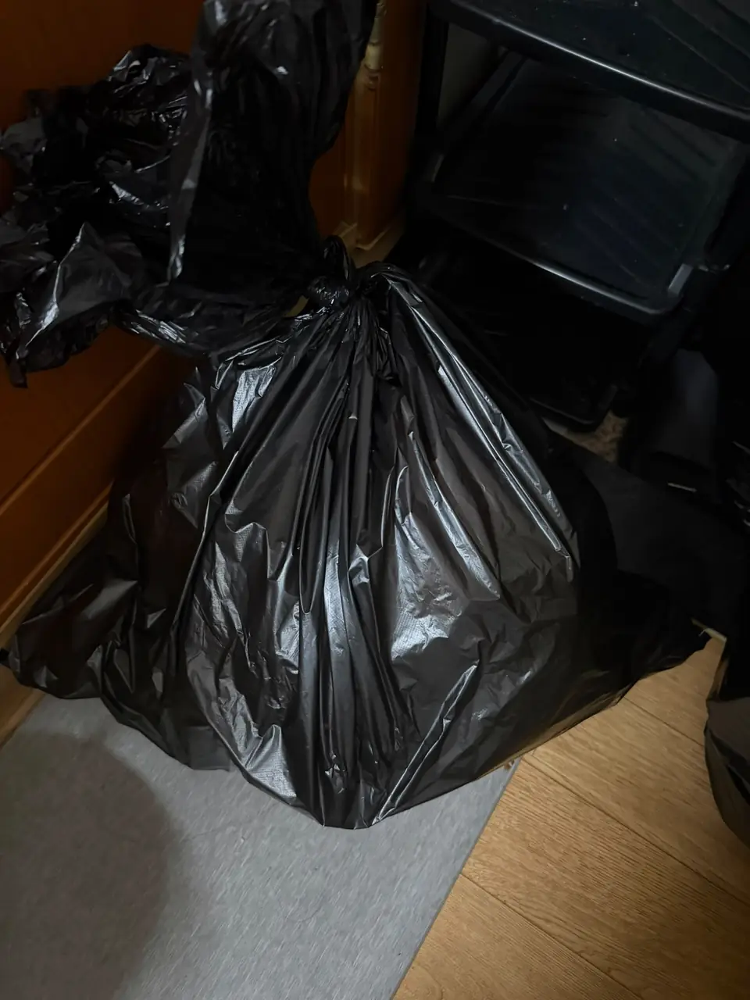
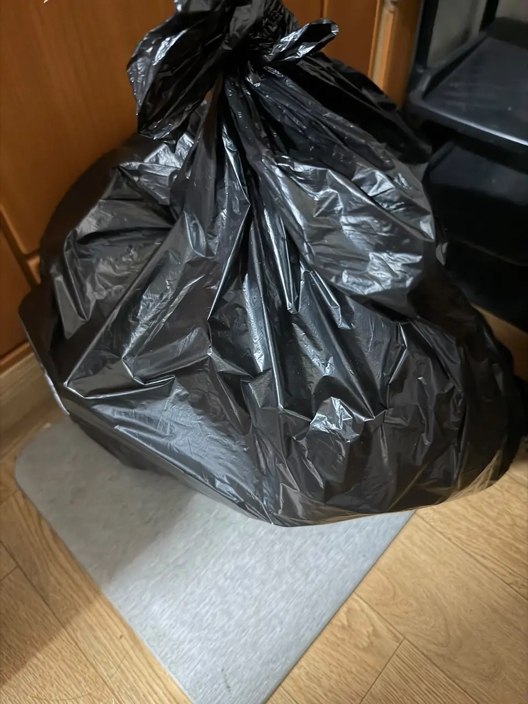
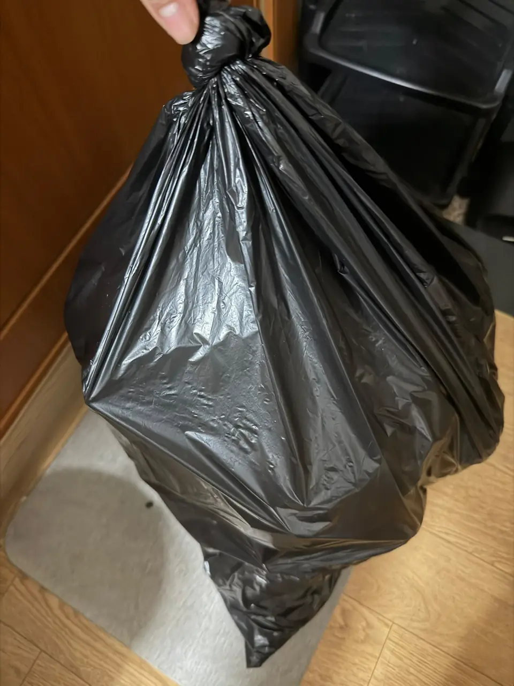

It never starts as a problem. **One bag goes by the door** because it is
raining, and because you are not certain it is the right bag anyway. A second
one joins it that week. The food waste goes in the freezer, which feels
clever for about seven days.

Then it is a month later, the room is small, and the bags are furniture.

That is how somebody in Seoul ended up messaging us recently: **seven bags**
by the door of a one-room — general waste, paper, plastics, cans, and food
waste that had been waiting a while — and no idea how to get rid of any of
them. Not a lazy person. Somebody who wanted them gone, could not work out
the rules, and had watched the problem grow past the point where starting
felt possible.

We cleared it. Here is why this happens to people here in particular, what it
costs to have it dealt with, and the point where it stops being a rubbish job
and becomes a cleaning one.

## Why the bags pile up here and not at home

**In a lot of countries, rubbish is one bag.** In the US it is the clearest
case: everything goes in together, the bag goes out, and it is gone. Nobody
sorts it, nobody is fined for it, and the idea that a bag could be *the wrong
bag* does not come up. Plenty of people arrive in Korea having never sorted
household waste in their lives, and there is nothing strange about that.

Korea sits at the other end of that scale. There is no bin you drag to the
kerb. There are **four separate streams**, each with its own container, its
own timing, and its own way of going wrong:

- **General waste** goes in a paid bag — and the bag has to be the one sold
  for *your* district. A bag bought in the next gu over is the wrong bag.
- **Food waste** is separated by law, into a chipped bin, a tag-priced bag,
  or a building collection point, depending on the building.
- **Recycling** splits further than most people expect: paper, plastics,
  cans, glass, vinyl.
- **Bulky items** need a paid sticker arranged in advance, which is a
  different process again.

And getting it wrong is not free. Rubbish in the wrong bag, or out on the
wrong night, comes back — as a sticker on the bag, a note from the building,
or **a fine**. That is the part that makes people freeze: not knowing the
rule is one thing, but the penalty for guessing wrong is what turns "I'll
deal with it tomorrow" into a month.

Each stream is straightforward on its own. The full rules, the fines and
the bulky-item process are in
[how to throw away trash in Korea](/blog/how-to-throw-away-trash-in-korea/),
and that guide is the one to read if what you want is to do it yourself.

What turns it into a pile is the stacking of four small obstacles:

1. **You are not sure which bag is correct**, so you postpone rather than
   risk it.
2. **Collection is on set nights**, and missing yours costs a week each time.
3. **There are almost no public bins**, so nothing can be dealt with on the
   way out.
4. **The room is small.** In a one-room there is no utility space to hide a
   backlog in, so it sits where you live.

None of that is a personal failing. It is four rules and a small flat.

*Seven bags, in a room with nowhere to put them · ⓒ @BalliBalliSeoul*

## What a clearance actually involves

The job is not carrying bags downstairs. It is **sorting first**, which is
the part people underestimate, and which decides what the whole thing costs.

For the flat above, that meant:

- Splitting what was already bagged into the four streams — a black bag with
  paper, plastic and food scraps mixed together cannot go out as it is
- Re-bagging the general waste into the correct district bags
- Emptying and rinsing the recyclables that needed it
- Handling the food waste separately, with its own bag and its own bin
- Carrying it all down, and putting each stream out **on the night that
  stream is collected**

That last line is the one that matters. Rubbish put out on the wrong night in
Korea often does not get taken, and in a building with a management office it
comes back with a note on it.

*Sorting is the work. Carrying it down is the easy part · ⓒ @BalliBalliSeoul*

## What it costs

Priced by volume and by how much sorting is needed, as of September 2026:

| What we find | Guide price |
|---|---|
| **Already sorted** — each stream in its own bag, ready to go out | From **₩30,000** for the visit |
| **Not sorted** — bags with everything mixed together | **From ₩50,000 per bag**, agreed with you before we start |
| Rubbish loose on the floor rather than in bags | Quoted from photos — usually a clean rather than a clearance |
| Furniture, appliances, a mattress | Bulky-item process, priced separately |

**The gap between those first two lines is the whole article.** A sorted
clearance is one visit priced once. An unsorted one is priced *per bag*,
because every mixed bag is its own job: open it, separate four streams out of
it, rinse what needs rinsing, re-bag the general waste into the correct
district bag. Seven mixed bags is seven of those.

So the cheapest thing you can possibly do, before anyone comes, is **split
what you have by stream** — even roughly, even into supermarket bags. You do
not need to know which district bag is correct or which night is which. Those
are the parts we handle.

**We buy the district bags for you** where that is what is needed, and pass
them on at what they cost.

> **Not sure whether this is a one-hour job or a bigger one?** Send a photo of
> the room on [KakaoTalk](https://pf.kakao.com/_RJxhSX/chat) or
> [WhatsApp](https://wa.me/821075191282) and we will tell you which of the
> lines above it is, and what the total comes to. Asking costs nothing.

## When it is a deep clean instead

There is a line worth being honest about, because paying for the wrong one
wastes your money.

**If the rubbish is in bags, this is a clearance.** Somebody sorts, carries
and disposes, and the room is normal again the same day.

**If the rubbish is on the floor** — if there are food containers under
furniture, if it has been there long enough to smell or to attract insects,
if the floor has not been seen for a while — then removing the bags leaves
you with a room that still needs doing. That is a
[deep clean](/blog/deep-clean-korea-sorting-first/), and the disposal is the
first stage of it rather than the whole job.

The deep-cleaning guide makes the same point from the other side: **the
bottleneck in a deep clean is almost always disposal, not cleaning.** A crew
can clean a floor in an hour. Getting four streams of accumulated waste out
of the building legally is what takes the day.

If insects have arrived, that is a third thing again and it comes first —
[pest control](/blog/pest-control-korea-cockroaches-bed-bugs/) before
cleaning, or you clean twice.

## Moving out? Do this before the deposit conversation

Leaving a flat with rubbish in it is one of the reliable ways to lose part of
a deposit, and it is also one of the easiest to avoid. Landlords and agents
deduct for disposal because they have to pay somebody to do exactly this.

The order that works: **rubbish out first, then the clean, then the
photographs.** Cleaning around bags achieves nothing, and photographs taken
with the bags still in shot are not the evidence you want. The deposit side
of this is in
[move-out cleaning](/blog/move-out-cleaning-korea/), and if furniture is
going too, the sticker process is in the
[trash guide](/blog/how-to-throw-away-trash-in-korea/).

*Out the same day, on the night that stream is collected · ⓒ @BalliBalliSeoul*

## The Korean part

Four places this needs Korean, which is the honest reason foreigners let it
build up:

1. **Which bag, for which district.** The bag names and sizes are in Korean,
   and the shop assistant's question — "몇 리터?" — expects a number.
2. **Where the food waste goes in this building.** It is a card-operated bin,
   a tagged bag, or a communal container, and which one is a building-level
   fact nobody has told you.
3. **Which night is which stream.** Usually posted in the entrance, in
   Korean, sometimes only on a sticker by the lift.
4. **The management office**, if something has already gone wrong and there
   is a note on your door.

## Get it sorted

Send a photo of the room. We will tell you whether it is a clearance or a
clean, what it will cost, and which night it can go out — and then do it,
with the right bags for your district.

It is an ordinary job and we have done it before. Nobody who does this for a
living is going to be shocked by the state of a room.
