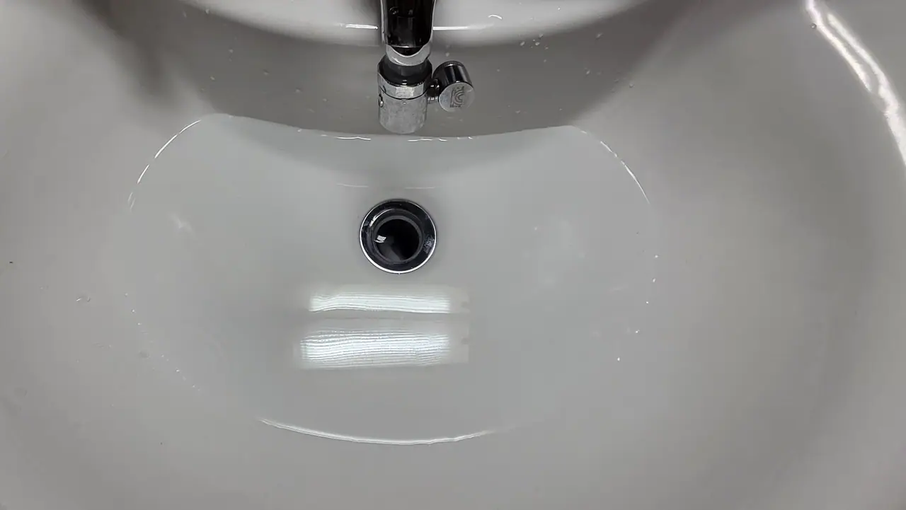
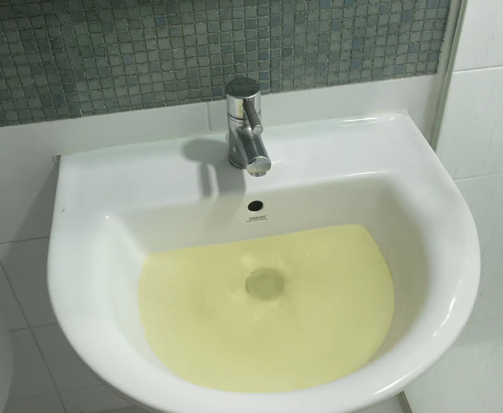
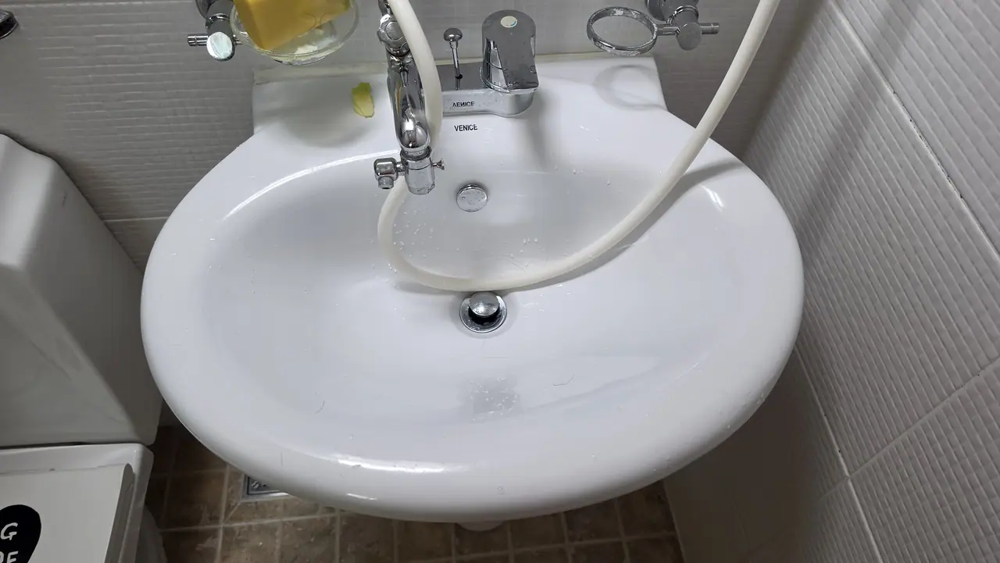
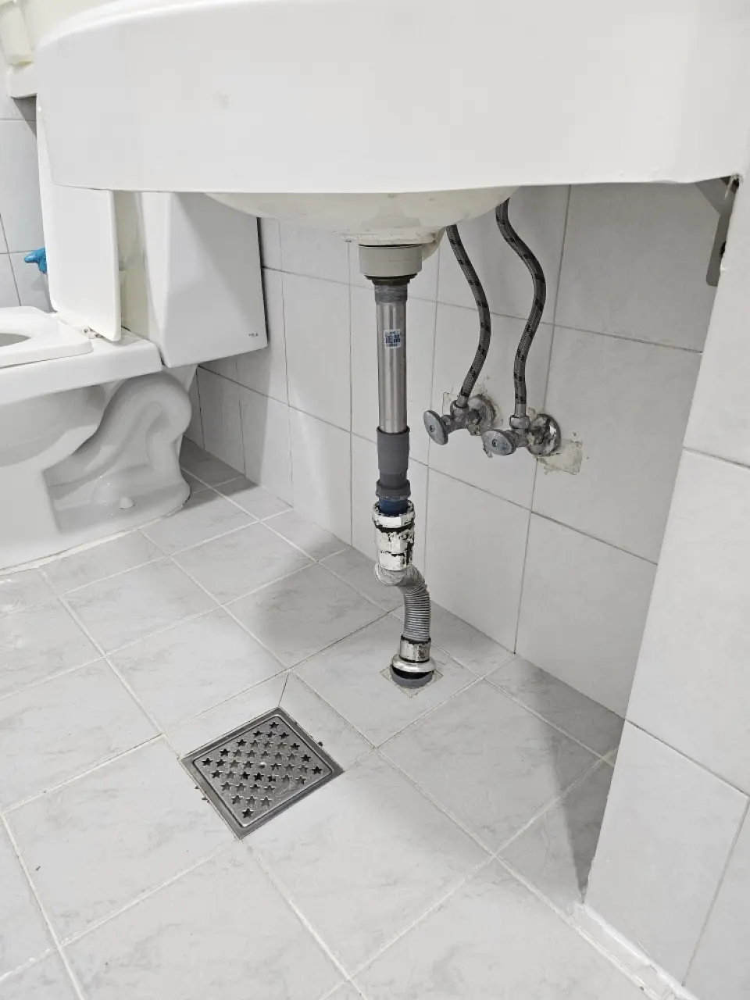
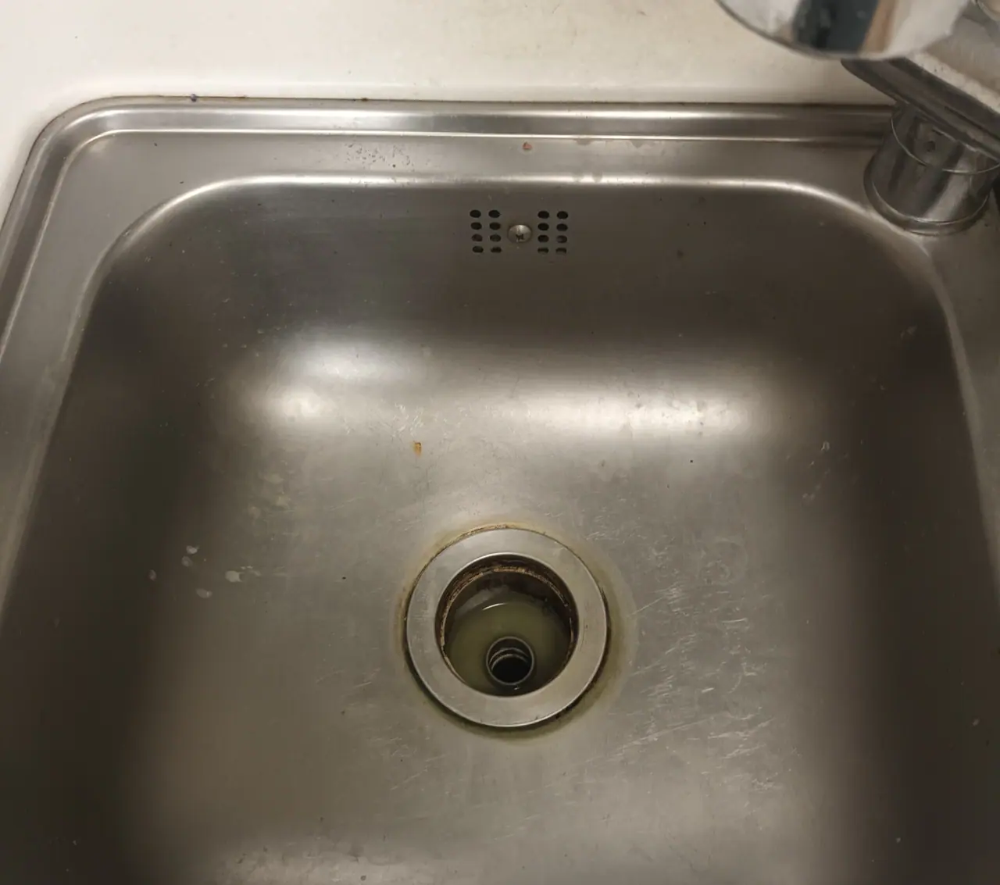
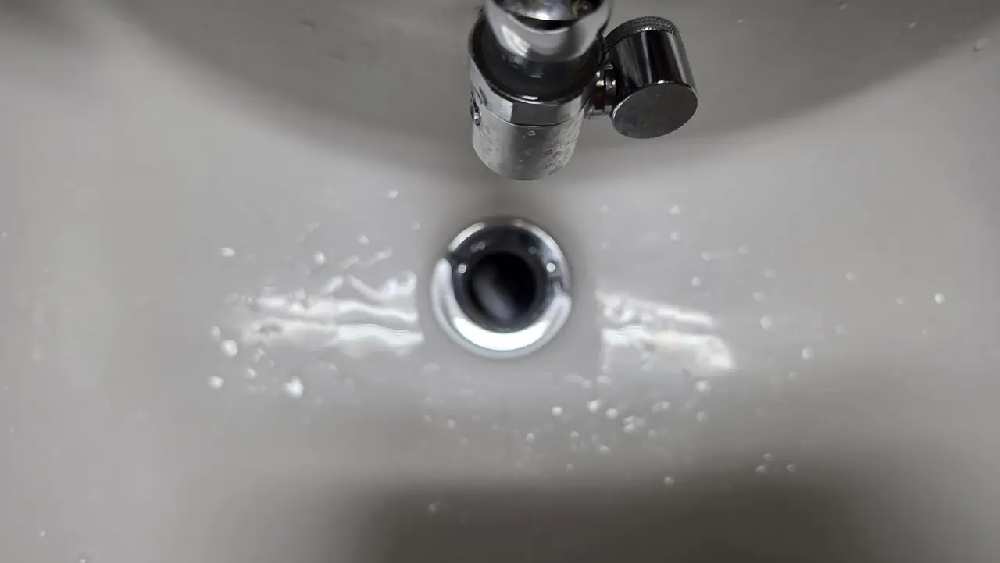

You poured a whole bottle of drain cleaner into the bathroom sink, watched
it sit there, and the water still drains like cold honey. Standard Korean
apartment problem, and the fix usually costs ₩2,000 — if it's the fix your
sink actually needs. Here's the order to try things in, and the signs that
mean stop.

**If it's the toilet rather than the sink**, almost none of this transfers — different
tool, different causes, and a much worse outcome if you get it wrong. That one is
[here](/blog/clogged-toilet-korea/).

## Slow and blocked are not the same problem

Start here, because the answer changes what you do next — and most people
skip it and go straight for the chemicals.

*Spotless basin, water still sitting in it · ⓒ @BalliBalliSeoul*

That basin is clean. It has also been holding that water for a while.
**A slow drain is a partial restriction** — the pipe is narrowed, not
sealed — and the cause is usually within arm's reach. **A dead stop is a
full blockage**, often further down, and the DIY odds are worse.

The slow version rarely arrives overnight. It gets worse over weeks,
people stop noticing, and then it looks like this.

*Same problem, several months later · ⓒ @BalliBalliSeoul*

That yellow is not the water supply. It is what has been sitting in the
trap coming back up, and by this point the ₩2,000 tools are a long shot
rather than a likely fix. **The gap between those two photographs is the
whole argument for dealing with a slow drain while it is only slow** —
it is the cheapest it will ever be to fix.

### The test: how many drains are slow?

Fill the basin, pull the stopper, and watch. Then do the same at every
other drain in the flat — the shower, the floor drain, the kitchen sink.
What you are comparing is not seconds on a stopwatch but **whether your
drains agree with each other.**

| What you see | What it usually means |
| --- | --- |
| One drain slow, the rest normal | Your trap or stopper. Keep reading — this is the fixable one |
| Bathroom drains slow together, kitchen fine | Often the bathroom's shared branch, past your fittings |
| **Everything slow, everywhere** | The building's vertical stack. **Not your job** — call the 관리사무소 |
| Slow **and** it gurgles or smells | Air is not moving properly. Worth a professional look |
| Slow, then suddenly backs up when a neighbour runs water | Stop. That is the shared line, and it can flood you |

The last two rows are the ones people push through and regret. A
building-line problem does not get better because you fed a plastic strip
into your basin.

## Try this first

### Pull the stopper out

Most Korean bathroom sinks use a **pop-up stopper** — the metal cap you
press to open and close. What nobody tells you: on most models it simply
**pulls straight out** (grab and yank firmly; some twist off instead). The
bottom of that stopper is usually wearing a beard of hair and soap gunk,
and half the time, that *is* the clog. Clean it, push it back in, done.

*The chrome cap in the middle is the stopper — it comes out · ⓒ @BalliBalliSeoul*

### The ₩2,000 tools that beat the ₩8,000 bottle

If the stopper was clean, the clog is in the pipe — and chemical drain
cleaner mostly fails against a packed hair ball. Two tools from Daiso or
any neighborhood mart do better:

- **A barbed plastic drain strip** — a long flexible strip with backward
  hooks. Feed it down the drain, twist, pull up slowly, and it drags the
  hair mass out with it. Usually ₩1,000–2,000.
- **A small plunger** — the Korean word to know is **뚫어뻥**
  (*ttureo-ppeong*, literally "unclog-pop"). Cup it over the drain, run a
  little water, and give it a dozen sharp pumps.

Can't explain what you need at the store? Show a photo — a picture of the
tool works better than any romanized pronunciation.

### Check under the sink

Behind or under the basin there's usually a **flexible accordion-style
plastic pipe** connecting the sink to the floor drain, often with a
screw-off trap. In Korean apartments these are cheap, standard parts that
are *designed* to be removed and rinsed: unscrew, tip the gunk into a bag,
screw back on. If yours hides behind a porcelain pedestal, reach around —
the back is hollow.

*The pipe in question — basin to floor drain · ⓒ @BalliBalliSeoul*

Put a bucket or a towel under it first. There is always more water in
that pipe than you expect.

### Last gentle option

A kettle of hot (not roiling boiling, if your pipes are plastic) water,
or baking soda followed by vinegar, can loosen greasy buildup. It won't
break a real hair clog, but it's a decent monthly habit against smells.

## The kitchen sink is a different clog

If it is the kitchen rather than the bathroom, stop thinking about hair.
**Kitchen drains block with grease**, which pours in warm and sets solid
in the cold section of pipe. The barbed strip that saves a bathroom sink
does very little here.

*Strainer lifted out — this ring is what slows a kitchen sink · ⓒ @BalliBalliSeoul*

Three things change:

- **Lift the strainer basket out.** Korean kitchen sinks drain through a
  removable basket (거름망) that sits in the opening. It is meant to be
  taken out and emptied, and a full one alone will slow the sink to a
  crawl.
- **Hot water and washing-up liquid genuinely help here**, unlike with
  hair. Run the tap as hot as it goes with a squirt of detergent, and
  repeat. Grease is the one clog that dissolves.
- **Food scraps do not go down the drain in Korea anyway.** Food waste is
  collected separately and thrown out by weight — the system is in
  [how to throw away rubbish in Korea](/blog/how-to-throw-away-trash-in-korea/).
  Scraping plates into the food bin instead of the sink is the single
  biggest thing that keeps a kitchen drain clear.

## When to stop and call someone

Put the tools down if any of these applies:

- **Several drains are slow at once** (sink + floor drain + shower). That
  points at the building's shared line, not your sink — no amount of Daiso
  equipment reaches it.
- **The clog came on suddenly** with no hair on the stopper — likely an
  object, or something further down.
- **It keeps coming back** within weeks. Recurring clogs usually mean a
  sagging pipe section where water pools, which is a camera-diagnosis job.
- **You already used chemical cleaner.** Important: **tell whoever comes to
  fix it.** Chemical residue sitting in a blocked pipe can burn skin and
  eyes, and a plumber needs to flush it safely before working. (This is
  standard procedure when we arrange one — just mention it in the chat.)

Two neighbours of this problem, in case you are in the wrong
article: a **tap that drips** rather than a drain that blocks is a
much cheaper fix and often a
[fifteen-minute job you can do yourself](/blog/fix-leaky-faucet-korea/).
And if water is appearing where no pipe of yours runs — a ceiling
stain, a damp patch on a neighbour's side — that is
[a different problem with a different bill attached](/blog/water-leak-korean-apartment/).

## What it costs in Seoul

Typical ranges for professional work, as of 2026:

| Work                                    | Typical cost              |
| --------------------------------------- | ------------------------- |
| Standard sink/drain clog                | ₩70,000–120,000           |
| High-pressure jetting (deep blockage)   | ₩120,000–200,000          |
| Building main / shared line             | From ₩150,000, on-site quote |

**Nights, weekends and public holidays can carry a call-out surcharge** —
that is how the trade works here, and anyone telling you otherwise is
guessing. When we arrange a plumber through our
[English-speaking plumbing service](/plumbing), the surcharge is inside the
number you are given: the price is confirmed with you in the chat **before**
work starts, never added to the invoice afterwards. Ask us in the chat and
you get the figure for your actual time and job. If it can't be fixed, you
pay nothing.

## The Korean part

The pipe doesn't care what language you speak, but everything around it
does. The store conversation for the right tool, the plumber's phone call,
and — the big one — **who pays**. In Korea, clogs from daily use (hair,
wipes, food scraps) are generally the tenant's cost, while aging pipes and
structural problems are the landlord's. That conversation happens in Korean
with your landlord or the building office (관리사무소, *gwallisamuso*), and
a written diagnosis with camera footage settles it fast — which is exactly
what we hand you when we arrange the visit. And if the landlord call is the
part you're dreading, our [anything-else concierge service](/etc) makes
that call in Korean for you.

This is also where the slow-versus-blocked distinction earns its keep. **A
drain that has been getting slower for months is evidence of a pipe
problem**, not of what you did last week — and that is a much better
position to be in when the bill is being decided.

## Get it sorted

*What you are aiming for · ⓒ @BalliBalliSeoul*

> **Tried the ₩2,000 tricks and it's still backing up?** Send a photo or
> video of the drain on [WhatsApp](https://wa.me/821075191282) — we'll
> tell you whether it's a DIY fix or a plumber job, and if it's the
> latter, arrange one with the price confirmed in English first. Asking
> costs nothing — you pay only for the work you book.

And a habit that prevents round two: drop a ₩1,000 hair-catcher net over
the drain, and pull the stopper for a rinse once a month. Your future self
— and your deposit — will thank you.
