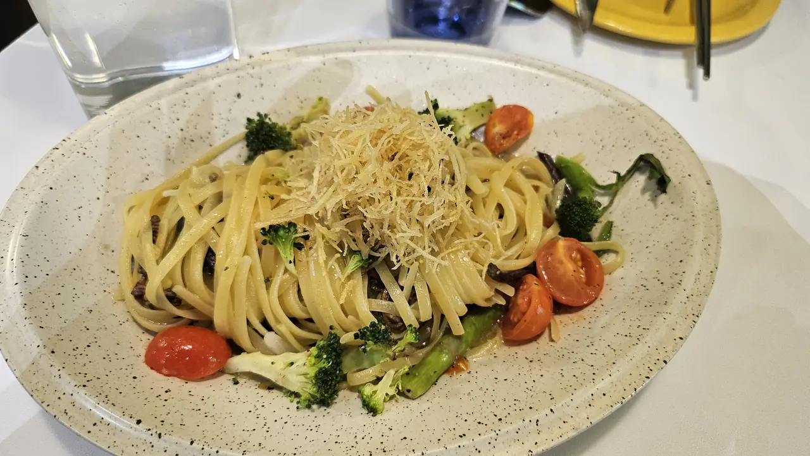
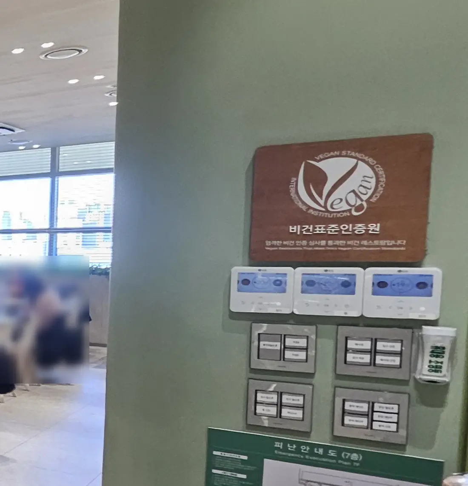
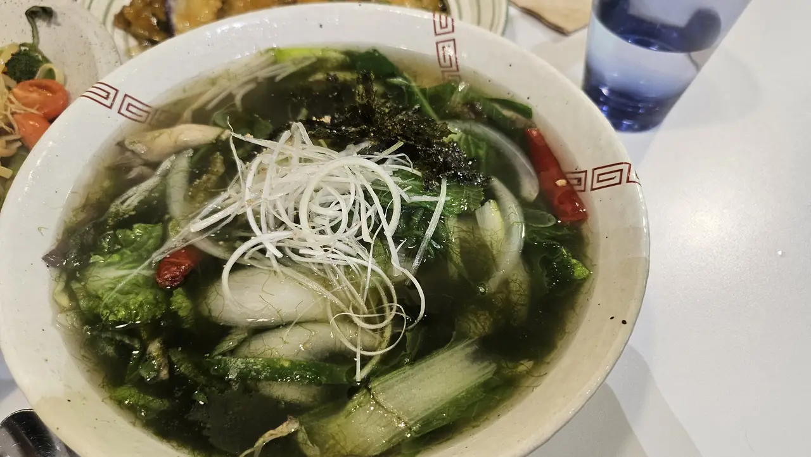
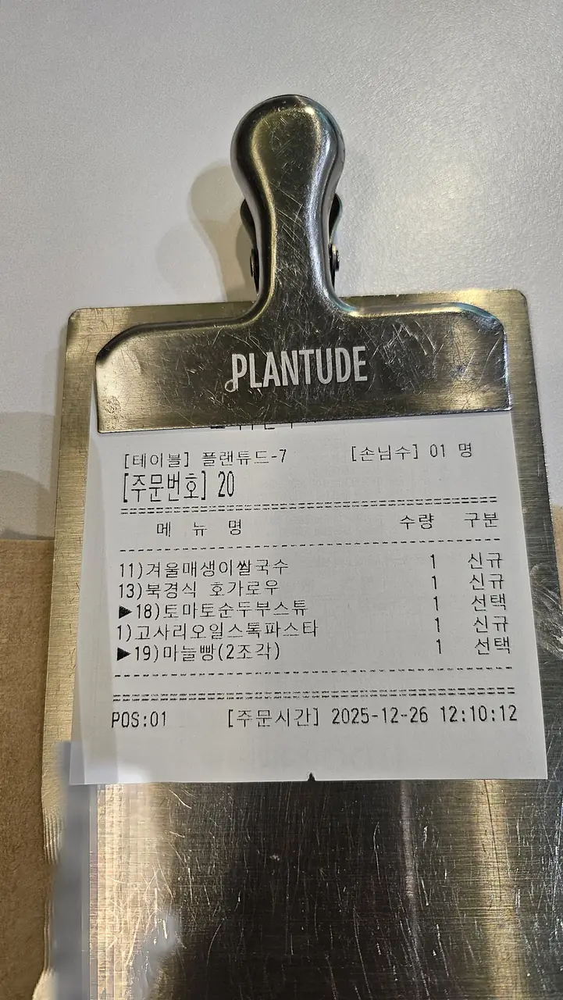

A Korean who lives abroad came back
[to r/koreatravel](https://www.reddit.com/r/koreatravel/comments/1wa769a/some_vegetarian_places_in_seoul/)
with a list. He visits family here every year or two with his American
wife, who is vegetarian, and over those visits they have built up a set of
places they return to. He wrote them all down for other people.

It is a genuinely useful list, and it is at the bottom of this page. But
the most important line in his post is a parenthesis:

> *"Her only exception is kimchi, where small shrimp sauce is used."*

Someone who has eaten vegetarian in Korea for years, with a Korean
partner translating, still makes an exception for the single most
unavoidable dish in the country. **That is the whole difficulty in one
sentence**, and it is not about restaurants at all.

## The problem is stock, not menus

Korean food looks like it should be easy. Vegetables everywhere, tofu on
every menu, a whole tradition of temple cooking. The difficulty is that
**a great many things that contain no visible meat are still not
vegetarian.**

| Looks fine | What is usually in it |
| --- | --- |
| Kimchi | **젓갈** — salted fermented shrimp or anchovy |
| Almost any soup or stew | **멸치육수** — anchovy stock, often with kelp |
| Namul and other vegetable banchan | **액젓** — fish sauce, as seasoning |
| Tteokbokki | Fish cake, and usually anchovy stock |
| Kimchi jjigae, sundubu, doenjang jjigae | Anchovy or meat stock as the base |

None of this is a restaurant being careless. Fish-based seasoning is the
backbone of the flavour, in the way stock cubes are elsewhere. **A kitchen
that leaves the pork out of your stew has not made it vegetarian**, and
usually does not think of the broth as an ingredient you were asking
about.

So the question that works is not *"is this vegetarian?"* It is **"what is
the stock made from?"**

## Vegetarian and vegan are further apart here

Worth being precise about which you are, because the answer changes what
you can eat.

If you eat **eggs and dairy**, a lot opens up — Korean-Chinese dishes,
pancakes, some noodle dishes, most bakery food.

If you are **vegan**, the broth problem stacks on top of the egg problem,
and the reliable options narrow to places that have decided to be vegan on
purpose. The word to look for is **비건 (bigeon)**; the broader word for
vegetarian is **채식 (chaesik)**.

## Five ways people actually eat here

Read the Reddit list closely and it is not eleven random restaurants. It
is five different strategies, and they are worth knowing separately.

**1. Restaurants that are simply vegan.** The safe ground — you order
anything. Seoul's vegan restaurants cluster in Insadong, Hongdae and
Itaewon, and one certified kitchen is worth more than three that merely
"have options".

**2. Temple food (사찰음식).** Korean Buddhist cooking is vegan by
tradition and also excludes the five pungent vegetables including garlic
and onion. It is the one strand of Korean cuisine that was built this way
rather than adapted, and Insadong is where you will find it.

**3. Korean-Chinese restaurants.** The surprise on the list — two of the
eleven are 중화요리 places. Chinese-Korean menus carry vegetable dishes
that were never meat dishes, so a kitchen can often serve you properly
rather than by subtraction.

**4. Asking for the meat to be left out.** This works, but narrowly. On
the list it is described as **two or three items** at a place they love —
not a menu you can order freely from. Useful to know as a specific
request, not a general strategy.

**5. Dishes that were never meat in the first place.** The most
underrated route. Perilla-oil buckwheat noodles (들기름 막국수), potato
pancake (감자전), plain gimbap, jjolmyeon, and **맑은 순두부** — a clear
soft-tofu soup made with tofu, salt and soy sauce and nothing else. These
are ordinary Korean dishes in ordinary Korean restaurants, which is what
makes them useful when you are not near a vegan place.

## Vegan and vegetarian restaurants in Seoul

These vegan and vegetarian places to eat are one traveller's regular
spots, not our recommendations — we have not eaten at them, and **he is honest that he is not certain which
are fully vegan.** Treat the vegan claims as things to confirm at the
door, and read his
[original post](https://www.reddit.com/r/koreatravel/comments/1wa769a/some_vegetarian_places_in_seoul/)
for his own notes.

| Place | What it is |
| --- | --- |
| [플랜트 Plant Cafe](https://maps.app.goo.gl/MVHBxzfQVxNnHJuK6) | Vegan. Branches in Hongdae and Itaewon |
| [비건 인사 Vegan Insa](https://maps.app.goo.gl/hu9vRRgE2qALFfr89) | Vegan, Insadong, near the palace |
| [오세계향 O Se Gye Hyang](https://maps.app.goo.gl/yC6kzH8VdBiPr39b7) | Vegan, Insadong |
| [비밥 Bebab](https://maps.app.goo.gl/3B1hnQfnHYd8PnYd8) | Bibimbap; their sundubu was described as vegan |
| [황금룡 Hwanggeumnyong](https://maps.app.goo.gl/p72bNkczwt8ADvQN8) | Korean-Chinese with vegan options |
| [가원 Gawon](https://maps.app.goo.gl/XHnSV6KpjYmTEM8s9) | Korean-Chinese, some vegetarian dishes |
| [담솥 Damsot](https://maps.app.goo.gl/35UYdzsdYdsFEKWQ8) | Branches all over Seoul; two or three items can be ordered without meat |
| [잘빠진메밀 Jalppajin Memil](https://maps.app.goo.gl/2zdNes83iKeqRsQo7) | Perilla-oil buckwheat noodles and potato pancake. Expect a queue |
| [꼬마 선비 김밥](https://maps.app.goo.gl/ug7vT4SDQSZAjz6g9) | Cheap and casual — some gimbap and jjolmyeon |
| [북촌 가마솥 순두부](https://maps.app.goo.gl/5cvemN42oCGzFmsr5) | Clear vegan sundubu, and grilled tofu |
| [달리아 다이닝 Dahlia Dining](https://maps.app.goo.gl/bEynEFfU1g7DG5aL6) | Vegetarian fine dining, if you want an occasion |

### Searching for vegan food near you, in Korea

If your instinct is to type *vegan restaurants near me* into Google Maps,
be ready for a thin answer. **Google Maps is crippled in Korea** — it
cannot route you on foot properly and its listings here are patchy, which
is a problem long before it is a vegetarian problem. The fix is the same
one locals use: **[Naver Map](/blog/naver-map-korea/)**, and increasingly
[Kakao Map](/blog/kakao-map-korea/) for reviews.

Search them in Korean, not English:

| Type this | You get |
| --- | --- |
| **비건** | Vegan places to eat, the reliable ones |
| **채식** | The wider vegetarian net, including temple food |
| **비건 카페** | Vegan bakeries and cafes |
| **사찰음식** | Temple cuisine |

**HappyCow** also covers Seoul reasonably well and is in English, which
makes it the better first stop if you are only here for a week. For
anything longer, learning to type those four words into Naver Map will
find you more vegan restaurants than any English list will.

## One we have actually eaten at

Everything above is somebody else's list. This one is ours, and it is the
clearest answer to the whole broth problem: **a restaurant where you do
not have to ask.**

*Bracken and oil, no anchovy anywhere near it · ⓒ @BalliBalliSeoul*

**Plantude (플랜튜드)** — the restaurant on this page's cover — is a vegan
restaurant run by **Pulmuone**, one of Korea's largest food companies. The first branch is at COEX; this is the
second, opened in 2023 in **Taste Park on the seventh floor of I'Park
Mall at Yongsan station** — which makes it one of the easiest vegan meals
in Seoul to actually reach, since you arrive by train and take a lift.

It runs **11:00 to 22:00**, last order around 20:20, with about seventy
seats and an open kitchen.

*The plaque is the reason you can stop asking · ⓒ @BalliBalliSeoul*

That plaque is the part worth understanding. Plantude is **certified** by
Korea's Vegan Standard Certification body — not "vegan-friendly", not
"has vegan options". The kitchen is vegan, which is why **they ask you
not to bring outside food in**: the certification is about
cross-contamination, and a sandwich from downstairs undoes it.

For anyone who has spent a month asking what the stock is made from,
that is the whole point. **You can order anything on the menu.**

*Maesaengi rice noodles — a soup that is normally built on anchovy · ⓒ @BalliBalliSeoul*

The dish above is the argument in a bowl. **매생이** is a fine winter
seaweed, and a Korean soup made with it would ordinarily start from
anchovy stock. Here it does not, and it still tastes like the thing it is
supposed to be — which is the standard the good vegan kitchens are
actually judged by.

*One real order, December · ⓒ @BalliBalliSeoul*

That is a genuine order from a winter visit: the seaweed rice noodles,
Beijing-style eggplant, a tomato and sundubu stew, a bracken-and-oil
pasta, and garlic bread. Two things to take from it. **The range is
wider than "salad and tofu"** — there is Korean, Chinese and Italian on
one slip. And **the menu is seasonal**, so those exact dishes may not be
there when you go; the winter set is not the summer set.

One more thing you will notice on the way in: a wall of small
hydroponic cabinets growing tomatoes and herbs under lights. It is
decoration rather than the source of your dinner, but it tells you what
kind of room you have walked into.

**The honest limitation:** it is a mall restaurant in a busy building,
it fills up at weekends, and it is not cheap by Korean lunch standards.
If what you want is a quiet temple-food lunch, Insadong is the other
direction entirely.

## The Korean part

Five sentences cover most of it. The first two are the ones that actually
change what arrives.

| Korean | What it does |
| --- | --- |
| **육수가 뭐로 만들었어요?** *yuksu-ga mwo-ro mandeureosseoyo* | What is the stock made from? |
| **멸치육수 들어가요?** *myeolchi-yuksu deureogayo* | Does it have anchovy stock in it? |
| **고기 빼주세요** *gogi ppae-juseyo* | Please leave the meat out |
| **젓갈 안 들어간 김치 있어요?** *jeotgal an deureogan kimchi isseoyo* | Do you have kimchi without fermented seafood? |
| **저는 채식해요 / 비건이에요** *jeoneun chaesik-haeyo / bigeon-ieyo* | I'm vegetarian / I'm vegan |

The last one is worth saying early rather than at the end of ordering. It
is a normal thing to say in Seoul now, and a kitchen that cannot help will
tell you straight away instead of improvising.

**Do not expect the kimchi question to work often.** Kimchi without 젓갈
exists — it is what temple kitchens make — but it is not what arrives free
with your meal. Deciding in advance where you stand on that, the way the
Reddit poster's wife did, saves the argument every single time.

> **Want a table somewhere on this list?** Most of these take walk-ins,
> and phoning is quicker than any app. **If the call is the part that
> stops you**, message us on [WhatsApp](https://wa.me/821075191282) or
> [KakaoTalk](https://pf.kakao.com/_RJxhSX/chat) — we'll ring them, ask
> what the stock is made from, and book you a table. Asking costs nothing.

## Get it sorted

Learn the stock question first. It does more work than any restaurant
list, because it travels with you to places nobody has written up.

Then decide, before you are hungry and standing in a doorway, whether
kimchi is a line you hold. Both of those are worth more than a saved map
pin.

If you want the call made in Korean — to check a dish, to ask about the
broth, or to book — that is what our
[concierge service](/etc) is for. **No restaurant pays us**, so a place
we point you at is one we think fits what you asked for. If you are still
learning how ordering works generally,
[how Korean restaurants work](/blog/korean-restaurant-how-it-works/)
covers the drawers, the bell and the free banchan.
