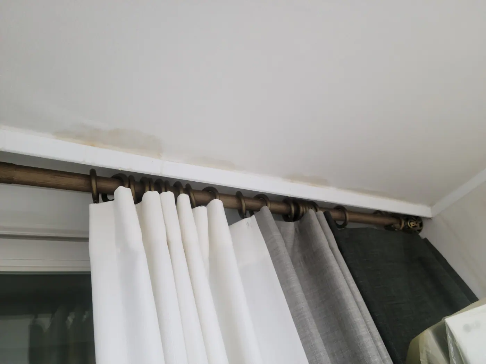
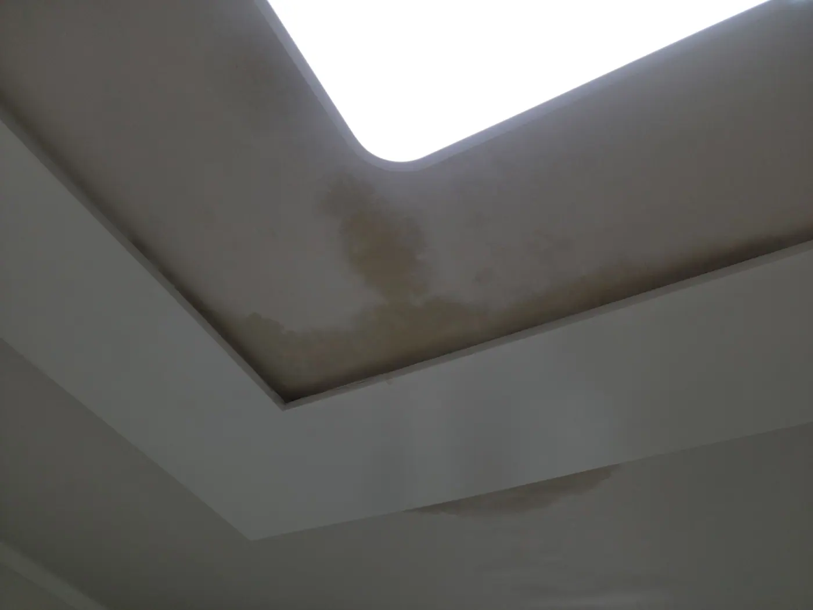
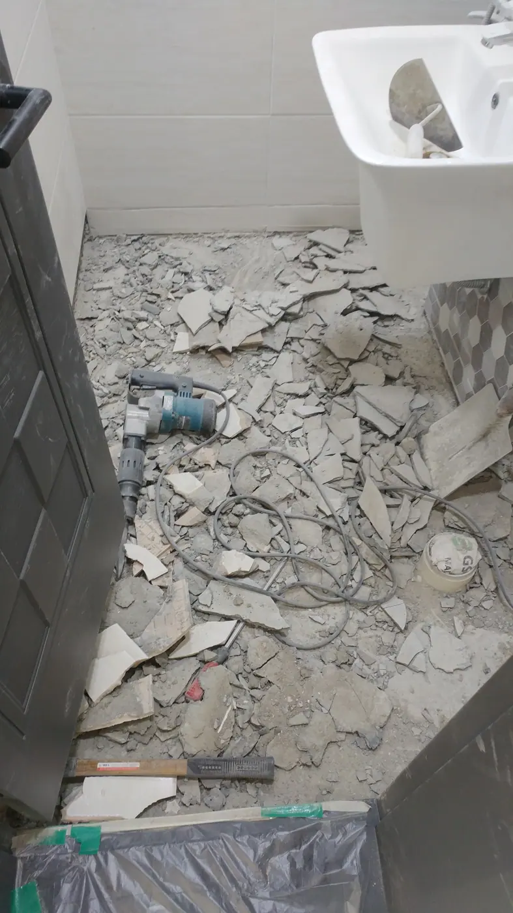
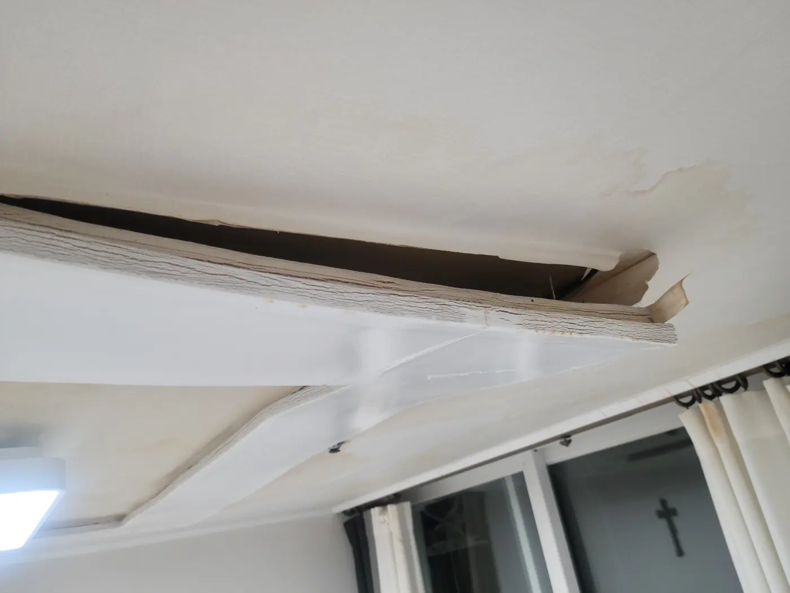
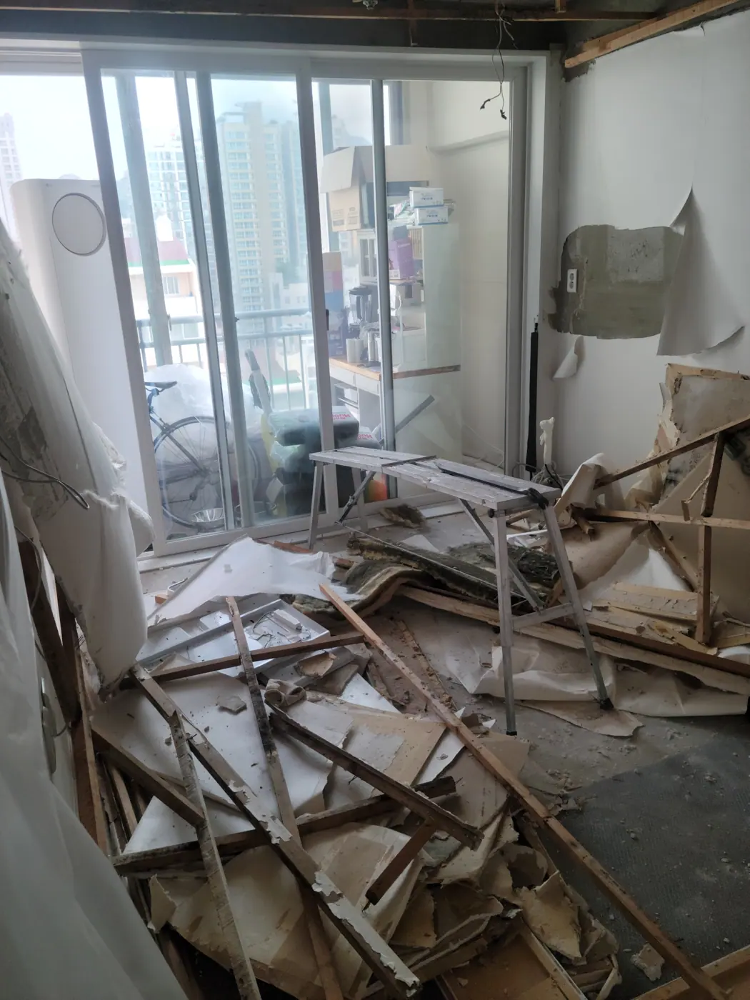
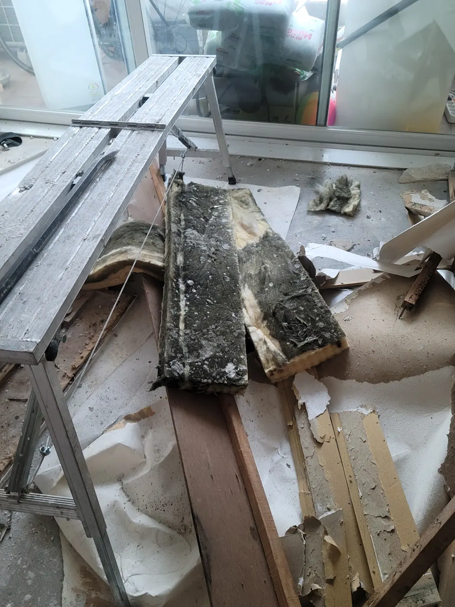
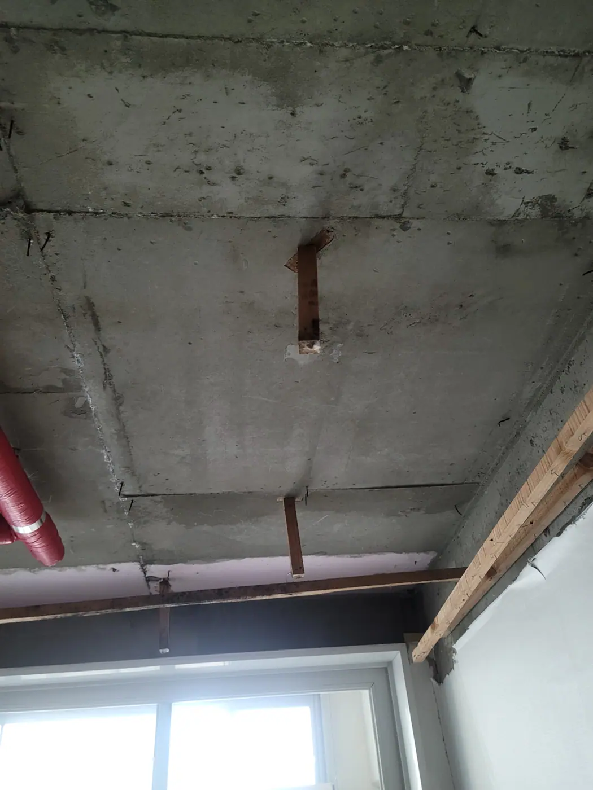
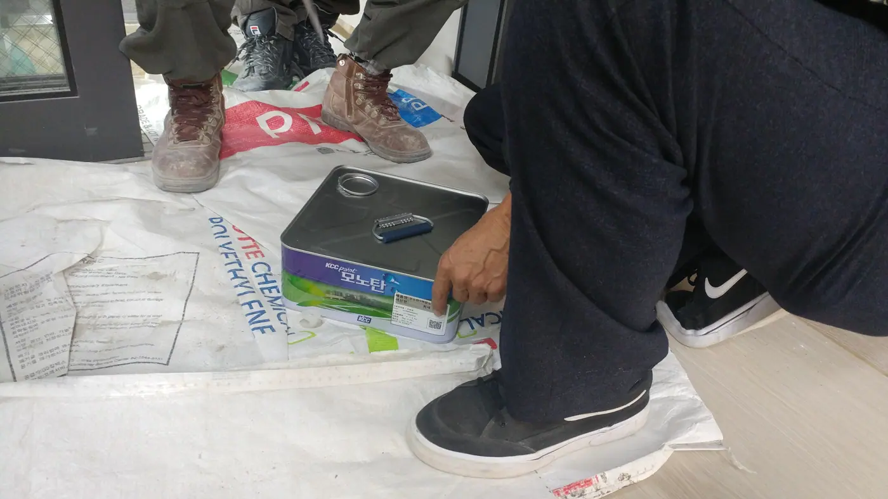
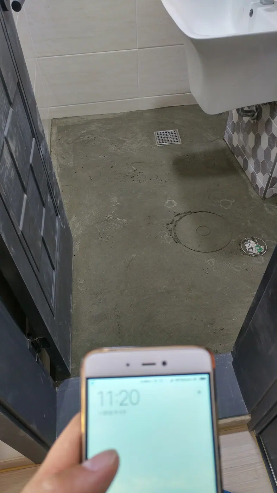
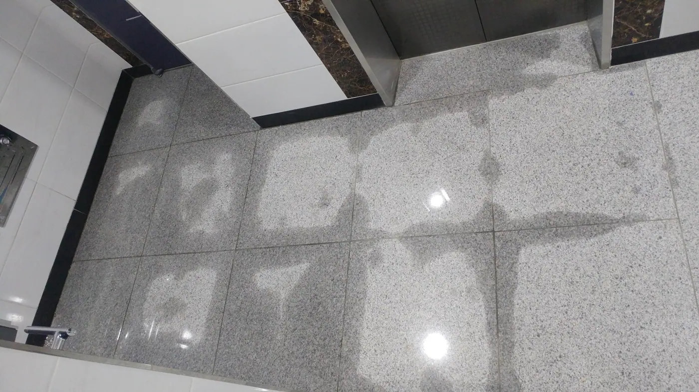

Water in a Korean apartment is not a rare disaster. Between our own
home and my mother's, we have been through it **six times** — twice
as the household with water coming through the ceiling, twice as
the household suspected of causing it, once in a newly built villa,
and once in a new apartment we visited that was already staining.

One of those is still unresolved years later. The stain is still on
her ceiling.

So treat this as what it is: **a thing that will probably happen to
you at some point**, and one where knowing the framework in advance
saves a lot of money and a lot of shouting.

It rarely announces itself. It starts like this — a faint brown
tidemark at the edge of a ceiling, easy to explain away:

*Week one. Easy to tell yourself it's nothing · ⓒ @BalliBalliSeoul*

Then it doesn't stop:

*Three weeks later, same ceiling · ⓒ @BalliBalliSeoul*

## First: who is responsible?

This is the question everything hangs on, and Korean practice
splits it three ways.

| Where the water comes from | Usually whose problem |
| -------------------------- | --------------------- |
| **The unit above yours** — their pipe, their bathroom, their waterproofing | **That household** |
| **Shared building plumbing** — risers, mains, roof, exterior walls | **The building** (관리사무소 / the owners' association) |
| **Your own unit's pipework** | **You** — or your landlord, depending on cause |

The split that catches foreigners out is the second one. If the
failure is in the building's shared parts (**공용부분**) rather than
inside one apartment (**전유부분**), **it is not a fight between two
neighbours at all** — it goes to the management office, and the
building pays.

Which is exactly what happened to us the second time. Water was
appearing downstairs, everyone assumed it was ours, and we opened
up our own bathroom to prove otherwise:

*Finding a leak often means destroying the room it might be in · ⓒ @BalliBalliSeoul*

It turned out to be a building defect. We had already demolished a
bathroom to find that out.

**The lesson: get the management office involved before you start
opening walls**, because if it's shared plumbing, the cost isn't
yours and the diagnosis isn't your job.

## The insurance nobody checks

Here is the single most valuable thing in this article, and most
foreign residents have never heard of it.

**일상생활배상책임보험** — "daily life liability insurance" — covers
damage you accidentally cause to other people, **including water
damage to the apartment below you.**

The reason so few people know they have it: **it isn't sold as a
standalone policy.** It's a rider bolted onto something else —
accident cover, children's cover, and very often **화재보험, which
translates as "fire insurance" and is the ordinary home policy
here.**

That name is the trap — in both directions.

**A fire policy does not cover water damage by itself.** What it can
carry is one or both of these **optional riders**, and whether you
have them depends entirely on what was ticked when the policy was
taken out:

| Rider | What it covers |
| ----- | -------------- |
| **일상생활배상책임** (liability) | Damage **you cause to someone else** — the flat below |
| **급배수시설 누출손해** (water damage) | **Your own** property, when your plumbing fails |

So neither assumption is safe. "I only have fire insurance, so I'm
not covered" may be wrong. "I have fire insurance, so I'm fine" may
also be wrong.

**The only answer is to read the rider list on the policy schedule,
or ring the insurer and ask whether those two are attached.** Ten
minutes, once, before anything goes wrong.

Three caveats before you assume it solves everything:

- **The property normally has to be named on the policy**, and the
  insured has to live there — or own it and rent it out.
- **There's an excess.** A claim doesn't pay out at face value, so
  small leaks may not be worth claiming.
- **As a foreign tenant you probably don't hold a Korean policy at
  all.** That doesn't end the conversation — **your landlord may,
  and so may the building.** Ask both.

And if you're the one being blamed: **ask the other side whether
they have it.** Two insured households arguing is a much shorter
conversation than two uninsured ones.

## Why the repair takes so long in summer

Our worst experience was the ceiling. Water came down from the flat
above, the plasterboard sagged, the cornice pulled away from the
wall — and eventually **part of the living room ceiling came down.**

*When the moulding lets go, the board above it is already saturated · ⓒ @BalliBalliSeoul*

We lost the sofa, moved the television, and **lost the room for a
month.** Not because nobody would come — because it was **monsoon
season, and the work physically could not be done.**

Fixing it meant taking the entire ceiling out:

*You don't patch a soaked ceiling. You remove it · ⓒ @BalliBalliSeoul*

And this is why. The insulation above the ceiling had been wet long
enough to turn black:

*This was sitting over the living room · ⓒ @BalliBalliSeoul*

**That is the real argument against "just repaint it".** Water that
reaches insulation stays there, and what grows in it is not
something a coat of paint contains. Everything soft came out, back
to bare concrete:

*Bare slab — the point you have to reach before rebuilding · ⓒ @BalliBalliSeoul*

*Waterproofing is a coating, and coatings need to cure · ⓒ @BalliBalliSeoul*

This is the part nobody explains when they tell you to "wait until
the rain stops". Waterproofing and paint are **chemical cures, not
just drying.** In high humidity they don't set properly, so a
contractor who cares will refuse to apply them — and a contractor
who doesn't will hand you a repair that fails again next year.

The full sequence, from our own bathroom, ran over the better part
of a week: demolition, then drying, then a new screed and
waterproofing layer, then tiling on top.

*Bare screed and a drain — this stage is the actual repair · ⓒ @BalliBalliSeoul*

**Plan for days, not an afternoon**, and expect the schedule to move
if it's raining.

## Before you tear anything up: leak detection

There is a step between "there is water somewhere" and "we removed
your floor", and it has its own trade: **누수탐지** — leak detection,
using thermal imaging and acoustic equipment to find the failure
point without opening everything.

It costs money. It costs dramatically less than demolishing the
wrong room. If a contractor's first suggestion is to start breaking
tiles, ask whether detection has been done.

## "New build" is not a safe answer

A thing foreigners assume and Koreans don't: **a new building is not
a low-risk building.** Defects show up in the first years, which is
precisely when a new-build leak happens. We've seen it in a newly
built villa we lived in and in a new apartment we visited that was
already showing stains.

The important consequence is that **the responsible party changes
entirely.** If the building is still young, this may be a
construction defect — the builder's problem under Korea's defect
liability rules, not your neighbour's and not yours.

- **In an apartment complex**, that runs through the management
  office and the owners' association, and there is a formal
  defect-dispute process at national level.
- **In a villa**, it is far harder in practice: small developers
  wind up, change names, or simply stop answering.

⚠️ Defect liability periods differ by building component and the
rules change, so **check the current terms for your building rather
than trusting any article, including this one.**

## When the other side simply doesn't fix it

Now the part that guides tend to skip, because it has no tidy
ending.

You can be completely right about liability and still be stuck. In
my mother's case the flat above hers caused the damage, **never
repaired it, and the stain is still there** — years on, exactly like
the one in the photographs at the top of this article, except hers
never got the month of demolition that fixes it. That's not a rare
outcome. It's the normal outcome when someone decides to wait you
out.

The escalation ladder, in order:

1. **Management office first.** They can inspect, rule on whether
   it's shared plumbing, and apply pressure a neighbour can't ignore
   as easily as they can ignore you.
2. **Document everything from day one** — photos with dates, video
   of active dripping, every message. This is the whole ballgame if
   it ever goes further.
3. **Ask about their liability insurance**, as above.
4. **내용증명** — content-certified mail. A formal letter, delivered
   with an official record that it was sent and received. It changes
   the tone of a conversation more than its content does.
5. **Legal routes** exist beyond that — small claims and free legal
   aid bodies among them — but the terms and eligibility change, so
   get current advice rather than acting on a blog post.

⚠️ **We are not lawyers and this is not legal advice.** It's the
sequence we've watched play out, twice.

## What to do in the first hour

If water is coming in right now:

- **Photograph and film it**, with something showing the date. Your
  phone does this automatically; use it.
- **Call the management office** (관리사무소) before you call anyone
  else. If the building is at fault, this is already their job.
- **Move what can be moved** and put a bucket under the rest.
  Electronics first.
- **Don't agree to pay for anything** until the source is
  established. The unit that looks guilty often isn't.
- **Bulky items that get ruined** — sofas, mattresses — can't just
  go out with the rubbish; they need
  [an official disposal sticker](/blog/how-to-throw-away-trash-in-korea/).

*When it reaches the shared corridor, it stops being a private argument · ⓒ @BalliBalliSeoul*

## Is it actually a leak?

Before you escalate to the management office, rule out the smaller
problems that produce similar-looking water:

- **A slow, spreading damp patch at the bottom of a wall**, with no
  pipe above it, is usually condensation rather than a leak —
  [and it has its own tell](/blog/mould-behind-baseboard-korea/)
- **Water pooling around a drain** is a blockage, not a leak, and
  often [a job you can finish yourself](/blog/unclog-bathroom-sink-korea/)
- **A tap or shower head that will not stop dripping** is a washer,
  [not a plumber's callout](/blog/fix-leaky-faucet-korea/)
- **Hot water that comes and goes** is the boiler, not the pipework —
  [ask about the valve first](/blog/korea-boiler-hot-water-problems/)

Everything else — a stain on a ceiling, water crossing between
units, anything that reaches a shared corridor — belongs in this
article.

## The Korean part

Everything above happens in Korean, at speed, with people who have
strong opinions: the management office, the neighbour, the
detection company, the contractor's quote, the insurer's claim form.
It is the single most stressful admin experience we've had in this
country, and we speak the language.

That's the gap we exist for. Through our
**[plumbing service](/plumbing)** we arrange the trades and confirm
the price in writing before anyone starts; through our
[anything-else concierge service](/etc) we make the calls, sit in
the meetings, and translate what the management office is actually
telling you.

## Get it sorted

> **Water where it shouldn't be?** Message us on
> [WhatsApp](https://wa.me/821075191282) with photos — we'll tell
> you who to call first, what it's likely to cost, and make the
> Korean calls if you want us to. Asking costs nothing — you pay only for the work you book.

The one-line version: **management office before neighbour, photos
before argument, check whether you already have liability insurance,
find the leak before you break anything — and don't expect
waterproofing to cure in the rain.**
