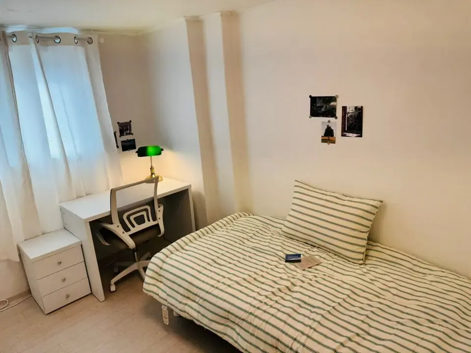
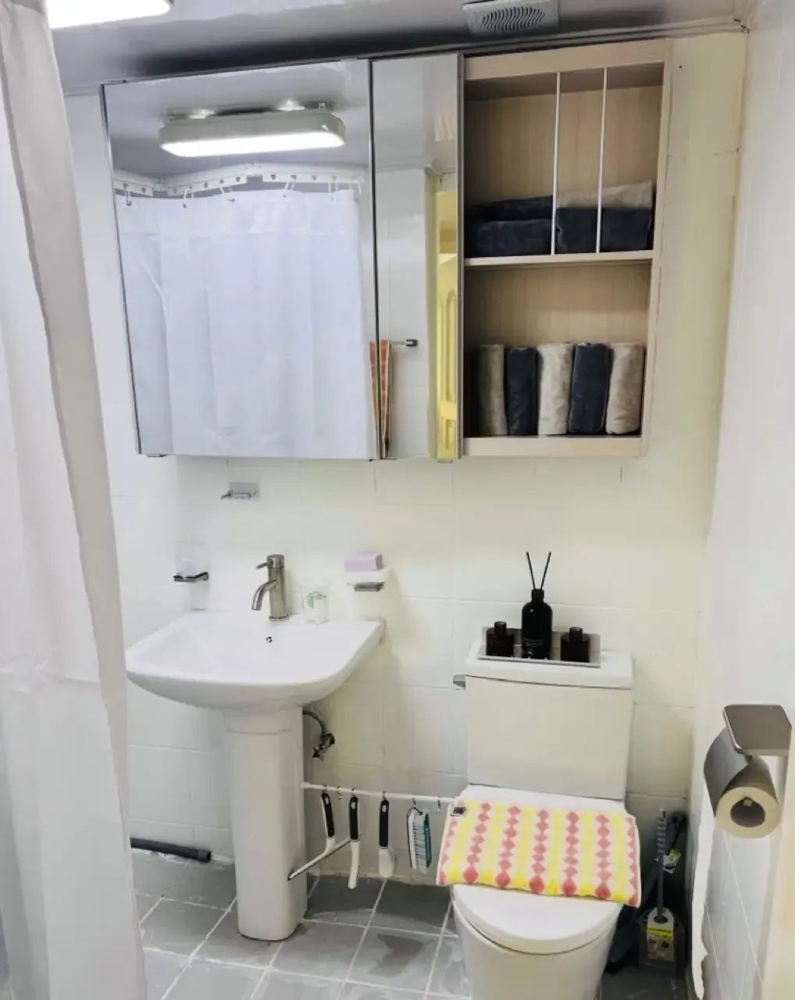
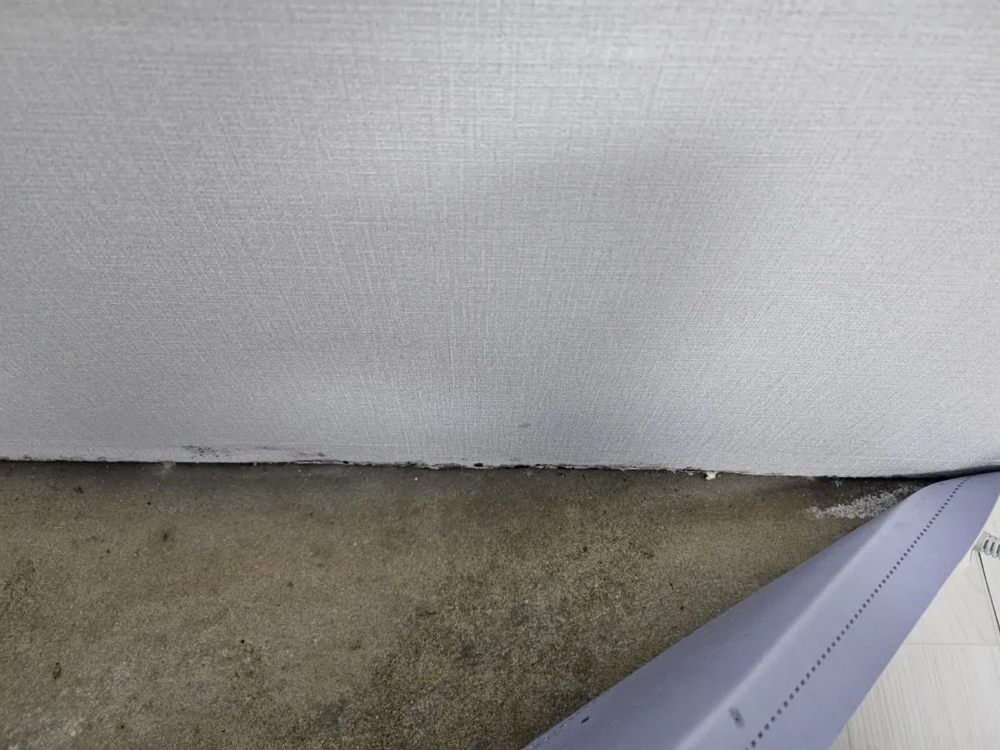
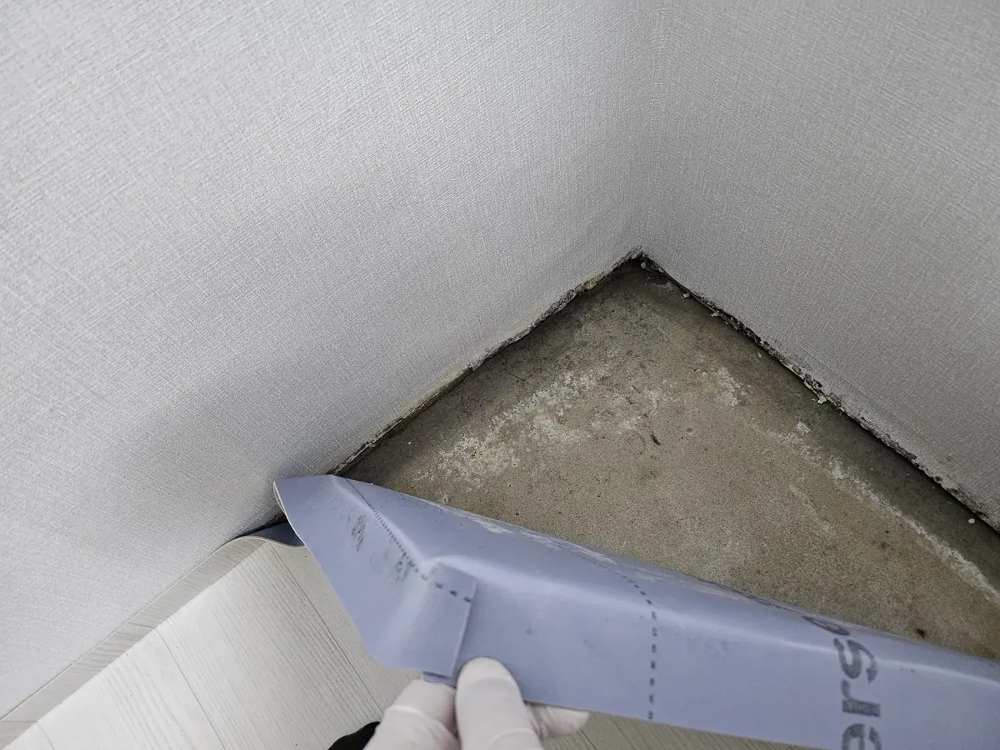

Someone moving to Seoul for an internship asked a good question on
Reddit recently. They'd been browsing Facebook housing groups and
kept seeing the same numbers:

> *"Deposit around 1–2 million KRW · Monthly rent around 300,000 KRW
> · Plus management fees ~100,000 KRW … Are prices like this
> normal/legit for very small one-rooms in Seoul, or should I be
> suspicious?"*

The honest answer is the one the thread eventually landed on:
**those numbers are real, but they are almost certainly not
describing a one-room studio.**

## What the deposit is actually telling you

Korean rentals trade deposit against rent. A bigger deposit buys a
lower monthly payment, and you can usually negotiate along that
line. Which means **a low deposit on its own means nothing** — it's
low deposit *and* low rent together that gives the game away.

Rough market shape in Seoul, as of 2026:

| What it is | Deposit | Monthly | What you get |
| ---------- | ------- | ------- | ------------ |
| **고시원 / 고시텔** | Little or none | ₩300,000–500,000 | A bed, a desk, sometimes a tiny shower. **Kitchen and often bathroom shared** |
| **One-room (원룸)** | **From around ₩10,000,000** | ₩400,000–700,000+ | Your own room, kitchenette and bathroom |
| **Officetel** | ₩10,000,000+ | ₩700,000+ | Better building, lift, security, higher 관리비 |

**A ₩1–2M deposit with ₩300,000 rent is goshiwon territory**, not a
studio. Goshiwons are a real and legitimate housing type — students
and workers live in them for years — but they are a **single small
room**, often windowless, with shared facilities. Nobody is
scamming you. The listing is just being generously described.

**For an actual one-room in Seoul, plan on ₩10,000,000 as the
realistic floor for the deposit.** Below that, either the deposit
has been converted into much higher rent, or you're looking at a
different category of housing entirely.

This matters most for newcomers, because **the deposit is the number
that decides whether you can move at all** — and it's the reason
[coliving and share houses exist](/blog/coliving-rooms-seoul-universities/),
since they take deposits sized in the low millions rather than the
low tens of millions.

## Read the management fee before the rent

**관리비** — the monthly management fee — is where the real cost
hides. ₩100,000 is normal, but the number is meaningless until you
know what's inside it.

Ask explicitly: **does it include water, electricity, gas, internet,
cleaning of common areas?** A ₩50,000 fee that covers nothing and a
₩120,000 fee that covers water, internet and heating are very
different propositions, and the cheaper-looking one often costs
more.

## Use an agent, and know why

The strong advice from residents who've done this: **go through a
licensed agent (부동산).**

It costs a fee. What it buys you is a contract that follows the
standard form, paperwork that's actually filed, and — the part
people underestimate — **a witness who is not your landlord.**

Foreign tenants in these threads describe landlords who assumed
they didn't know the rules: demanding extra payments after the
fact, or objecting to how much water and electricity they used. A
signed agency contract is the thing that ends those conversations.

Two more contract facts worth knowing before you sit down:

- **The standard residential lease is two years.** One-rooms and
  officetels often do one year, but shorter than that is a
  negotiation, not a norm.
- **가계약금** — a small holding deposit to reserve a unit while the
  contract is prepared — is normal practice. Confirm in writing
  what happens to it if either side walks away.

## Now the ten minutes that matter

You'll get one viewing, and it will feel rushed. Here's the order
we'd go in.

### Before you walk in

- **Which floor, and is it below ground?** 반지하 (semi-basement)
  units are cheaper for reasons you will feel in July.
- **Which way does it face?** North-facing rooms stay cold and damp.
  Ask, or check which way the sun is coming from.
- **How far is the station, walking, uphill?** Listings measure
  distance generously and rarely mention the hill.

### The two-minute physical test

*You get about ten minutes in here. Use them · ⓒ @BalliBalliSeoul*

**Water pressure.** Turn the shower on and flush the toilet at the
same time. If the shower dies, that's your morning, every morning.

*Run the shower and flush together — it takes ten seconds · ⓒ @BalliBalliSeoul*

**Hot water.** Run the tap and wait. How long until it's actually
hot? And find the boiler: there's a plate on it with a manufacture
date. **A boiler over about ten years old is near the end of its
life** — we wrote about
[what that means and who pays](/blog/korea-boiler-hot-water-problems/).

**Mobile signal.** Check your phone in the room, not the hallway.
Thick concrete and a back-alley position can leave you with no bars
where you sleep.

### The wall, the ceiling, the window

This is where a cheap flat tells the truth.

**Crouch at the wall base and smell.** Damp sits low. Then look at
the very bottom edge of the wallpaper, especially in corners and on
exterior walls.

*This was behind a strip that lifted off in one piece · ⓒ @BalliBalliSeoul*

**White crystalline deposits are worse than black spots.** That's
efflorescence — salt carried out of the concrete by water moving
through the structure, not just surface damp.

*White means water has been coming through, repeatedly · ⓒ @BalliBalliSeoul*

The full version of this check — including why Korean interiors
hide it so well and what to ask the landlord — is
[here](/blog/mould-behind-baseboard-korea/).

**Look up too.** Brown rings or a sagging cornice mean water has
come from above at some point.
[Leaks between floors](/blog/water-leak-korean-apartment/) are
common and slow to resolve, and a stain is evidence that the
building has form.

**Open the windows.** Do they actually open, is there an insect
screen, and does anything about the frame look like it sweats in
winter? Condensation marks around window frames are the early
version of the mould above.

### Before you sign

**Photograph everything, with dates.** Every mark, scuff, stain and
appliance, on move-in day.

This is the single highest-value ten minutes of the whole process,
and it has nothing to do with the flat's quality: **it is your
evidence when you move out and the deposit conversation starts.**
Existing damage that you didn't record is, by default, damage you
caused.

## Once you've signed

The checks above protect you before money changes hands. The other
half of protecting a deposit happens on the day you get the keys:
**[photograph the flat before you unpack](/blog/photograph-your-flat-move-in-day/)**,
starting with the meter readings, because utility bills are
calculated from a number that does not reset for a new tenant.

If you are arriving for a semester and do not have an ARC or a
Korean phone number yet, the doors that are actually open to you
are a different set —
[we went through them separately](/blog/student-housing-seoul-no-arc/).

## A note on pets

Since it comes up constantly: **"pet-friendly" in Korean listings
usually means small dogs.** Under roughly 5–10kg, in practice. A
large breed narrows your options dramatically regardless of budget,
and it needs to be the first thing you tell an agent — not something
that emerges at the viewing.

## The Korean part

Everything above happens in Korean: the listing, the agent, the
contract, the landlord's answer about the boiler, the negotiation
over the management fee.

We do two things here. Through our
[anything-else concierge service](/etc) **we come to viewings with
you** — translating, asking the questions above, and telling you
honestly what we'd walk away from. And when you've signed, our
**[moving service](/moving)** handles the van, the crew and the
disposal of whatever the last tenant left behind.

## Get it sorted

> **Looking at a listing and not sure what you're reading?** Send it
> to us on [WhatsApp](https://wa.me/821075191282) — we'll tell you
> what kind of housing it actually is, what that price should get
> you, and what to check when you go. First answer is free.

The one-line version: **a ₩1–2M deposit means goshiwon, a real
one-room starts around ₩10M, the management fee matters more than
the rent, and ten minutes with the shower running and your nose at
the skirting board will tell you more than any listing photo.**
