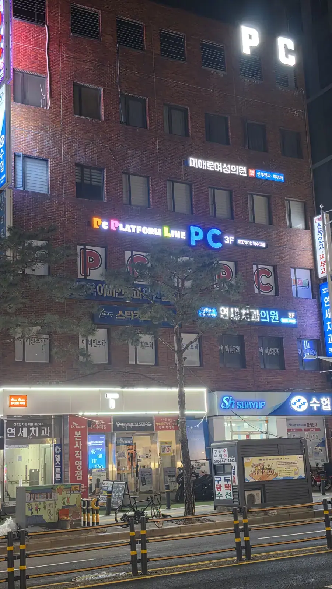
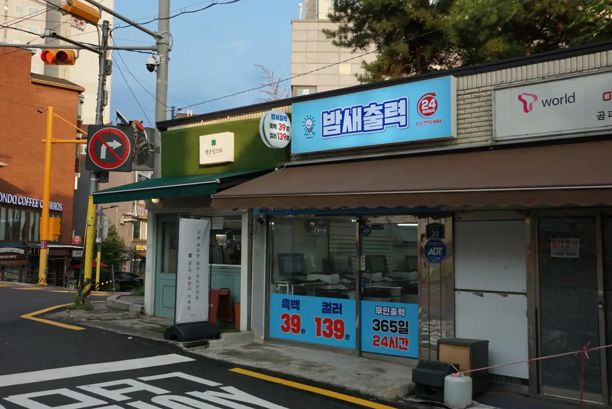
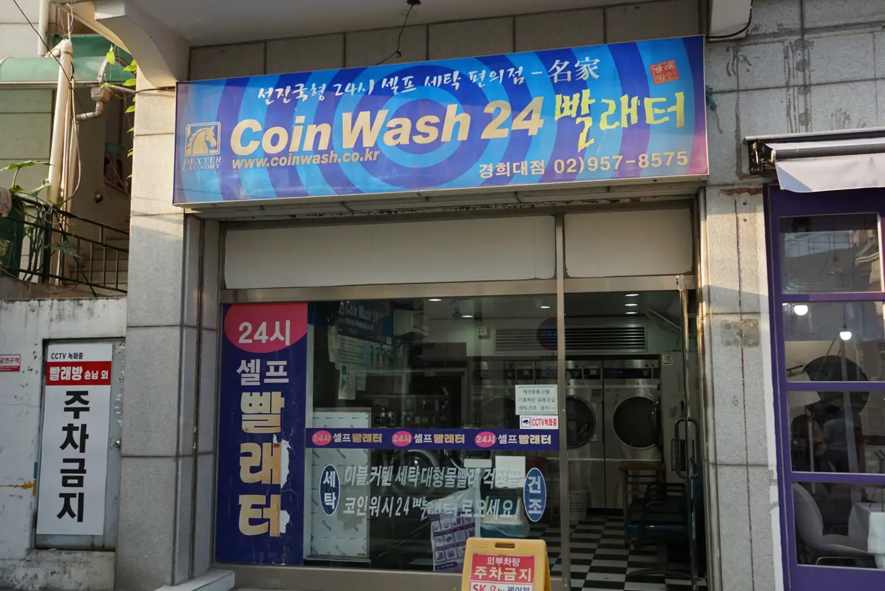

Walk one Seoul block and you'll pass a **PRINT CAFE**, a building
with **PC** glowing on three floors, a **Coin Wash 24**, and a
**study cafe**. None of them sell coffee as the main event. At some
point you realise the word isn't doing the job you think it's
doing.

**In Korea, "cafe" mostly means: a room you rent by the hour.**
Once that clicks, a whole category of shopfront becomes legible.

## Why the city is built this way

The underlying reason is space. Homes here are small and expensive,
especially the ones young people can afford, so the functions that
would live inside a house elsewhere have been **unbundled and sold
back by the hour**: a desk, a washing machine, a printer, a big
screen, a room to be loud in.

That's not a hardship story — it's a genuinely good deal. You get a
better desk, a better machine and better air conditioning than you
could fit in your room, and you pay only for the hours you use.

## Two suffixes: 카페 and 방

You'll see both, and the difference is mostly branding and vintage.

- **방 (bang)** literally means *room* — **PC방, 노래방** (karaoke),
  **찜질방** (bathhouse), **만화방** (comics). The older, plainer
  word.
- **카페 (cafe)** is the newer, tidier label applied to the same
  idea — **스터디카페, 프린트카페, 만화카페, 보드게임카페**.

Same economics, different decade of signage.

## PC방 — the gaming room

The most famous one. Rows of high-spec PCs, big monitors, deep
chairs, and a keyboard that has been used a great deal.

*PC on the third floor, and the fourth · ⓒ @BalliBalliSeoul*

What surprises visitors:

- **It's cheap** — roughly ₩1,000–2,000 an hour, often less
  overnight.
- **There's a real kitchen.** You order food from the screen at
  your seat — ramyeon, fried rice, dumplings — and someone brings
  it to you. The PC방 meal is a genre of its own.
- **You log in at the seat.** Staff can set up a guest or temporary
  account; you may be asked for ID.
- **Minors have curfews.** Under-16s aren't allowed late at night,
  so ID checks are normal and not aimed at you.

## Study cafe (스터디카페) — a desk, by the hour

A silent room of individual desks, sold by the hour — roughly
₩2,000–3,000 — often running 24 hours with a door code instead of
staff. You pay at a kiosk, it prints a code, you let yourself in.

This is the paid tier of a habit that already runs through ordinary
coffee shops here, where one americano buys you the table all
afternoon — which we covered in
[Korean cafe culture](/blog/korea-cafe-culture-guide/).

## Print cafe (프린트카페) — the one you'll actually need

Sooner or later you'll need to print a contract, a visa form or a
boarding pass, and you don't own a printer. This is the answer, and
it's usually open 24 hours.

Bring the file on a **USB stick**, or send it to yourself and open
it on the shop PC. The machines do **printing, copying, scanning
and fax** — and yes, Korean bureaucracy still occasionally wants a
fax.

*₩39 mono, ₩139 colour, 365 days · ⓒ @BalliBalliSeoul*

The prices on that sign are typical: **around ₩39 a page in black
and white and ₩139 in colour**. Printing thirty pages costs about
as much as a bus ride.

## Coin wash (코인워시 · 빨래방) — laundry by the load

Self-service laundromats, open around the clock, unstaffed, with
machines that take cards or coins. Wash and dry are priced
separately per load, and the big machines take a duvet — which is
the real reason to go, since home machines here are small.

*Unstaffed, open all night · ⓒ @BalliBalliSeoul*

Many are deliberately built as **laundry plus lounge**: seating,
Wi-Fi, sometimes a coffee machine, so the hour your washing takes
isn't wasted. Which is, once again, the same idea — you're renting
a room and a machine.

## And the rest of the family

- **만화카페 (comic cafe)** — walls of comics, cushions, blankets,
  hourly rate. Some people nap.
- **보드게임카페 (board game cafe)** — hundreds of games, staff who
  explain rules, hourly rate.
- **노래방 (karaoke)** — a private room, by the hour, no stage and
  no audience. A **코인노래방** charges per song instead.
- **찜질방 (jjimjilbang)** — bathhouse plus communal sleeping room,
  open overnight.

## What each one costs, roughly

| Place | What you rent | Typical rate (2026) |
| ----- | ------------- | ------------------- |
| **PC방** | A gaming PC and a seat | ₩1,000–2,000 / hour |
| **스터디카페** | A silent desk | ₩2,000–3,000 / hour |
| **프린트카페** | A printer, per page | ~₩39 mono · ~₩139 colour |
| **코인워시** | A washer, then a dryer | Per load, priced separately |
| **만화카페** | Comics, a cushion, a blanket | Hourly |
| **코인노래방** | A karaoke booth | Per song |

Rates vary by neighbourhood — university districts are cheapest,
and overnight packages are usually better value than the hourly
rate.

## How to use any of them, without asking

The pattern repeats almost everywhere:

1. **Pay first, at a kiosk**, usually by card. Choose hours or a
   package.
2. **Take the printed code or seat number.** For 24-hour places the
   code opens the door.
3. **Everything else is self-service** — machines, screens,
   ordering, and often no staff on site at all.
4. **Clean up and leave.** Sort your rubbish into the marked bins
   on the way out.

If a place is unstaffed and the kiosk is in Korean, that's the one
moment you're stuck. Which brings us to the usual disclaimer.

## The Korean part

Every one of these is a kiosk in Korean attached to a door code.
Send us a photo of the screen and our
[anything-else concierge service](/etc) will walk you through it, or
book and pay for it if that's easier.

## Get it sorted

> **Standing in front of a Korean-only kiosk?** Snap it and message
> us on [WhatsApp](https://wa.me/821075191282) — we'll translate the
> options and tell you which button to press. First answer is free.

The one-line version: **"cafe" here means a room by the hour —
gaming, studying, printing, washing, singing — you pay at a kiosk
before you use it, and most of them never close.**
