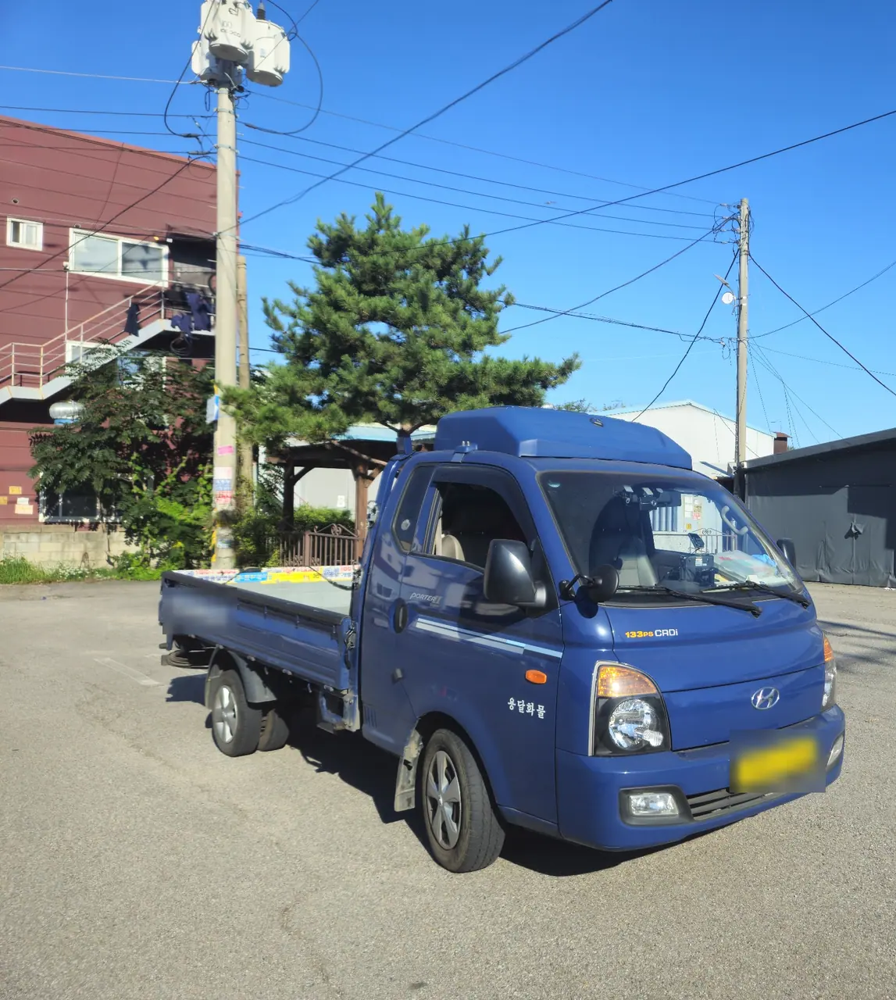
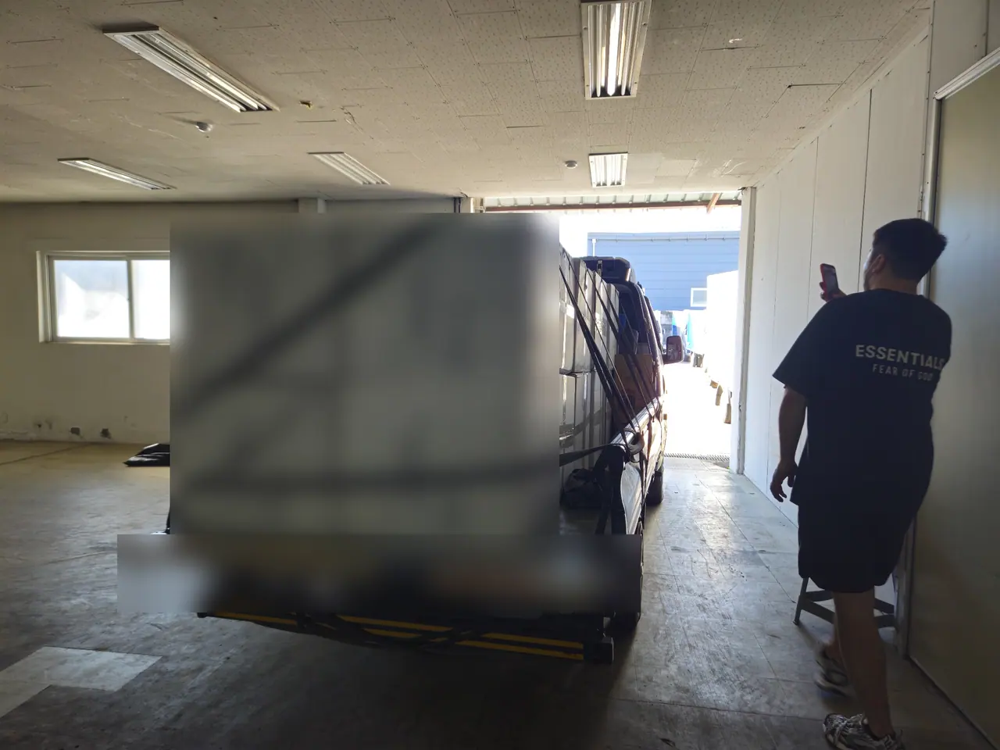

Two quotes come back. One says ₩80,000 and one says ₩400,000, and the
cheap one is a **용달** (yongdal). The obvious question is why anyone
would pay five times more.

The useful question is different. Yongdal is not a discount version of a
moving company — it is a different product, and the only thing that
decides whether it works for you is whether your things fit on one truck
and whether you can get them down to it.

## What you are actually buying

A yongdal booking buys **a vehicle and a driver**. That is the whole
specification.

Plenty of drivers help carry things, and many are generous about it. Treat
that as goodwill rather than something you have paid for. Some bookings
really are vehicle-only, and finding that out at eight in the morning with
a wardrobe on the third floor is a bad morning.

Ask which one yours is when you book. It is one sentence and it changes
the entire day.

If you want the full picture of how yongdal sits against semi-pack and
full-pack — and what each costs — that is in
[what a fair moving quote looks like](/blog/moving-company-seoul-quotes/).
This piece is only about the cheapest tier, and whether it is enough.

## The bed is the whole spec

Here is what "a truck" means. This is the standard 1-ton in Korea — a
Hyundai Porter, in the blue that half the trade seems to drive.

*This is the product: a flat bed and a driver · ⓒ @BalliBalliSeoul*

The bed is roughly **2.8 metres long and 1.6 metres wide**, with drop
sides about a foot high. Long-wheelbase versions run to about 3.1 metres.
Those numbers are worth holding in your head, because they are the real
constraint — not the tonne.

**A 1-ton rating is a weight limit, and household goods almost never hit
it.** Books and a washing machine can, but a room full of clothes, bedding
and flat-pack furniture runs out of *space* long before it runs out of
weight. When a driver says your load is too big, they usually mean it will
not stack, not that it is too heavy.

As a rough guide, a 1-ton takes **a studio or a one-room** with normal
belongings. A two-room flat, or a one-room with a lot of furniture, is
where people start being told they need a 1.4-ton or a 2.5-ton. Nobody can
confirm that from a description — send photos of every room and let the
driver decide.

## What actually fits

The cover photo above is that same truck loaded, and it is a fair picture
of the ceiling: boxes stacked two deep, filled to the top rail, strapped
down.

**One honest note about these photographs.** They are from a freight run —
stock going into a warehouse, not somebody's flat. We are showing you the
vehicle, the capacity and the way a load is secured, and all three are the
same whether the boxes hold pillows or your kitchen. We are not going to
caption a cargo delivery as a house move.

## The load is strapped, not padded

*Straps hold it still — nothing here is wrapped · ⓒ @BalliBalliSeoul*

Look at what is holding that load: **tension straps over the top, and
nothing else.** No blankets, no wrapping, no padding between items. That
is normal, correct, and exactly what you are paying for.

It also tells you what yongdal cannot do for you. Anything that needs to
arrive unscratched needs to arrive that way because **you** packed it that
way. A mirror, a monitor, a guitar, a framed picture — wrap it, box it, or
put it in your own car. On a strapped load, an unprotected flat surface
finds a corner.

Three habits cover most of it:

- **Box everything you can**, even things that seem awkward to box. Loose
  items are what slide.
- **Fill the boxes.** A half-empty box collapses under the one above it
  and takes the contents with it.
- **Say what is fragile before the day**, so it can be loaded last and on
  top rather than wedged in at the bottom.

## Four things that stop yongdal working

The truck is rarely the problem. Getting your things to it usually is.

**No lift, or a lift too small.** Older villas and low-rise buildings
often have neither a lift nor a staircase a wardrobe can turn in. That
means a **사다리차** (sadari-cha, ladder truck) lifting furniture through
the window — a separate vehicle and a separate charge, and one of the
fastest ways for a cheap move to stop being cheap. Check the stairwell
before you book anything.

**A long carry.** If the truck cannot get near the door — a narrow alley,
a market street, a building set back from the road — everything is carried
further, by hand, usually yours.

**Things that have to come apart.** Beds, wardrobes and desks often cannot
leave the room assembled. A yongdal driver is not booked to disassemble
them, and built-in wardrobes (붙박이장) should not be touched at all: they
are fitted to the wall, taking one apart badly destroys it, and the damage
comes out of your deposit.

**A second trip.** If the load does not fit, the truck comes back, and
that is charged. This is the whole argument for sending photographs
honestly rather than optimistically.

## What to do the day before

Yongdal rewards preparation more than any other tier, because the parts
that would normally be someone's job are now yours.

**Pack completely.** Not mostly. The truck arrives, and a driver waiting
while you find tape is a driver who has another booking.

**Get rid of what is not coming, properly.** Large items in Korea need a
paid disposal sticker and cannot simply go out with the rubbish — the
process is in
[how to throw away rubbish in Korea](/blog/how-to-throw-away-trash-in-korea/).
Doing this a week early also shrinks the load, which is the cheapest way
to stay on one truck.

**Book the clean for the empty window.** If the flat you are moving into
needs one, it has to happen after the old tenant leaves and before your
truck arrives — [what the crew needs from you](/blog/deep-clean-service-seoul/) is worth sorting
the same week as the truck.

**Photograph both flats.** The empty one you are leaving, and the new one
before anything goes into it. This is the same twenty minutes that
protects your deposit, described in
[photograph your flat on move-in day](/blog/photograph-your-flat-move-in-day/).
Do the meters first.

**Sort out parking at both ends.** In an apartment complex that usually
means telling the 관리사무소 (management office) in advance. A truck with
nowhere to stop turns into a long carry.

**Ask about insurance.** Licensed operators carry cargo liability cover —
**적재물배상책임보험**. A van found through an app may hold neither a
licence nor a policy, which is much of why it is cheap. Ask before you
book, not after something breaks.

## Carry these yourself

Never put your passport, your ARC, cash, jewellery or your laptop on the
truck. Not because a yongdal driver is any less trustworthy than anyone
else — because valuables that were not declared in advance sit outside
what any mover's cover is for. Take them in your own bag.

## The Korean part

Everything above assumes you can get a quote at all, and this is usually
where it stalls.

Booking a yongdal means a phone call in Korean, a description of your
volume, your floor and your access, and a driver asking questions about
lifts and alleys. The answer comes back as a Korean text message. There is
no English booking flow because the trade does not have foreign customers
in mind — it has a driver and a phone.

## Get it sorted

The decision is smaller than it looks. If your things fit on one bed and
you can get them down to it, yongdal is the right answer and everything
above the price of it is money you did not need to spend. If you are
guessing on either count, get the photos in front of a driver before you
book anything.

If the Korean part is the obstacle, that is what we do: we
[arrange the move](/moving) in English, put your volume and access in
front of drivers in terms they can price, and read the reply back to you
in plain English. We are a booking and coordination service — the driver
is an independent local operator, and their price goes to them.

We take no commission from any driver. Whichever one you use, we earn the
same, which is the only reason we can tell you honestly when the cheap
option is the right one.

Not sure whether your load is a one-truck job? Send photos of each room
and we'll tell you what you are looking at.
**[KakaoTalk](https://pf.kakao.com/_RJxhSX/chat) is the easiest way to
reach us**, and [WhatsApp](https://wa.me/821075191282) works too. If you
need someone on the line in English while you sort it out, the
government's living-information hotline is also free — see
[the 1330 hotline guide](/blog/korea-travel-hotline-1330/).
